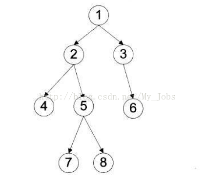

# 二叉树
## 遍历
&emsp;&emsp;二叉树有很多种遍历形式：
- 深度遍历
  - 前序遍历
  - 中序遍历
  - 后序遍历
- 广度遍历（层次遍历）



### 前序遍历
&emsp;&emsp;前序遍历的顺序是根结点——>左子树——>右子树，例如上图，前序遍历的顺序为1  2  4  5  7  8  3  6。
遍历的代码可以写成递归和用栈的两种形式：
```
void preOrderTraverse1(TreeNode* root) {
	if(root){
		cout<<root->val<<endl;
		preOrderTraverse1(root->left);
		preOrderTraverse1(root->right);
	}
}
```
```
vector<int> preorderTraversal(TreeNode* root) {
    vector<int> res;
    if(!root) return res;
    stack<TreeNode*> s;
    s.push(root);
    while(s.size()>0){
        TreeNode* tmp=s.top();
        s.pop();
        if(tmp->right) s.push(tmp->right);
        if(tmp->left) s.push(tmp->left);
        res.push_back(tmp->val);
    }
    return res;
    }
```

### 中序遍历
&emsp;&emsp;中序遍历的顺序是左子树——>根结点——>右子树，例如上图，中序遍历的顺序为4  2  7  5  8  1  3  6。
```
void preOrderTraverse1(TreeNode* root) {
	if(root){
        preOrderTraverse1(root->left);
		cout<<root->val<<endl;
		preOrderTraverse1(root->right);
	}
}
```
```
void inOrder1(TreeNode* root){
    std::stack<TreeNode *> nstack;
    TreeNode *temp=root;
    while(temp||!nstack.empty()){
        if(temp){
            nstack.push(temp);
            temp=temp->left;
        }
        else{
            temp=nstack.top();
            std::cout<<temp->value;
            nstack.pop();
            temp=temp->right;
        }
    }
}
```

### 后序遍历
&emsp;&emsp;后序遍历的顺序是左子树——>右子树——>根结点，例如上图，中序遍历的顺序为4  7  8  5  2  6  3  1。
```
void preOrderTraverse1(TreeNode* root) {
	if(root){
        preOrderTraverse1(root->left);
		preOrderTraverse1(root->right);
        cout<<root->val<<endl;
	}
}
```
```
void posOrder1(TreeNode* root){
    if(TreeNode==NULL) return;
    std::stack<TreeNode*> nstack1, nstack2;
    nstack1.push(root);
    while(!nstack1.empty()){
        TreeNode *temp=nstack1.top();
        nstack1.pop();
        nstack2.push(temp);
        if(temp->left) nstack1.push(temp->left);
        if(temp->right) nstack1.push(temp->right);
    }
    while(!nstack2.empty())
    {
        std::cout<<nstack2.top()->value;
        nstack2.pop();
    }
}
```

前序中序和后序都是深度（优先）遍历的一种策略，其中前序用的最多。

### 广度遍历（层次遍历）
&emsp;&emsp;优先遍历整层的所有元素，例如上图的顺序为1  2  3  4  5  6  7  8。
```
vector<int> preorderTraversal(TreeNode* root) {
    vector<int> res;
    if(!root) return res;
    queue<TreeNode*> s;
    s.push(root);
    while(s.size()>0){
        TreeNode* tmp=s.front();
        s.pop();
        if(tmp->left) s.push(tmp->left);
        if(tmp->right) s.push(tmp->right);
        res.push_back(tmp->val);
    }
    return res;
    }
```