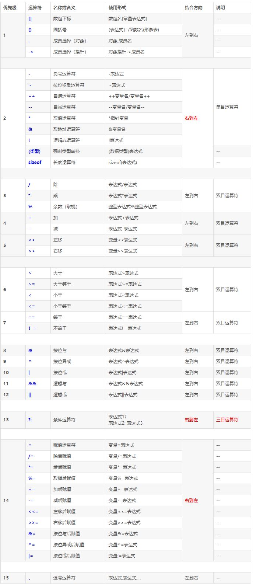

<!--
 * @Author: your name
 * @Date: 2020-05-04 21:58:09
 * @LastEditTime: 2020-05-13 23:30:23
 * @LastEditors: Please set LastEditors
 * @Description: In User Settings Edit
 * @FilePath: \StupidBirdFliesFirst\C++Fundamental\C++Fundamental.md
 -->

# C++基础知识

## C++与C语言的不同
- C++是面向对象语言，C语言是面向过程语言
- C++比C语言多了类、模板等部分
- C++有87个标准库，C有29个标准库

## C++的程序创建过程（linux）
1. 编写源代码，使用各种文本编辑器编写；
2. 预处理，处理源代码文件中的宏定义、条件编译文件、头文件等，最终生成一个没有宏定义，没有编译指令，头文件均被展开的文件；
    ```
    gcc -E hello.c -o hello.i
    ```
3. 编译，检测语法的规范性，检测有无语法错误，然后将源码生成汇编代码；
    ```
    gcc -S hello.i -o hello.s
    ```
4. 汇编，将汇编文件生成机器指令文件，即目标文件；
    ```
    gcc -c hello.s -o hello.o
    ```
5. 链接，将目标文件与其他代码链接起来，例如各种库或者启动代码，最终生成可执行文件，
   ```
   gcc hello.o -o hello
   ```
   库分为动态链接库和静态链接库两种：
   - 静态库是在链接过程中把库文件全部加入到可执行文件中，在运行时就不再需要库文件了，后缀为.a
   - 动态库在编译链接时并没有把全部代码都加入到可执行文件中去，在程序执行时再加载库，后缀为.so

    使用以上两种库时在gcc命令中刚加入-L表示查找路径，加入-l表示库名，之后将生成可执行文件。

gcc和g++其实都是可以编译c和cpp文件，但是gcc会把文件内容当成c语言，g++会把内容当成C++语言，所以这里同样需要注意。

## 内存的基本单位
&emsp;&emsp;计算机内存的基本单位是位（bit）。字节通常指的是8位的内存单元，不过在C++中有不同的定义，C++的字节表示能够容纳基本字符集的相邻位，在基本的ASCII和EBCDIC字符集中，一个字节为8位，但是也有更大的，但是一般来说还是认为一个字节有8位。

&emsp;&emsp;字是字节之上的另一个单位，通常是由CPU决定的，例如8位的CPU的话1字=1字节，16位的CPU就是1字=2字节。

## 整型数据
### 整型数据
&emsp;&emsp;整型数据包含short、int、long和long long，为了满足各种计算机的需求，C++本身不规定每一种类型的绝对长度，而是只确保最小长度：
- short至少16位
- int至少和short一样长
- long至少32位，且至少和int一样长（这意味着int可以为16位，24位，32位）
- long long至少64位，且至少和long一样长

检测长度时可以用sizeof命令，或者在头文件climits中查询。

&emsp;&emsp;C++中还包含无符号类型，只要在上述类型前加unsigned即可。其表示范围的大小没变，只是全部都是正数。

**注意，当整型数据溢出时，在数值上回在范围的另一端取值，比如无符号的整数设为0再减去1时，数值就会变为当前类型的最大值**

### 整型数据的字面值
&emsp;&emsp;整型数据在程序中写值的时候，可以有三种写法，分别表示10进制数、8进制数和16进制数：
- 10进制就直接写就行
- 8进制就是第一位先写0，然后写后面的数字，例如042，就表示十进制的34
- 16进制时先写0x或者0X，然后再写16进制的数字

&emsp;&emsp;当程序中出现常数值时，如果不带后缀的十进制数，使用int、long和long long中最小能够存储的类型存储；如果时不带后缀的八或者十六进制数，则用int、unsigned int、long、unsigned long、long long或unsigned long long表示（一般十六进制都会被存成unsigned int，因为十六进制一般用来表示地址），如果带了后缀（例如22022L就会被存成long）

### char类型
&emsp;&emsp;char比short更小，用来存储最基本的每个字符，所以其长度依据字符集中的最小单位来定（一般只要字符集里的所有符号不超过128个，就都能用一个字节来表示）。char的字面值就是字符集中表示某个字符的数字，如果直接用cout输出时即可输出其表示的字符。若是将char强制转换成int就能输出数字。在程序中给char赋值时可以用单引号包含单个字符，也可以直接赋值数字。

&emsp;&emsp;如果还需要更大的字符集，可以使用wchar_t和c++11新增的char16_t和char32_t。

### 布尔类型
&emsp;&emsp;没啥可说的，就是true和false，唯一需要注意的就是true和false都可以被提升为int类型，会变成1和0：
```
int a=true //a=1
int b=false //b=0
```
同时任何数字或者指针都可以被隐式转换成bool值，任何非零值都被转换为true，零值被转换位false

## const限定符
&emsp;&emsp;const限定符加在变量定义之前就无法在之后的程序只修改：
```
const int Months=12
```
注意最好不要先声明一个const变量，然后再定义，这样常量值一开始就不确定，也无法修改，最好就跟上面的一样，声明定义一起来。

&emsp;&emsp;const相比#define好在可以指定类型，同时可以使用c++的作用域规则将定义限制在特定区域中，而且还能将const用于结构体等更复杂的类型。

## 浮点数
&emsp;&emsp;浮点数之所以叫浮点数是因为计算机将其分为两部分存储，一部分时基准值（0到1）和缩放因子，基准值根据缩放因子移动小数点的位置，所以叫浮点数。

### 浮点数表示法
```
+5.36E+16
```

### 浮点类型
&emsp;&emsp;浮点数一般包含float，double和long double。float至少32位，其位数的表示方法是第1位表示符号；2到9表示指数（8位，所以可以表示-127到128）；10到32表示尾数（具体的数值，因为有23位，所以可以表示6到7位数字）。double也是同样的构成，1+11+52。

### 浮点常量
&emsp;&emsp;一般的浮点常量都会默认为double，需要将常量设计为其他浮点类型时需要加上f（float）或者l（long double）后缀。

### 浮点数的优缺点
优点：
- 也可以表示整数值
- 表示的范围更大（有缩放因子）
缺点：
- 计算更慢
- 精度比整型降低（因为int可以表示32位，float的尾数是23位，能表示的有效数字更少）

## 运算符
&emsp;&emsp;加减乘除求余数
### 运算符优先级问题


&emsp;&emsp;优先级1级最高，15级最低，表示在一个运算中的顺序。其中的结合性指的是如果出现同一级别的运算时，到底先算谁的问题，例如：
```
float f=120/4*5
```
其中出现了除法和乘法，可以看到都是同一优先级，且结合方向为从左到右，意思就是对于两个同优先级运算符中间的数来说（比如这里就是4），应该先和左边的运算符号结合（即除法），计算出结果后再和右边结合（即算出30以后再乘5）。

&emsp;&emsp;需要注意的是前置加减和后置加减的问题（即++和--），如果是对于一个变量来说，a++和++a就是一个意思，但如果把它用在一个运算的算式中就不一样了。前置运算是变量的值先加1或减1, 然后将改变后的变量值参与其他运算, 如x=5; y=8; c=++\*y；运算后，c的值是48，x的值是6，y的值是8。而后置运算是变量的值先参与有关运算，然后将变量本身的值加1减1，即参加运算的是该变量变化前的值。如x=5；y=8； c=x++\*y；运算后，c的值是40，x的值是6，y的值是8。另外前置、后置运算只能用于变量，不能用于常量和表达式，且结合方向是从右至左。如当i=6 时，求-i++的值和i的值。由于“-”(负号) “++”为同一个优先级，故应理解为-(i++)，又因是后置加，所以先有-i++的值为-6, 然后i增值1为7，即i=7。如果是单独出现一个i++或者++i（比如循环语句中），这时表达的意义都是一样的。

### 除法分支
&emsp;&emsp;假如一个除法中的两个值都是整数，则最后得数也一定是个整数，小数部分会被丢弃；只要有一个是浮点数，则得数也是浮点数
### 类型转换的问题
&emsp;&emsp;C++中一般有以下三种情况会执行特定的类型转换
1. 将一种类型赋值给另一种类型

&emsp;&emsp;一般来说将取值范围小的类型传递给更大的类型是不会出问题的，大的整型传递给小的整型会造成精度下降，由于是直接截取二进制数右边的字节，所以传递之后的结果是不确定的。将浮点数转化为整数时会造成小数部分的丢失，超出取值范围时结果不确定。浮点数同上。

2. 以{}方式初始化

&emsp;&emsp;以{}方式进行初始化时不允许缩窄，变量的类型可能无法表示赋给它的值。

3. 表达式中的转换
   
&emsp;&emsp;表达式中小于int的整型会先全部提升到整型，计算出结果之后再依据结果定义的类型转换回去；其余的是全部转换为最大的类型进行计算。

4. 将参数传递给函数

&emsp;&emsp;由函数原型控制（也可以取消原型对参数的控制）。

5. 强制类型转换
```
long(thorn) //c++风格
(long)thorn //c风格

static_cast<long>(thorn) //比传统强制类型转换更严格
```
以上这几种其实都没有改变原本的数值，而是创建了一个新的值。

## 数组
### 数组的初始化
&emsp;&emsp;数组在初始化时必须包括数组类型、数组名和元素数，有以下几种初始化方式：
```
int card[4]={1,2,3,4};
int hand[4];
```
第一种是最普通的初始化方式，第二种只初始化了元素数，接下来想要赋值时只能挨个每个元素赋值。另外以下这种赋值时不允许的
```
hand=card;
```
因为等于号没有关于数组进行重载。如果在初始化时只对一部分元素设定了值，那么剩下的元素都将变为0，所以如果就是想把所有的值都设定为0的话，那就初值给一个0就行：
```
int total[100]={0};//这一种会把所有的值都设定成0
int total[100]={1,2};//这一种除了第一个和第二个数被设定成1和2以外，其他的都是0
```
也可以不直接指定元素数：
```
int j[]={1,2,3,4};
int num=sizeof j/sizeof(int);//计算元素数
```
C++11也可以直接使用大括号赋值（看上去就像上面的方法省略了等号）。

## 字符串
&emsp;&emsp;字符串就是一系列的字符，c++中可以用char[]和string。字符串均以'\0'结尾，如果没有这个空字符那就不叫字符串，就只是个字符数组。赋值的时候可以用双引号括起一串单词字母来赋值。

**注意，'s'和"s"看起来是一样的，但是's'表示的仅仅是一个字符，而"s"表示的是s的字符和一个空符号\0。另外字符串常量表示的是一个地址，所以如果真的写出一个char s="s"的命令的话，那char s中存的就是"s"的地址**

鉴于char[]（来自C）运用起来比较麻烦，一般还是会用string类（来自c++），而且赋值、拼接等操作都更加直接。（char需要strcat等命令）

### 其他形式的字符串
```
wchar_t title[]=L"wells";
char16_t name[]=u"wells";
char32_t car[]=U"wells";
```

### 原始字符串
&emsp;&emsp;C++11新增的另一种类型是原始字符串raw。原始字符串中的字符表示的就是自己。例如"\n"表示的不是换行符，而是两个字符：斜杠和n。原始字符串不用""来限定开头和末尾，而是用"(和)"用作定界符，并使用前缀R来标识原始字符串。
```
cout<<R"(hello,"Bob".)"<<endl; //打印hello,"Bob".
```
原始字符串还可以自定义定界符，默认定界符是"(和)"。因此若想要在字符串中允许)"，则必须自定义定界符。如：
```
cout<<R"+*("(Who is it?)")+*"<<endl;//打印"(Who is it?)"
```
自定义定界符的方法就是在"和(之间添加字符，当然在末尾的定界符应保持一致。以上例子自定义的定界符是"+\*(，则末尾定界符是)+\*"。自定义定界符时，在默认定界符之间添加任意数量的基本字符，但空格，左括号，右括号，斜杠和控制字符等除外。

## 结构
&emsp;&emsp;结构是C++中类的基石
```
struct inflatable{
    char name[10];
    float volume;
    double price;
};
```
初始化时有很多选择
```
struct inflatable wells{"wells",0.12,9.98};//前面的struct可以省略，大括号前也可以加上等号
inflatable maya{};//这时所有的成员都会被设置为0
//当然也可以单独给实例的每个成员单独赋值，也可以在声明的时候后面直接跟一个实例。
```
两个相同的结构之间可以直接赋值

### 结构数组
&emsp;&emsp;结构本身可以构成一个数组：
```
inflatable wells[11];
inflatable guests[2]={
    {"jack",1.0,1.0},
    {"jake",1.0,1.0}
};
```

### 结构中的位字段
指定占用特定位数的结构成员，通常用在低级编程中。

## 共用体
&emsp;&emsp;union是一种数据格式，可以存储不同的数据类型，但同一时间只能存储一种类型，如果重新定义了原本的就没了：
```
union one{
    int int_val;
    long long_val;
    double double_val;
};

one pail;
pail.int_val=10;
pail.doublr_val=1.0;//此时前面的int_val就没了
```
共用体在存储时只占有一段内存（即定义时最长的那个类型的长度），所以这一段存的内容也只能有一个。适用于不同时使用的几个类型（可以节省一点空间）。

&emsp;&emsp;共用体用在结构中的时有两种情况：
```
struct wells{
	char name[20];  //姓名
	int num;    //编号
	char sex;   //性别
	char profession;  //职业
	union   //定义联合体
	{
		float score;   //学生的成绩
		char course[20];  //教室所教课程
	}sc;
};
wells w;
cin>>w.sc.course;//前面将结构体中的共同体实例化为sc，所以这里在实际使用的时候也要有sc

struct wells{
	char name[20];  //姓名
	int num;    //编号
	char sex;   //性别
	char profession;  //职业
	union   //定义联合体
	{
		float score;   //学生的成绩
		char course[20];  //教室所教课程
	};
};
wells w;
cin>>w.course;//前面将结构体中的共同体没有实例化，称为匿名共用体，这时就可以直接用
```

## 枚举
```
enum DAY{
      MON, TUE, WED, THU, FRI, SAT, SUN
};
```
&emsp;&emsp;枚举可以定义多个符号常量，有时可以代替const。通常如果在枚举中没有指定每个成员的值，就将从0开始自动赋值，例如以上的成员就自动被赋值为了0到7。

&emsp;&emsp;枚举实例化以后再赋值只能被赋给声明时的成员：
```
DAY day=MON;
int mon=day;//相当于int mon=1
```
但是要注意，直接写DAY day=1是不行的，枚举的成员之间也不能做运算再赋给枚举的实例，但是这种情况是可行的：
```
int ssd=MON+TUE;//这时ssd=0+1=1
```
所以枚举值确实代表了一个数字，但是数字所能进行的运算只能在转化为int之后，在枚举的实例化中不能把它当成数字。但是强制转化后也是可以的：
```
DAY day=DAY(1);//相当于赋值了TUE，但是如果数字超过了枚举值能表达的值，可能不会报错，但会有意想不到的结果
```
&emsp;&emsp;枚举的取值范围，即通过强制转换增加了枚举可接受的合法值

## 指针
### 基本知识
- 在变量前面加&可以打印出地址
- 指针在定义时需要加上*，*称为间接值或者解除引用，在指针前面加上\*可以得到存在该处的值
- 打印出的地址其实时每个变量所占的第一个字节的地址。因为内存中每个地址存一个字节，一个字节8位，例如int要占32位，那么一个int变量就要占4个字节，应该有4个连续的地址，但是打印出来的只是第一个。
- 指针的类型表明“当前指针指的值是一个某某类型的值”，例如一个int*的指针指的就是一个int类型的值，这种定义的意义在于能知道这个指针指的数据应该要占几个内存。
- 一定要在对指针应用解除引用*（即给这个指针指的地方赋值时）之前将指针定义为一个确定且适当的地址，否则很可能把值存到不该存的地方。
- 最好别直接拿一个16进制数给指针赋值，要赋也得强制转化：
  ```
  int* pt;
  pt=(int*)0xB8000000;//这样才知道存的是个int
  ```
- 通常内存在编译阶段就已经确定好了，但是面向对象的特点就是在运行阶段做决策，所以可以用new在运行时开辟空间
  
### new指令
&emsp;&emsp;new可以在没有存东西的情况下开辟一个存特定数据对象的空间：
```
int a=1000;
int *pa=&pa;//此时pa指向的内存中已经有值了
int* pt=new int;//这时只是开辟了空间，还没有值
*pt=1000;//现在有了
```
以上命令看上去似乎效果差不过，但是还有有很大区别，**new分配的内存是在堆里，而a是存在栈里**。

### delete指令
&emsp;&emsp;每次new一个指令，必须跟一个delete去释放内存：
```
int* pt=new int;
......
delete pt;
```
这时必须的，因为存在栈里的变量会随着函数的结束而自动释放，但是new的内存存在堆里，不会自动释放，如果不加delete就会一直在内存里，这样长此以往会造成内存的浪费，称为**内存泄漏**。

&emsp;&emsp;但是已经释放的内存就不要再去释放了，会出意想不到的问题（对空指针用delete是安全的）。也不要让两个指针指向同一个地址。

&emsp;&emsp;delete会释放指向的空间，但是那个指针本身不会消失，也就是说它仍然指着那个地址，只是那个地址没东西了。这时删除后最好将指针定为空指针（pt=ptrnull），一否则此指针将称为不受控的野指针，因为指针在delete之后，如果再新建一个指针很有可能还会指向同一个内存块，这是很危险的。

### 使用new创建动态数组
```
int* ps=new int[10];
delete [] ps
```
&emsp;&emsp;给数组new内存时可以这么写，这时返回的也是第一个字节的地址，记得跟delete配对使用。

### 使用动态数组
&emsp;&emsp;可以将指针当成数组名那样用，但是他们还是有本质区别：
```
double* p=new double [2];
p[0]=1.0;
p[1]=1.2;//类似数组名的用法
p=p+1;//这里将指针下移，即之前指向的是p[0]的第一个字节，现在指向的是p[1]的第一个字节，这也是指针和数组名的本质区别，数组名没有这种用法
p=p-1;
delete [] p;//如果上面没有p=p-1的话那么delete就是从p[1]开始delete了，这就不对了，所以一定要再把指针移回来
```
其实C++在多数情况下也是把数组名解释为指针的，但是跟真的由new创建的数组还有有区别，new数组的指针指向第一个地址得首字节，当进行加减法时会移动一个指定类型所占用得长度（就像上面定义了一个double类型的指针，double要占64位，8字节，所以加一的时候会向后移动8位，这时在地址的值上就能看出时+8了）。在数组名中，数组名也被解释成指向第一个地址的指针，在表示的时候，例如a[2]就相当于是*(a+1)，但是数组名不能直接做加减法（不能直接a=a+1），只能有a[0]=a[0]+1，这也跟指针没关系，仅仅是表示当前的值+1。

还有个区别就是，对数组用sizeof时会得到数组长度，对指针会得到指针长度（当前类型的长度），也就是说这时候C++不把数组名解释为指针。

数组名还有一点问题：
```
short t[10];
cout<<t<<endl;//这时数组名被解释为指向第一个元素的指针，就相当于&t[0]
cout<<&t<<endl;//这时就不一样了，这时取得的地址是整个数组的地址（主要体现在长度上）
```
从数字上来说确实两次打印出来的都是一样的，但是他们所代表的长度不一样。如果打印的时候来个+1的话，t+1将把地址加2（因为short占用2个字节），&t+1就是把地址加20（10*2），这种区别主要就是c++在不同时候对于数组名的解释不一样。

如果想用指针表现出数组名的效果，可以这么写：
```
short t[10];
short (*p) [10]=&t;
```
这时p+1的地址就会移动20了。

### 指针与字符串
&emsp;&emsp;尽管向上面一样直接来一个cout<<t<<endl可以直接打印出t的第一个元素的地址，但是假如是一个字符串，那么不管是数组形式还是指针形式都会直接把整个字符串打印出来：
```
char f[10]="rose";
cout<<f<<endl;//打印rose
char* fp="violet";
cout<<fp<<endl;//打印violet
```
效果上是这样的，但是实际上它还是把这个字符串的首字母的地址传给了指针，只是在cout的时候处理不同，它会一直打到\n为止，也就把整个字符串全打出来了。如果一定要打印出char的地址可以做一个强制转化（int*）。另外字符串的数组名形式在初始化以后就不能再用等号直接赋值了，必须用strcpy。指针形式的字符串初始化以后可以再用等号赋值，但是由于用双引号括起来的字符串常量在C++中也是以地址形式存的，所以再用等号其实就是把一个新地址赋给了当前这个指针，这样的话看起来是改变了字符，但是原本的那个字符串还在，但是就找不到了；不仅赋值，用==来做判断也是不行的，因为这时C++对于其不像cout那样做特别的处理，所以其实就是在判断地址是否相等（数组名形式和指针形式都不行，数组名可以用strcmp）而且直接用字符串常量赋值给char指针是无法修改的（字符串常量默认为const char），想要修改只能老老实实new一个char数组并且一个一个把单个字母输进去，还不能忘了最后的\n，这才能修改每个值。

### 使用new创建动态结构
&emsp;&emsp;建立一个结构体的指针：
```
struct inflatable{
    char name[10];
    float volume;
    double price;
};

inflatable* ps=new inflatable;
ps->volume=10.0;
(*ps).price=12.0;
```
这就是新建了一个指向inflatable结构的指针，这时要访问结构成员的时候就要用->代替原来的.，或者也可以用*ps来指代当前这个结构。

## for循环
&emsp;&emsp;for的基本用途都知道，这里不再细说。for的基本构成如下所示：
```
for ( init; condition; increment )
{
   statement(s);
}
```
其中for括号中的语句的执行顺序如下图所示：


注意for 语句中的三个表达式可部分或全部省略，但两个分号不能省略。

&emsp;&emsp;另外C++11新增了基于范围的for循环：
```
for( atuo& r : v){//这里的r前面的&表示接下来的语句可以对数组v中的元素进行修改，如果不加&那就不能修改原数组
  r *= 2;
}

```
这里面可以遍历的对象包括：
- 数组（不包括指针）
- 定义了begin()和end()方法，且返回该方法返回迭代器的类对象（STL 中所有容器都可以）。

要通过范围for 改变序列元素的值必须将元素声明成引用&（如果不是，则相当于一个局部变量，只是序列元素的副本），另外不能通过for循环增加或则删除序列元素，因为序列的end 已经被保存，增删会使end迭代器失效。

## while和dowhile
&emsp;&emsp;基本也没什么好说的，这俩的区别在于while在进入循环之前进行判断，dowhile是先做一轮，然后再判断。

## 逻辑运算符
- && 与
- || 或
- ! 非

## 字符函数库
这个库来自C语言，是一个与字符相关的非常方便的函数软件包，定义在cctype.h中：


## ?:运算符
```
3==9?25:34;\\问好前面用来判断，若为true则表达式为25，若为false则表达式为34
```

## 分支语句
### if else
### switch case
switch语句本身不为了取值范围而设计，每一个case就是一个单独的标签，可以是一个具体值，也可以是枚举。
### break continue

## 函数
### 基本知识
&emsp;&emsp;在C++中使用函数时必须包含以下这些要素：
- 提供函数定义
- 提供函数原型
- 调用函数

&emsp;&emsp;其中函数的定义即函数的各个组成部分俱全的函数定义（函数名，参数，返回值，函数体等）。其中有返回值的函数必须有相应的返回语句，如果返回类型不一致将会强制转换。基本上任何类型都可以返回，数组除外（但是可以将数组作为结构或者对象的组成部分返回）。

&emsp;&emsp;函数的原型就像函数的声明（只有返回类型，函数名和参数，后面加个分号），一般是写在调用这个函数的代码之前（假如这个函数的定义就在调用之前，那就不用非得单独声明了）。

&emsp;&emsp;之所以一定需要原型是因为原型描述了函数到编译器的接口，换句话说就是它把函数的基本信息都告诉了编译器，这样编译器就不用在一串代码编译到一半的时候去满文件找函数定义了。而不去找的原因一是因为这样速度更慢，另一个是因为编译器可以分文件编译，有时一个函数的定义可能在另一个文件中，但是还没编译到它，这时原型的意义其实就是先让编译器知道有这么个东西，让编译先顺利过去，然后等编译到它的定义时再补上定义。

&emsp;&emsp;函数原型最大的意义还就是在于帮助编译器检查，以及在返回类型不一致的时候帮助进行强制转化（但也不是所有的都能转，比如变量转结构之类的，而且精度变化时会有warning）

### 参数按值传递
&emsp;&emsp;C++使用参量（argument）来表示实参，使用参数（parameter）来表示形参。形参可以看做是一个占位符，它没有数据，只能等到函数被调用时接收传递进来的数据；实参是函数被调用时给出的参数，包含了实实在在的数据，会被函数内部的代码使用。

&emsp;&emsp;按值传递就是最普通的那种函数参数。这种传递会使用参数的副本，无论怎么修改都不会影响原函数中的变量。

### 函数对于数组的处理
&emsp;&emsp;C++可以在将数组作为参数（c不可以），但是仍然有一定缺陷。我们都知道数组与指针最大的区别在于，尽管数组名也是一个指向第一个值的指针，但是可以记录整个数组的长度（使用&时取到的地址代表着整个数组，+1时会移动整个数组的长度）。而在函数的参数中，如果传入一个数组，那么函数直接就把它当成指针来看待，这样就没有整个数组的长度信息了。所以如果一定要用的话，还要一起传递数组的长度。
```
double avg(int arrays[],int sizes)
```
这种情况的原因应该与参数的按值传递有关。因为两个数组之间没法直接赋值，所以就直接以指针形式赋值，也就因此失去了数组长度。从这个角度来说，数组在函数中是直接以原值被处理的，并没有生成副本。这时如果不想在函数中让数组中的值被修改，可以使用const
```
double avg(const int arrays[],int sizes)
```
这种改动最大的意义在于不能再使用指针来修改数据。

### const和指针
&emsp;&emsp;例如以下程序：
```
int age=20;
const int * pt=&age;
```
这个程序意味着pt是一个const int，也就说程序不能通过指针来修改这个age值，但是仅仅是不能用指针pt修改而已，程序还是可以用age来修改自己的值，另外这个指针pt虽然不能修改所指向的值，但是还是可以指向别的地址。

&emsp;&emsp;从另一个角度来说，如果将const int的变量赋值给指针呢？C++本身是禁止这种行为的，所以C++中不可能将一个const的变量的地址赋值给非const的指针，也禁止一个const的指针赋值给一个非const的指针，只有都是const才行（但是const的普通变量赋给非const的变量还是可以的）。

&emsp;&emsp;顺着这个思路，如果将一个函数的参数中声明的数组名（其实就是指针）不是const的话，那么就不能把一个const的数组代入函数。

所以一般而言将参数中的指针设置为const是有好处的：
- 避免无意间修改数据
- 可以处理const和非const

&emsp;&emsp;但是假如出现以下这种写法：
```
int sloth=3;
const int * ps=&sloth;
int * const f=&sloth;
```
这种把const写在int*后面的表示f只能指向sloth的地址，但是允许修改数值，跟前面的相反，甚至可以写成这样：
```
const double * const s=&age;
```
这就表示s只能指向age的地址且不能修改。

### 函数和二维数组
&emsp;&emsp;一般如果需要将二维数组作为参数，则必须这么写：
```
int data[3][4]={......};
int sum(int (*ar)[4],int size);
```
这里的括号是必不可少的，它表示的意思是**由4个int组成的数组的指针**。
```
int * ar[4];
```
这种写法的意思是**由4个指向int的指针组成的数组**。

### 函数和c风格字符串
&emsp;&emsp;c风格的字符串一般有三种形式：
- char数组
- 双引号的字符串常量
- char指针

以上这几种在函数中都会变成指向第一个字符的指针，但是因为字符串最后有一个结束字符，所以可以不用传递长度。

### 函数指针
#### 函数指针的用途
&emsp;&emsp;函数指针指向一个函数在内存中的地址，在程序中可以把一个函数的地址作为参数给另一个函数，这样能在另一个函数中运行它。
#### 获取一个函数的地址
&emsp;&emsp;函数的地址其实就是函数名，比如定义了一个叫think的函数，那么think就是此函数的地址，而think()就是运行这个函数并得到返回值：
```
//这里的think和process分别是两个函数
process(think)//将think这个函数的地址作为参数给process
process(think())//将think运行之后的返回值作为参数给process
```
#### 声明函数指针
&emsp;&emsp;就像
```
int i;
i=0;
```
这样先声明一个int类型的i再给i赋值一样，函数指针也可以先声明后赋值：
```
double pam(int); //函数原型
double (*pt)(int);//声明一个函数指针
pf=pam;//将pam赋值给pf
```
以上的第二行就是声明函数指针的语句，注意\*pt是必须加括号的，因为如果不加括号的话就变成了声明一个返回double\*的函数。另外给函数指针赋值就不需要用&了，因为函数名本身就是一个地址。

&emsp;&emsp;不过实话讲，如果只是要一个函数指针的话还有更偷懒的方法：
```
const double * f1(const double *, int);
auto pt = f1;
```
不管你服不服，我是服了。
#### 使用指针来调用函数
&emsp;&emsp;在一个函数中，如果将函数指针作为参数传入之后，如果想要使用它需要这样写：
```
double y=(*pt)(5);//这种就很好理解，因为给指针加上解除引用以后就代表这开始使用它指向的值，即函数本身
double y=pt(5);//这种好像不太符合常理，不过也是允许的。
```
这里的第一种形式非常清晰，就是说现在要使用一个指针所指向的函数了，但是第二种也是允许的，这是一种历史遗留问题，因为前面也说了函数名本身就是个地址，函数指针也是个地址，所以pt其实就是原函数的别名，这俩应该是一样的（苦笑），所以c++允许这两种操作。