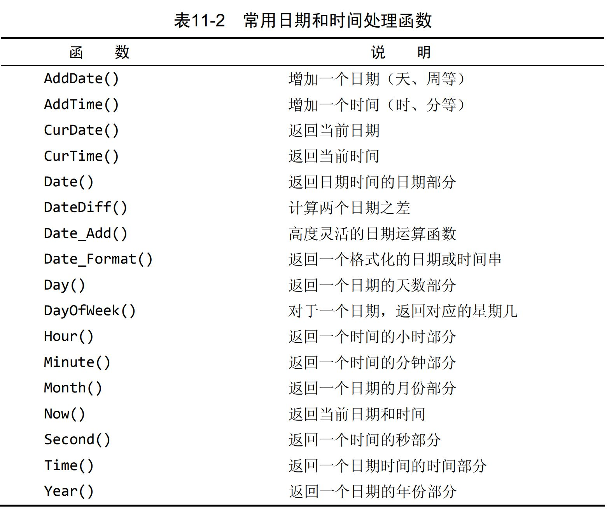
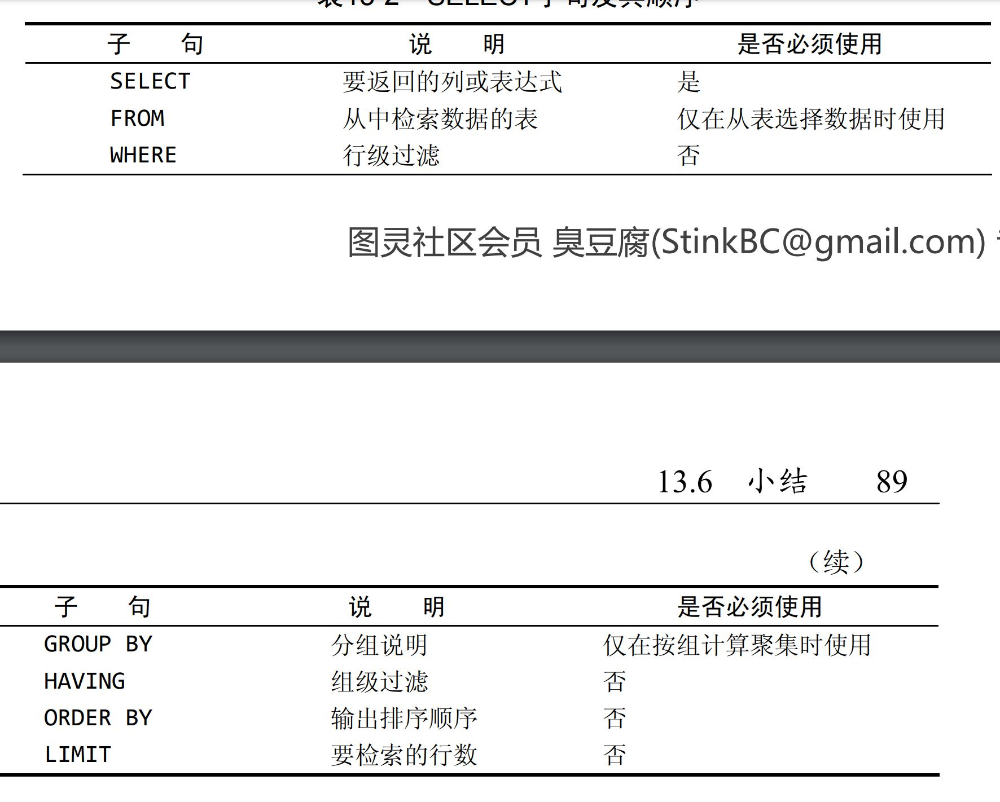

<!--
 * @Author: your name
 * @Date: 2020-06-02 18:57:30
 * @LastEditTime: 2020-06-11 22:23:43
 * @LastEditors: Please set LastEditors
 * @Description: In User Settings Edit
 * @FilePath: \undefinedc:\Users\conan\Desktop\LongTime\StupidBirdFliesFirst\DataBase\MySQL.md
--> 
# MySQL
参考书目：
- 《MySQL必知必会》

## 数据库基础
&emsp;&emsp;数据库是一种以某种有组织的方式存储的数据集合。再简单一点，保存有组织的数据的容器

###
 表
&emsp;&emsp;每一条数据都存在一个文件中，这个文件在数据库领域中称为表。这是一种结构化的文件，可以用来存储特定类型的数据。通俗点来说，就像是excel里的表格。

&emsp;&emsp;表只能存放一类数据，不应该将不同的数据放在一个表中存储。

&emsp;&emsp;每个表有一个表名，同一个数据库中不允许有两个表名相同。

### 模式
&emsp;&emsp;模式表示表中的一些特性，它们定义了在表中该如何存储，可以存什么数据，各部分如何命名等。

### 列
&emsp;&emsp;每个表都是一列一列组成的，跟excel中的列相似，每一列存的都应该是相同的数据类型，另外每个表所能容许的数据类型不一定一样

### 行
&emsp;&emsp;代表每一个个体。

### 主键
&emsp;&emsp;所谓主键就是代表每一行的一个ID，用于唯一标识每行，一般会存在第一列。例如一张表存的是班级里所有学生的联系方式，第一列存的是每个人的名字，这时每个名字就是每一行的主键。

&emsp;&emsp;当然理论上任意一列都可以是主键，只要满足：
- 任意两行主键值都不相同
- 不能有哪个主键值是NULL

也可以把多个列作为主键，上述条件必须应用到构成主键的所有列，所有列值组合必须唯一。

&emsp;&emsp;主键非常重要，所以需要遵循以下几个原则：
- 不更新主键中的值
- 不重用主键中的值
- 不在主键中存将会被更改的值
  
## SQL
&emsp;&emsp;SQL是结构化查询语言，是一种专门用来和数据库通信的语言。

## MySQL
&emsp;&emsp;数据库的所有存储、检索、管理和处理都是由数据库软件（DBMS）来实现的，MySQL就是其中一种。

&emsp;&emsp;一般来说DBMS分为两类，一种是基于共享文件系统，例如Access，用于桌面用途，不用于高端或者关键应用；另一种是基于客户机-服务器的数据库，例如MySQL，Oracle等。

### 连接
&emsp;&emsp;数据库的连接与连接服务器相似，需要指定IP地址和端口，以及用户名和密码。

### 选择数据库
&emsp;&emsp;使用USE关键字，例如需要使用一个叫wells的数据库：
```
USE wells
```
这时就将当前数据库切换到了wells，在进行操作之前一定要有这一步。

### 数据库列表
&emsp;&emsp;显示所有的数据库：
```
SHOW DATABASES
```

### 当前数据库内可用的表
```
SHOW TABLES
```
返回当前数据库内所有可用的表。

### 某个表内的列
```
SHOW COLUMNS FROM wellst
```
将会返回wellst这个表中所有的列，并且有它们的类型，是否允许NULL，键信息，默认值等信息。也可以使用：
```
DESCRIBE wellst
```
效果相同。

### SHOW的其他命令
```
SHOW STATUS //显示服务器信息
SHOW CREATE DATABASE
SHOW CREATE TABLE //显示用于创建特定数据库或表的语句
SHOW GRANTS //显示授予用户的权限
SHOW ERRORS
SHOW WARNING //显示服务器错误或者警告
```

### 检索数据
#### 检索单个列
```
SELECT name FROM wells
```
表示利用SELECT语句从wells的表中检索一个叫name的列，这时会返回此列所有的数据。注意这时的数据如果没有明确排序查询结果则乱序排列。另外命令本身可以空行，所以上述命令也可以表示成：
```
SELECT name 
FROM wells
```

#### 检索多个列
```
SELECT name, age, gender
FROM wells
```

#### 检索所有列
```
SELECT *
FROM wells
```
这里使用通配符*来表示wells表中的所有列。

#### 检索数值不同的行
&emsp;&emsp;以上检索都会把整列数据中每一行都显示出来，但是比如说一群人的年龄有很多数值相同的，现在想要返回不同的所有值，可以使用DIDTINCT命令：
```
SELECT DISTINCT age
FROM wells
```
假如DISTINCT后面跟了多个列的话，那么会将所有不同的组合全部列出来。

#### 限制结果
&emsp;&emsp;可以使用LIMIT命令来限制返回的数量：
```
SELECT name 
FROM wells
LIMIT 5
```
表示返回前5行；
```
SELECT name 
FROM wells
LIMIT 5，15
```
表示返回从第5行开始的15行（从第0行开始）。如果超出了总行数不会报错，有多少行返回多少行

#### 使用完全限定的表名
```
SELECT wells.name 
FROM data.wells
```

以上语句中，SELECT是一个主句，FROM是一个子句

### 数据排序
#### 数据排序
&emsp;&emsp;可以使用SELECT的子句ORDER BY命令来给返回的列排序：
```
SELECT name 
FROM wells
ORDER BY name
```
即使用名字的字母顺序排序，可以以其他的列为基准进行排序。

#### 按多个列排序
```
SELECT name, age,id
FROM wells
ORDER BY id,name
```
这里表示查询了多个列，返回之后将先按照id的顺序进行排序，id相同的再按照name的顺序排序，总之排序顺序和语句的顺序是相对应的。

#### 降序排列
&emsp;&emsp;语句的排序默认是升序排列，如果想要降序排列可以使用DESC语句：
```
SELECT name, age,id
FROM wells
ORDER BY id DESC
```
如果想要升序降序混着用，则可以：
```
SELECT name, age,id
FROM wells
ORDER BY id DESC, name
```
这就是先按照id降序排列，然今相同id的再按照name升序排列。DESC只能用于它前面的那个列，如果多个列都要降序排列的话那就必须都写上DESC。

与DESC相反的是ASC，但是它没什么用，因为默认就是升序排列。

以下命令可以找出年龄最大的人：
```
SELECT name, age,id
FROM wells
ORDER BY age DESC
LIMIT 1
```

### 过滤数据
#### 使用WHERE子句
&emsp;&emsp;WHERE子句可以指定搜索条件进行过滤，在表名之后给出：
```
SELECT name, age,id
FROM wells
WHERE age=10
```
即只返回age为10的行。

在同时使用ORDER BY和WHERE子句时，应该让ORDER BY位于WHERE之后，否则将会产生错误。

#### WHERE子句的操作符


#### 空值检查
&emsp;&emsp;空值表示当前位置没有存任何值，它与0、空字符、空格都不一样，是真的什么都没有，用NULL表示：
```
SELECT name
FROM wells
WHERE age IS NULL
```
操作符中的等于和不等于操作符都不会匹配到NULL的值。

#### AND操作符
&emsp;&emsp;WHERE还可以写出很多复杂的查询语句，例如加上逻辑操作符：
```
SELECT name, age,id
FROM wells
WHERE age=10 AND id<10
```
AND就是逻辑与，表示返回age=10且id<10的行。

#### OR操作符
```
SELECT name, age,id
FROM wells
WHERE age=10 OR id<10
```
OR就是逻辑或，表示返回age=10或者id<10的行。

#### 计算次序
&emsp;&emsp;WHRER中可以包含任意数目的AND和OR操作符，但是它们的计算顺序是不一样的，通常sql会先计算AND，再计算OR，所以如果要自己指定先算什么的话要用括号：
```
SELECT name, age,id
FROM wells
WHERE (age=10 OR id<10) AND name='musk' //另外这种查询是否相等的操作符在字符上不区分大小写
```

#### IN操作符
&emsp;&emsp;IN操作符用来指定条件范围，范围中的每个条件都可以进行匹配。IN取合法值的由逗号分隔的清单，全都括在圆括号中：
```
SELECT name, age,id
FROM wells
WHERE id IN (1,2,3)
```
意思就是把id等于1，2和3的行都挑出来，其实跟OR是一样的

#### NOT操作符
&emsp;&emsp;NOT就是逻辑中的非，用来否定后面跟的条件：
```
SELECT name, age,id
FROM wells
WHERE id NOT IN (1,2,3)
```
就是把id不等于1，2和3的行都挑出来

### 通配符过滤
&emsp;&emsp;在搜索子句中使用通配符，必须使用LIKE操作符。LIKE指示MySQL，后跟的搜索模式利用通配符匹配而不是直接相等匹配进行比较。
#### %通配符
&emsp;&emsp;%表示任何字符出现任意次数：
```
SELECT name, age,id
FROM wells
WHERE name LIKE 'Jake%'
```
表示找出所有name以Jake开头的行，%告诉MySQL接受Jake之后的任意字符，不管它有多少字符。

如果只是想找name中带有Jake的，可以在Jake前也加上%：
```
SELECT name, age,id
FROM wells
WHERE name LIKE '%Jake%'
```
表示匹配任何位置包含文本anvil的值，而不论它之前或之后出现什么字符。

另外%不能匹配到NULL

#### _通配符
&emsp;&emsp;作用与%一样，但是_只能匹配单个字符，而%可以匹配多个多个字符

### 正则表达式进行搜索
&emsp;&emsp;正则表达式是用来匹配文本的特殊的串（字符集合）。如果你想从一个文本文件中提取电话号码，可以使用正则表达式。如果你需要查找名字中间有数字的所有文件，可以使用一个正则表达式。如果你想在一个文本块中找到所有重复的单词，可以使用一个正则表达式。如果你想替换一个页面中的所有URL为这些URL的实际HTML链接，也可以使用一个正则表达式（对于最后这个例子，或者是两个正则表达式）。

在WHERE中加入REGEXP表示后面跟的东西作为正则表达式：
```
SELECT name
FROM wells
WHERE name REGEXP '1000'
```
这条语句将返回name列中所有值中带有1000的行。这与上面的LIKE语句非常相似，但是LIKE在加上通配符的基础上才能表示“值中带有这一部分”的含义，而正则表达式则直接写上就可以。

另外还有一种例子：
```
SELECT name
FROM wells
WHERE name REGEXP '.000'
```
这其中的.就是正则表达式中的一个特殊字符，表示匹配任意一个字符，所以这条语句执行的时候值中带有1000或2000或3000的都会被返回。

#### OR匹配
&emsp;&emsp;正则表达式中的OR操作用|来表示：
```
SELECT name
FROM wells
WHERE name REGEXP '1000|2000'
```
这样的正则表达式表示匹配其中之一，所以凡是值中带有1000或者2000的行都会被返回。

#### 匹配几个字符之一
&emsp;&emsp;以上可以知道在正则表达式中可以用.来匹配任意字符，那假如不想匹配任意的，只想匹配几中字符中的一个，可以这样写：
```
SELECT name
FROM wells
WHERE name REGEXP '[123] Ton'
```
这里的[123]定义了一组用来匹配的字符，表示只能匹配里面的1或者2或者3，也就是说最终会返回带有1 Ton或2 Ton或3 Ton的值得行。

这其实也是另一种形式得OR。

#### 匹配范围
&emsp;&emsp;就像上面的例子，可以改写成以下形式：
```
SELECT name
FROM wells
WHERE name REGEXP '[1-3] Ton'
```
这就表示匹配一个1到3的范围，也可以写[a-z]来表示匹配字母的范围。

#### 匹配特殊字符
&emsp;&emsp;以上已经说明了几种特殊字符：.|[]-等，那么假如我们就是想匹配带有这些特殊字符的行，这时需要在特殊符号前面加上\\\：
```
SELECT name
FROM wells
WHERE name REGEXP '\\.'
```
这样就可以返回值中带有.的行。\\\也可以用来引用元字符：


#### 匹配字符类
&emsp;&emsp;在匹配中为了简化，语句中预设了一些字符集，在写正则表达式时可以直接使用：


#### 匹配多个实例
&emsp;&emsp;目前为止使用的所有正则表达式都试图匹配单次出现。如果存在一个匹配，该行被检索出来，如果不存在，检索不出任何行。但有时需要对匹配的数目进行更强的控制。例如，你可能需要寻找所有的数，不管数中包含多少数字，或者你可能想寻找一个单词并且还能够适应一个尾随的s（如果存在），等等。正则表达式中可以使用元字符来完成：

例如：
```
SELECT name
FROM wells
WHERE name REGEXP '\\([0-9] sticks?\\)'
```
返回的结果为:
```
+--------------+
|     name     |
+--------------+
|TNT (1 stick) |
|TNT (5 sticks)|
+--------------+
```

又例如：
```
SELECT name
FROM wells
WHERE name REGEXP '[[:digit:]]{4}'
```
返回结果：
```
+--------------+
|     name     |
+--------------+
|JetPack 1000  |
|JetPack 2000  |
+--------------+
```
这句话中的[:digit:]匹配任意数字，因而它为数字的一个集合。{4}确切地要求它前面的字符（任意数字）出现4次，所以[[:digit:]]{4}匹配连在一起的任意4位数字。

#### 定位符
&emsp;&emsp;目前为止的所有例子都是匹配一个串中任意位置的文本。为了匹配特定位置的文本，需要使用表9-4列出的定位符：

例如，如果你想找出以一个数（包括以小数点开始的数）开始的所有产品，怎么办？简单搜索[0-9\\.]（或[[:digit:]\\.]）不行，因为它将在文本内任意位置查找匹配。解决办法是使用^定位符，如下所示：、
```
SELECT name
FROM wells
WHERE name REGEXP '^[0-9\\.]'
```
这表示只有.或者任意数字出现在值的第一个字符时才返回它们

### 计算字段
&emsp;&emsp;大部分情况下存储在数据库中的数据都不是我们直接想要的，基本都需要经过一些字符串上的处理或者数值上的计算才能用，因此就需要在SQL的命令中写出特定的计算或处理过程。

#### 拼接字段
&emsp;&emsp;例如数据库中的两列存着姓名和国籍，但是用的时候希望它们俩能拼接成一个字符串输出，此时可以这么写：
```
SELECT Concat(name, '(', country, ')')
FROM wells
```
返回值为：
```
+-------------------------------+
|Concat(name, '(', country, ')')|
+-------------------------------+
|ACME(USA)                      |
|Jale(AUS)                      |
|LT(CHA)                        |
+-------------------------------+
```
Concat()可以把多个串连接起来形成一个较长的串。需要一个或多个指定的列明或者字符串，各个串之间用逗号分隔。

#### 使用别名
&emsp;&emsp;以上拼接语句拼接出的结果仅仅能够显示而已，并不能将它作为一个新的列，此时可以利用别名使它变成一个新列：
```
SELECT Concat(name, '(', country, ')') AS title
FROM wells
```
这里就是将拼接之后的值存在了一个叫title的新列中，任何客户机应用都可以按名引用这个列。

#### 执行算术计算
&emsp;&emsp;计算字段的另一常见用途是对检索出的数据进行算术计算：
```
SELECT quantity, item_price, quantity*item_price AS price
FROM wells
```
返回的结果为：
```
+-------------------------------+
|quantity  |item_price  |price  |
+-------------------------------+
|10        |5.99        |59.90  |
|3         |9.99        |29.97  |
+-------------------------------+
```
可以看出同时显示出了两列相乘的结果。

### 使用数据处理函数
&emsp;&emsp;sql中预先定义好了一些用来处理值的函数
#### 文本处理函数
&emsp;&emsp;Upper()函数：
```
SELECT Upper(name) AS uname
FROM wells
```
作用是将字符全部变成大写。

还有其他的文本处理函数，这里不作一一介绍，用法与Upper相同：

SOUNDEX需要做进一步的解释。SOUNDEX是一个将任何文本串转换为描述其语音表示的字母数字模式的算法。SOUNDEX考虑了类似的发音字符和音节，使得能对串进行发音比较而不是字母比较。

#### 日期和时间处理函数
&emsp;&emsp;首先，MySQL的数据库中采用不同的数据类型存储日期或者时间：
|  数据类型   | 存储格式  |
|  ----  | ----  |
| DATA  | yyyy-mm-dd |
| TIME  | HH:MM:SS |
| DATETIME  | YYYY-MM-DD HH:MM:SS |
日期和时间的处理函数可以用来处理这些数据：

例如想要查2005年9月的所有数据，可以这样写：
```
SELECT id, num
FROM wells
WHERE Date(date) BETWEEN '2005-09-01' AND '2005-09-30'
```
其中的BETWEEN操作符可以把后面的两个日期定义为一个要匹配的范围

#### 数值处理函数
&emsp;&emsp;数值处理函数仅处理数值数据。这些函数一般主要用于代数、三角或几何运算，因此没有串或日期—时间处理函数的使用那么频繁。


### 汇总数据
#### 聚集函数
&emsp;&emsp;我们经常需要汇总数据而不用把它们实际检索出来，为此MySQL提供了专门的函数。使用这些函数，MySQL查询可用于检索数据，以便分析和报表生成。这种类型的检索例子有以下几种。
-  确定表中行数（或者满足某个条件或包含某个特定值的行数）
-  获得表中行组的和
-  找出表列（或所有行或某些特定的行）的最大值、最小值和平均值。

上述例子都需要对表中数据（而不是实际数据本身）汇总。为方便这种类型的检索，MySQL给出了5个聚集函数，见表12-1。这些函数能进行上述罗列的检索。

##### 平均值
例如求某列的平均值：
```
SELECT AVG(price) AS avg_price
FROM wells
WHERE id=1
```
这就是返回所有id为1的行的价格的平均值

##### 计数
COUNT()函数进行计数。有两种使用方式：
- 使用COUNT(*)对表中行的数目进行计数，不管列中包含的是空值还是非空值
- 使用COUNT(column)对特定列中具有值的行进行计数

#### 据集不同值
&emsp;&emsp;MySQL5之后的版本中，使用DISTINCT可以在函数计算的时候只考虑不同的值：
```
SELECT AVG(DISTINCT price) AS avg_price
FROM wells
WHERE id=1
```

#### 组合聚集函数
&emsp;&emsp;可以根据需要包含多个聚集函数：
```
SELECT AVG(DISTINCT price) AS avg_price,
       MAX(price) AS max_price
FROM wells 
WHERE id=1
```

### 分组数据
#### 数据分组
&emsp;&emsp;以上的聚合可以进行一些统计功能，但是只能返回某一列或者某几列的统计数据。假如现在想要这种统计：每一种不同的id分别都有多少行，如果需要这种数据，可以这么写：
```
SELECT id, COUNT(*) AS nums
FROM wells
GROUP BY id
```
GROUP BY子句指示MySQL按id排序并分组数据，id相同的就是一组。这使得对每个id进行统计而不是对整个表计算一次。

GROUP BY的一些规定：
- GROUP BY子句可以包含任意数目的列。这使得能对分组进行嵌套，为数据分组提供更细致的控制。
- 如果在GROUP BY子句中嵌套了分组，数据将在最后规定的分组上进行汇总。换句话说，在建立分组时，指定的所有列都一起计算（所以不能从个别的列取回数据）。
- GROUP BY子句中列出的每个列都必须是检索列或有效的表达式（但不能是聚集函数）。如果在SELECT中使用表达式，则必须在GROUP BY子句中指定相同的表达式。不能使用别名。
- 除聚集计算语句外，SELECT语句中的每个列都必须在GROUP BY子句中给出。
- 如果分组列中具有NULL值，则NULL将作为一个分组返回。如果列中有多行NULL值，它们将分为一组。
- GROUP BY子句必须出现在WHERE子句之后，ORDER BY子句之前。

#### 过滤分组
&emsp;&emsp;除了能用GROUP BY分组数据外，MySQL还允许过滤分组，规定包括哪些分组，排除哪些分组。这里使用HAVING语句：
```
SELECT id, COUNT(*) AS nums
FROM wells
GROUP BY id
HAVING COUNT(*)>=2
```
这时将会只返回总行数大于等于2的分组。

这里的HAVING和WHERE是有去别的，HAVING作用于不同的组，而WHERE作用于行。

#### SELECT子句的顺序
&emsp;&emsp;SELECT所有的子句顺序遵循如下规定：


### 联结表
#### 关系表
&emsp;&emsp;所谓关系表是一种数据存储的方法，例如商铺的发货单，这类数据库中肯定会记载每次发货的商品、时间、收件人等信息，但是每种商品又肯定有很多信息很多属性需要存储，因此应该建立两种表来存储信息，且这两张表是有关系的，所以称之为关系表。

其中的商品表的主键可以存储在发货表中的一列，称之为发货表的外键，这个外键是构建两张表关系的桥梁。

#### 联结
&emsp;&emsp;因为多种数据存储在不同的表中，为了使用单条SELECT语句都能给检索出来，所以要用联结来进行检索。所谓联结就是多个表返回一组输出

#### 创建联结
```
SELECT name,  price
FROM wells, jake
WHERE wells.id=jake.id
```
这里的name和price分别来自wells和jake两张表中（如果重名的话就要用全名称写），WHERE中指定了两张表中的id这一列建立联结，这样一来返回的就是同一表，且wells中的name和jake中的price都是通过id一一对应的。

此外还可以这么写：
```
SELECT name,  price
FROM wells INNER JOIN jake
  ON wells.id=jake.id
```
这里的ON也是FROM的一部分。FROM中的语句表示两个表有联结，ON后面表示这个联结的具体条件。

#### 联结多个表
理论上可以联结的数量没有限制，可以写很多：
```
SELECT name,  price, gender
FROM wells, jake, tom
WHERE wells.id=jake.id
  AND jake.school=gender.school
```

#### 自联结
例如这种情况：你发现某物品（id为DTNTR）存在问题，想知道它的供应商，以及其生产的其他物品是否也存在问题。因此优先需要查到id为DTNTR的物品的所有供应商，再查这些供应商供应的所有物品，可以直接这样写：
```
SELECT prod_id, prod_name
FROM wells
WHERE vend_id=(SELECT vend_id
             FROM wells
             WHERE prod_id='DTNTR')
```
这种方法称为子查询方法，用内部生成的检索结果来确定外部检索的条件。

也可以使用联结查询：
```
SELECT p1.prod_id, p1.prod_name
FROM wells AS p1, wells AS p2
WHERE p1.vend_id=p2.vend_idwells
  AND p2.prod_id='DTNTR'
```
这种情况被称之为自联结，因为此查询中需要的两个表实际上是相同的表。因此wells表在FROM子句中出现了两次。虽然这是完全合法的，但对wells的引用具有二义性，因为MySQL不知道你引用的是wells表中的哪个实例。为解决此问题，使用了表别名。wells的第一次出现为别名p1，第二次出现为别名p2。现在可以将这些别名用作表名。例如，SELECT语句使用p1前缀明确地给出所需列的全名。如果不这样，MySQL将返回错误，因为分别存在两个名为prod_id、prod_name的列。MySQL不知道想要的是哪一个列（即使它们事实上是同一个列）。WHERE（通过匹配p1中的vend_id和p2中的vend_id）首先联结两个表，然后按第二个表中的prod_id过滤数据，返回所需的数据。

#### 外部联结
上面使用INNER JOIN的被称为内部联结，它可以匹配所有的关联项，但是像那些没有关联项的是不会返回的，如果想返回非关联项，可以使用外部联结：
```
SELECT name,  price
FROM wells LEFT OUTER JOIN jake
  ON wells.id=jake.id
```
OUTER JOIN表示外部联结，但是前面还需有LEFT或者RIGHT指定包括所有行的表，例如这里写的是LEFT，就是说wells.id的表无论有没有关联项都会显示出来，而在jake.id中与之对应的会显示NULL。

### 组合查询
UNION 基本和WHERE的功能一样

### 全文本搜索
在索引之后，SELECT可与Match()和Against()一起使用以实际执行搜索。

### 插入数据
