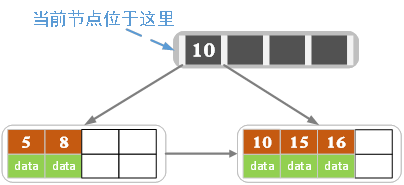
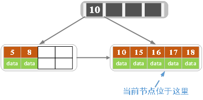

<!--
 * @Author: your name
 * @Date: 2020-06-13 22:09:25
 * @LastEditTime: 2020-06-15 19:10:48
 * @LastEditors: Please set LastEditors
 * @Description: In User Settings Edit
 * @FilePath: \undefinedc:\Users\conan\Desktop\LongTime\StupidBirdFliesFirst\DataBase\index.md
--> 

<!-- TOC -->

- [索引](#索引)
  - [分类](#分类)
    - [从数据结构分类](#从数据结构分类)
    - [物理存储角度](#物理存储角度)
    - [逻辑角度](#逻辑角度)
  - [B树](#b树)
    - [平衡二叉树](#平衡二叉树)
    - [B树](#b树-1)
      - [B树的插入操作](#b树的插入操作)
      - [B树的删除操作](#b树的删除操作)
  - [B+树](#b树-2)
    - [B+树的插入操作](#b树的插入操作-1)
    - [B+树的删除操作](#b树的删除操作-1)
  - [不同数据库的不同选择](#不同数据库的不同选择)

<!-- /TOC -->

# 索引

## 分类
### 从数据结构分类
- B树/B+树
- Hash索引
- R树索引
- 全文索引

### 物理存储角度
- 聚集索引
- 非聚集索引

### 逻辑角度
- 主键索引
- 普通索引或单列索引
- 复合索引
- 唯一索引
- 空间索引

## B树
B树是数据库存储索引所使用的数据机构，是使用检索能够快速检索的关键。B树来源于平衡二叉树，所以现在先简单介绍一下平衡二叉树

### 平衡二叉树
平衡二叉树基于二分法，将数据按照各自的大小比较存进树中，主要有以下特点：
- 非叶子节点最多拥有两个子节点；
- 非叶子节值大于左边子节点、小于右边子节点；
- 树的左右两边的层级数相差不会大于1;
- 没有值相等重复的节点;

### B树
B树与平衡二叉树相比不用一定是每个节点最多两个子节点，它可以有更多的子节点，且每个节点可以包含多个元素：
- 每个节点有m个子节点，成为你m阶（m=2时就是二叉树）
- 每个节点包含的元素数量大于等于ceil(m/2)-1个（ceil表示向上取整）且小于m-1个
- 根节点最少可以有一个元素
- 所有叶子结点都位于同一层，或者说根结点到每个叶子结点的长度都相同
- 每个结点中的关键字都按照从小到大的顺序排列，每个关键字的左子树中的所有关键字都小于它，而右子树中的所有关键字都大于它。

其中这种B树的存储方式是每个节点都会存储索引及指向的数据，如图所示：

上图就是一个阶数为4的B树。可以看出每个节点存的是一组值，表示一个key对应一个value，其中key就表示数据库中的索引，value就表示指向这一行的指针（或者说是逻辑地址）。

这种查找结构从查找次数来说跟二叉树其实是差不多的，但是在把磁盘里的数据加载到内存中的时候，是以页为单位来加载的，而我们也知道，节点与节点之间的数据是不连续的，所以不同的节点，很有可能分布在不同的磁盘页中。所以对于二叉查找树，比较多少次就是要做几次寻址加载，这对于计算机来说负担是比较重的。

但是在B树种，由于每个节点可以放多个元素，所以磁盘做寻址加载的次数就更少，在计算机种，每一次做数值的比较是在内存中做的，这至少比磁盘的寻址加载速度快了几百倍，所以宁可多比较几回，也要减少寻址加载的次数。

实际上磁盘的加载次数，基本上是和树的高度相关联的，高度越高，加载次数越多，越矮，加载次数越少。所以对于这种文件索引的存储，我们一般会选择矮胖的树形结构。

#### B树的插入操作
- 根据要插入的key元素的值，找到叶子结点并插入。
- 判断当前结点元素的个数是否小于等于m-1，若满足则结束，否则进行第3步。
- 以结点中间的元素为中心分裂成左右两部分，然后将这个中间的元素插入到父结点中，这个元素的左子树指向分裂后的左半部分，这个元素的右子支指向分裂后的右半部分，然后将当前结点指向父结点，继续进行第3步。

下面以5阶B树为例，介绍B树的插入操作，在5阶B树中，结点最多有4个key,最少有2个key：
- 在空树中插入39，此时根结点就一个key，此时根结点也是叶子结点

- 继续插入22，97和41，根结点此时有4个key

- 继续插入53，插入后超过了最大允许的关键字个数4，所以以key值为41为中心进行分裂，结果如下图所示，分裂后当前结点指针指向父结点，满足B树条件，插入操作结束。当阶数m为偶数时，需要分裂时就不存在排序恰好在中间的key，那么我们选择中间位置的前一个key或中间位置的后一个key为中心进行分裂即可。

- 依次插入13，21，40，同样会造成分裂，结果如下图所示。

- 依次插入30，27, 33 ；36，35，34 ；24，29，结果如下图所示。

- 插入key值为26的记录，插入后的结果如下图所示。

当前结点需要以27为中心分裂，并向父结点进位27，然后当前结点指向父结点，结果如下图所示。

进位后导致当前结点（即根结点）也需要分裂，分裂的结果如下图所示。

分裂后当前结点指向新的根，此时无需调整。

- 最后再依次插入key为17,28,29,31,32的记录，结果如下图所示。

#### B树的删除操作
- 如果当前需要删除的key位于非叶子结点上，则用后继key（这里的后继key均指后继记录的意思）覆盖要删除的key，然后在后继key所在的子支中删除该后继key。此时后继key一定位于叶子结点上，这个过程和二叉搜索树删除结点的方式类似。删除这个记录后执行第2步
- 该结点key个数大于等于Math.ceil(m/2)-1，结束删除操作，否则执行第3步。
- 如果兄弟结点key个数大于Math.ceil(m/2)-1，则父结点中的key下移到该结点，兄弟结点中的一个key上移，删除操作结束。否则，将父结点中的key下移与当前结点及它的兄弟结点中的key合并，形成一个新的结点。原父结点中的key的两个孩子指针就变成了一个孩子指针，指向这个新结点。然后当前结点的指针指向父结点，重复上第2步。

有些结点它可能即有左兄弟，又有右兄弟，那么我们任意选择一个兄弟结点进行操作即可。

下面以5阶B树为例，介绍B树的删除操作，5阶B树中，结点最多有4个key,最少有2个key
- 原始状态

- 在上面的B树中删除21，删除后结点中的关键字个数仍然大于等2，所以删除结束。

- 在上述情况下接着删除27。从上图可知27位于非叶子结点中，所以用27的后继替换它。从图中可以看出，27的后继为28，我们用28替换27，然后在28（原27）的右孩子结点中删除28。删除后的结果如下图所示。

删除后发现，当前叶子结点的记录的个数小于2，而它的兄弟结点中有3个记录（当前结点还有一个右兄弟，选择右兄弟就会出现合并结点的情况，不论选哪一个都行，只是最后B树的形态会不一样而已），我们可以从兄弟结点中借取一个key。所以父结点中的28下移，兄弟结点中的26上移,删除结束。结果如下图所示。

- 在上述情况下接着32，结果如下图。

当删除后，当前结点中只key，而兄弟结点中也仅有2个key。所以只能让父结点中的30下移和这个两个孩子结点中的key合并，成为一个新的结点，当前结点的指针指向父结点。结果如下图所示。

当前结点key的个数满足条件，故删除结束。

- 上述情况下，我们接着删除key为40的记录，删除后结果如下图所示。

同理，当前结点的记录数小于2，兄弟结点中没有多余key，所以父结点中的key下移，和兄弟（这里我们选择左兄弟，选择右兄弟也可以）结点合并，合并后的指向当前结点的指针就指向了父结点。

同理，对于当前结点而言只能继续合并了，最后结果如下所示。

合并后结点当前结点满足条件，删除结束。

## B+树
各种资料上B+树的定义各有不同，一种定义方式是关键字个数和孩子结点个数相同。这里我们采取维基百科上所定义的方式，即关键字个数比孩子结点个数小1，这种方式是和B树基本等价的。上图就是一颗阶数为4的B+树。

除此之外B+树还有以下的要求。

- B+树包含2种类型的结点：内部结点（也称索引结点）和叶子结点。根结点本身即可以是内部结点，也可以是叶子结点。根结点的关键字个数最少可以只有1个。

- B+树与B树最大的不同是内部结点不保存数据，只用于索引，所有数据（或者说记录）都保存在叶子结点中。

- m阶B+树表示了内部结点最多有m-1个关键字（或者说内部结点最多有m个子树），阶数m同时限制了叶子结点最多存储m-1个记录。

- 内部结点中的key都按照从小到大的顺序排列，对于内部结点中的一个key，左树中的所有key都小于它，右子树中的key都大于等于它。叶子结点中的记录也按照key的大小排列。

- 每个叶子结点都存有相邻叶子结点的指针，叶子结点本身依关键字的大小自小而大顺序链接。

### B+树的插入操作
- 若为空树，创建一个叶子结点，然后将记录插入其中，此时这个叶子结点也是根结点，插入操作结束。
- 针对叶子类型结点：根据key值找到叶子结点，向这个叶子结点插入记录。插入后，若当前结点key的个数小于等于m-1，则插入结束。否则将这个叶子结点分裂成左右两个叶子结点，左叶子结点包含前m/2个记录，右结点包含剩下的记录，将第m/2+1个记录的key进位到父结点中（父结点一定是索引类型结点），进位到父结点的key左孩子指针向左结点,右孩子指针向右结点。将当前结点的指针指向父结点，然后执行第3步。
- 针对索引类型结点：若当前结点key的个数小于等于m-1，则插入结束。否则，将这个索引类型结点分裂成两个索引结点，左索引结点包含前(m-1)/2个key，右结点包含m-(m-1)/2个key，将第m/2个key进位到父结点中，进位到父结点的key左孩子指向左结点, 进位到父结点的key右孩子指向右结点。将当前结点的指针指向父结点，然后重复第3步。

下面是一颗5阶B树的插入过程，5阶B数的结点最少2个key，最多4个key。

- 空树中插入5

- 依次插入8，10，15

- 插入16

插入16后超过了关键字的个数限制，所以要进行分裂。在叶子结点分裂时，分裂出来的左结点2个记录，右边3个记录，中间key成为索引结点中的key，分裂后当前结点指向了父结点（根结点）。结果如下图所示。

当然我们还有另一种分裂方式，给左结点3个记录，右结点2个记录，此时索引结点中的key就变为15。

- 插入17

- 插入18，插入后如下图所示

当前结点的关键字个数大于5，进行分裂。分裂成两个结点，左结点2个记录，右结点3个记录，关键字16进位到父结点（索引类型）中，将当前结点的指针指向父结点。

当前结点的关键字个数满足条件，插入结束。

- 插入若干数据后

- 在上图中插入7，结果如下图所示

当前结点的关键字个数超过4，需要分裂。左结点2个记录，右结点3个记录。分裂后关键字7进入到父结点中，将当前结点的指针指向父结点，结果如下图所示。

当前结点的关键字个数超过4，需要继续分裂。左结点2个关键字，右结点2个关键字，关键字16进入到父结点中，将当前结点指向父结点，结果如下图所示。

当前结点的关键字个数满足条件，插入结束。

### B+树的删除操作
如果叶子结点中没有相应的key，则删除失败。否则执行下面的步骤

- 删除叶子结点中对应的key。删除后若结点的key的个数大于等于Math.ceil(m-1)/2 – 1，删除操作结束,否则执行第2步。

- 若兄弟结点key有富余（大于Math.ceil(m-1)/2 – 1），向兄弟结点借一个记录，同时用借到的key替换父结（指当前结点和兄弟结点共同的父结点）点中的key，删除结束。否则执行第3步。

- 若兄弟结点中没有富余的key,则当前结点和兄弟结点合并成一个新的叶子结点，并删除父结点中的key（父结点中的这个key两边的孩子指针就变成了一个指针，正好指向这个新的叶子结点），将当前结点指向父结点（必为索引结点），执行第4步（第4步以后的操作和B树就完全一样了，主要是为了更新索引结点）。

- 若索引结点的key的个数大于等于Math.ceil(m-1)/2 – 1，则删除操作结束。否则执行第5步

- 若兄弟结点有富余，父结点key下移，兄弟结点key上移，删除结束。否则执行第6步

- 当前结点和兄弟结点及父结点下移key合并成一个新的结点。将当前结点指向父结点，重复第4步。

注意，通过B+树的删除操作后，索引结点中存在的key，不一定在叶子结点中存在对应的记录。

下面是一颗5阶B树的删除过程，5阶B数的结点最少2个key，最多4个key。

- 初始状态

- 删除22,删除后结果如下图

删除后叶子结点中key的个数大于等于2，删除结束

- 删除15，删除后的结果如下图所示

删除后当前结点只有一个key,不满足条件，而兄弟结点有三个key，可以从兄弟结点借一个关键字为9的记录,同时更新将父结点中的关键字由10也变为9，删除结束。

- 删除7，删除后的结果如下图所示

当前结点关键字个数小于2，（左）兄弟结点中的也没有富余的关键字（当前结点还有个右兄弟，不过选择任意一个进行分析就可以了，这里我们选择了左边的），所以当前结点和兄弟结点合并，并删除父结点中的key，当前结点指向父结点。

此时当前结点的关键字个数小于2，兄弟结点的关键字也没有富余，所以父结点中的关键字下移，和两个孩子结点合并，结果如下图所示。

## 不同数据库的不同选择
MongoDB采用B树索引，Mysql采用B+树做索引。这是因为B+树只有叶节点存储数据，其余节点用来做索引，这使得B+树更适合存储外部数据，也就是磁盘中的数据。在MySQL这种关系型数据库中，数据量一般非常大，可以达到上亿级别，因为为了减少内存占用就会把索引存在磁盘上，这时磁盘的IO数就显得非常重要，B+树只有进入叶节点以后才回去读取数据，与B树比起来IO数大大减少，所以MySQL会选择B+树。

MongoDB并不是传统的关系性数据库，而是以Json格式作为存储的nosql，目的就是高性能，高可用，易扩展。首先它摆脱了关系模型，上面所述的优点2需求就没那么强烈了，其次Mysql由于使用B+树，数据都在叶节点上，每次查询都需要访问到叶节点，而MongoDB使用B-树，所有节点都有Data域，只要找到指定索引就可以进行访问，无疑单次查询平均快于Mysql（但侧面来看Mysql至少平均查询耗时差不多）。