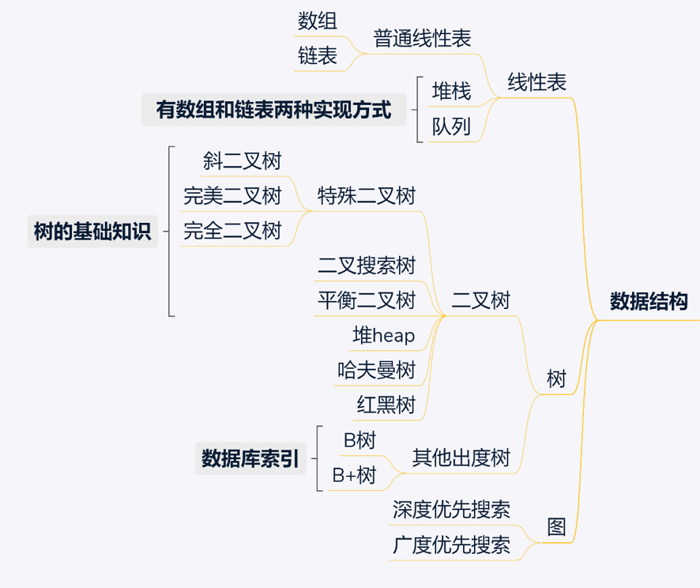
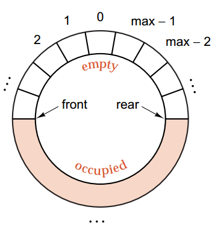

<!--
 * @Author: your name
 * @Date: 2020-06-15 19:36:05
 * @LastEditTime: 2020-07-10 23:27:21
 * @LastEditors: Please set LastEditors
 * @Description: In User Settings Edit
 * @FilePath: \undefinedc:\Users\conan\Desktop\LongTime\StupidBirdFliesFirst\DataStructure\DataStructure.md
--> 



<!-- TOC -->

- [线性表](#线性表)
  - [数组](#数组)
  - [链表](#链表)
  - [双向链表](#双向链表)
  - [数组和链表的区别](#数组和链表的区别)
  - [队列](#队列)
  - [队列的数组实现](#队列的数组实现)
  - [队列的链表实现](#队列的链表实现)
  - [栈](#栈)
  - [栈的数组实现](#栈的数组实现)
  - [栈的链表实现](#栈的链表实现)

<!-- /TOC -->

# 线性表
线性表就是n个具有相同特性的数据元素的有限序列。

## 数组
c++中的数组一般用int[]来表示，可以存储一组相同类型的数据。数组在声明时必须预留出空间，在使用前要申请空间，所以很有可能浪费内存。数组所占用的空间是一段连续的区域，所以所有的数据的地址都是连续的。数组很难在中间插入数据，但是读取的效率比较高。

初始化数组：
```c++
double balance[5] = {1000.0, 2.0, 3.4, 7.0, 50.0};
double balance[] = {1000.0, 2.0, 3.4, 7.0, 50.0};
```

读取：
```c++
balance[4] = 50.0;
double salary = balance[9];
```

在STL中，array是可以代替数组的，与数组的基本特点一致。针对数组和array无法变长的缺点，STL中提供了vector。

## 链表
链表虽然也是将相同的数据存储成线性模式，但是它与数组有很大不同，链表的存储空间是离散的，并不会占用一整块连续的空间，所以每个元素除了存储自己的值以外还要存储下一个元素的地址。链表比较容易在中间插入或者删减数据，但是读取效率很低，因为只能从头到尾遍历。

C++链表的一般写法：
```c++
 struct ListNode {
    int val;
    ListNode *next;
    ListNode(int x) : val(x), next(NULL) {}
};
```

STL中list可以代替链表。

## 双向链表
双向链表，又称为双链表，是链表的一种，它的每个数据结点中都有两个指针，分别指向直接后继和直接前驱。所以，从双向链表中的任意一个结点开始，都可以很方便地访问它的前驱结点和后继结点。一般我们都构造双向循环链表。


双向链表在程序中与单向链表最大的不同就是除了next以外还会记pre节点

双链表插入的两种方法：
```
p->next = q;  //p的后继
p->pre = q->pre;//p的前驱
q->pre = p; //(q)的前驱
p->pre->next = p;///新节点的前驱( p->pre)的后继

p->next = q;  //p的后继
p->pre = q->pre;//p的前驱
q->pre->next = p;  //这一步要在前面，
q->pre = p;
```
## 数组和链表的区别
- 存储：数组时连续的内存空间，链表不需要连续
- 长度：数组的长度需要预先确定，若超出数组则会溢出；链表的长度是动态扩展的
- 随机访问：即按照需要访问线性表中第n个元素。数组可以随机访问，时间复杂度为O(1)；链表不支持随机访问，平均需要O(n)
- 插入、删除：数组其实位置的插入和删除， 时间复杂度为O(n)；链表的时间复杂度为O(1)
- 数组从栈中分配空间，链表从堆中分配空间

## 队列
队列的最大特点就是依照存储顺序，先进先出。一般改变队列中元素的操作方法只有两个——push与pop。push是把元素从队尾插入，pop是把元素从队头删除。

## 队列的数组实现
队列的数组实现有两种形式，一种是线性实现，另一种是循环实现。

线性实现如下所示，front表示当前队列的队首，rear表示当前队列的队尾。因为数组必须要提前声明占用的空间，所以线性实现有一定的局限性，当rear抵达max-1的时候就不能再让元素入队了。此时front前面的空间将被浪费，因为前面的都出去了，然后就没法再被使用。


循环实现就是把一个数组看成一个循环的圆，当rear或front抵达max - 1的时候，再前进，将回到0处。这样一来，就能对数组的空间有充分的利用。当然实际上的数组不可能是个环，实现这个环的方式是head和rear对数组长度求余数，这样保证head和rear的序号永远在一个固定范围内。


在实现的时候，需要区分如何判断队列已满或者队列已空。一般的判断准则是当rear的下一个位置是front的时候，则队列已满。当rear和front的位置重叠，则队列已空。

```c++
template <class T>
class Queue {
private:
    static const int maxqueue = 10; // 所占用的最大空间
    T entry[maxqueue + 1];  // 分配比maxqueue + 1的空间
                            // 实际上队列的可用空间还是maxque
    int head; // 队首序号
    int rear; // 队尾序号
    int queueSize; // 队列尺寸
 
    bool full() const {
        return (((rear + 1) % (maxqueue + 1)) == head) // 求余都是为了让rear和front的范围限定在[0, 10]
            && (queueSize == maxqueue);
    }

public:
    Queue() : head(0), rear(0), queueSize(0) {
        for (int i = 0; i < maxqueue + 1; i++)
            entry[i] = T();
        }

    // 下面求余都是为了让rear和front的范围限定在[0, 10]

    void push(const T &val) {
        if (!full()) {
            entry[rear] = val;
            rear = (rear + 1) % (maxqueue + 1);// 插入数据以后rear再向后一个，为了防止rear+1以后比10大，所以要求余
            ++queueSize;
        }
    }

    void pop() {
        if (!empty()) {
            head = (head + 1) % (maxqueue + 1);
            --queueSize;
        }
    }

    T front() const {
        if (!empty())
        return entry[head];
    }

    T back() const {
        if (!empty())
        // rear-1是队列最后一个元素的位置
        // rear-1可能是-1，所以将其跳转到maxqueue位置
      return entry[(rear - 1 + (maxqueue + 1)) % (maxqueue + 1)];
    }

    bool empty() const {
        return ((rear + 1) % (maxqueue + 1) == head) && (queueSize == 0);
    }

    int size() const {
        return queueSize;
    }
};
```

## 队列的链表实现
链表的实现总体来说就简单理解一些，利用两个结点，head记录链表头即队头，rear记录链表尾即队尾。
```c++
template <class T>
class Queue {
private:
    struct Node {
        T data;
        Node *next;
    };

private:
    Node *head;
    Node *rear;
    int queueSize;

public:
    Queue() : head(NULL), rear(NULL), queueSize(0) { }

    ~Queue() {
        while (!empty())
        pop();
    }

    void push(const T &val) {
        Node *new_node = new Node;
        new_node->data = val;
        new_node->next = NULL;
        if (head == NULL && rear == NULL) {
            head = rear = new_node;
        } else {
            rear->next = new_node;
            rear = rear->next;
        }
        ++queueSize;
    }

    void pop() {
        if (!empty()) {
            Node *temp = head;
            head = head->next;
            delete temp;
            --queueSize;
        }
    }
 
    T front() const {
        if (!empty())
        return head->data;
    }

    T back() const {
        if (!empty()) return rear->data;
    }

    bool empty() const {
        return queueSize == 0;
    }

    int size() const {
        return queueSize;
    }
};
```

## 栈
栈跟队列相反，存储的数据按照顺序先进后出

## 栈的数组实现
因为一开始入栈的数据会最晚出去，出去栈就空了，所以不用循环数组：
```c++
#define MAXSIZE 10;

template<class T>
class Stack{
public:
    //默认构造函数
    Stack():maxSize(MAXSIZE),top(-1){
        arrays=new T[maxSize];
        if(arrays==NULL) cout<<"动态分配内存失败";
    }

    Stack(size_t maxElements):maxSize(maxElements),top(-1){
        arrays=new T[maxSize];//创建存储栈的数组
    }

	Stack(T data[],size_t maxElments):maxSize(maxElements),top(-1){
        arrays=new T[maxSize];//创建存储栈的数组

	    for(size_t i=0;i<maxSize;i++){
		    arrays[i]=data[i];
	    }
	    top+=maxSize;
    }

	~Stack(){
        delete[] arrays;
    }

	//入栈
	void Push(T data){
        if(isFull()){
		    throw runtime_error("Full stack");
        }
	    else{
            top++;//指向栈顶
            arrays[top]=data;	
	    }
    }

	//出栈并返回
	T Pop(){
        if(isEmpty()){
		    throw runtime_error("No elements in the stack");
	    }
	    else{
		    T data=arrays[top];
		    top--;
		    return data;
	    }
    }

	//返回栈顶元素
	T Top(){
        if(isEmpty()){
		    throw runtime_error("No elements in the stack");
	    }
	    else{
		    return arrays[top];
	    }
    }

	//判断是否为空栈
	bool isEmpty(){
        return top==-1;
    }

	//栈是否已满
	bool isFull(){
        return top==maxSize-1;
    }
 
	//清空栈
	void Clear(){
        while (top!=-1){
		    top--;
	    }
    }

	//获得栈里元素的个数
	size_t GetSize(){
        return top+1;
    }

private:
	//栈标指示器
	size_t top;

	//数组
	T *arrays;

	//栈的容量
	size_t maxSize;
};
```

## 栈的链表实现
链表实现栈最大的难点是出栈时该怎么让指针回到上一个数据。为了避免这种问题，链表的栈push进来的数据全部都插在head后面：
```c++
template <typename T> 
class Stack {
    struct node {
        T value;  //储存的值
        node *next;
        node() :next(nullptr) {};
        node(T t) : value(t), next(nullptr) {}
    };

    int length; //入栈数量
    node *head; //栈的头部
public:
    Stack() { 
        length = 0; 
        head = new node; 
    }

    //入栈
    void push(T arg){
        node* pnode = new node(arg);
        pnode->next = head->next;
        head->next = pnode;
        length++;
    }
    //出栈
    T pop(){
        if (head->next!=NULL){
            node* pnode = head->next;
            T pdata = pnode->value;
            head->next = head->next->next;
            delete pnode;
            return pdata;
        }
    }

    //获取栈顶元素
    T top(){
        while (head->next!=NULL){
            return head->next->value;
        }
    }

    void print(); //打印栈
    int size(); //获取栈内元素个数
    bool isEmpty(); //判断空
};

template<typename T>
void Stack<T>::print() {
    while (head->next != NULL)
    {
        head = head->next;
        cout << head->value << endl;
    }
}

template<typename T>
int Stack<T>::size() {
    return length;
}

template<typename T>
bool Stack<T>::isEmpty() {
    return length == 0;
}
```