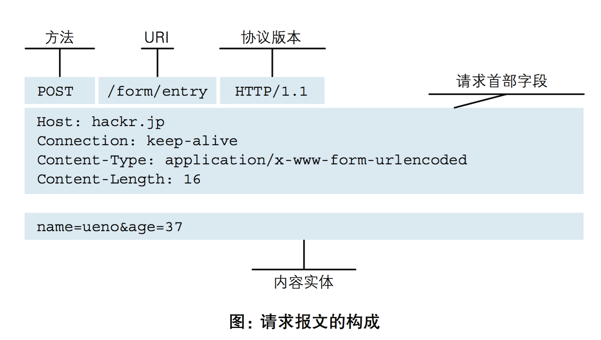
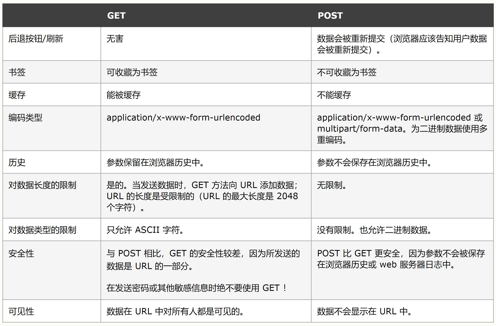
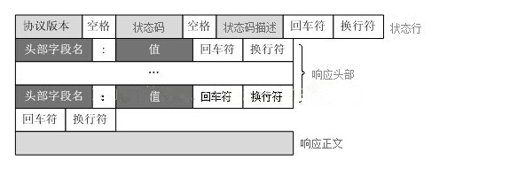
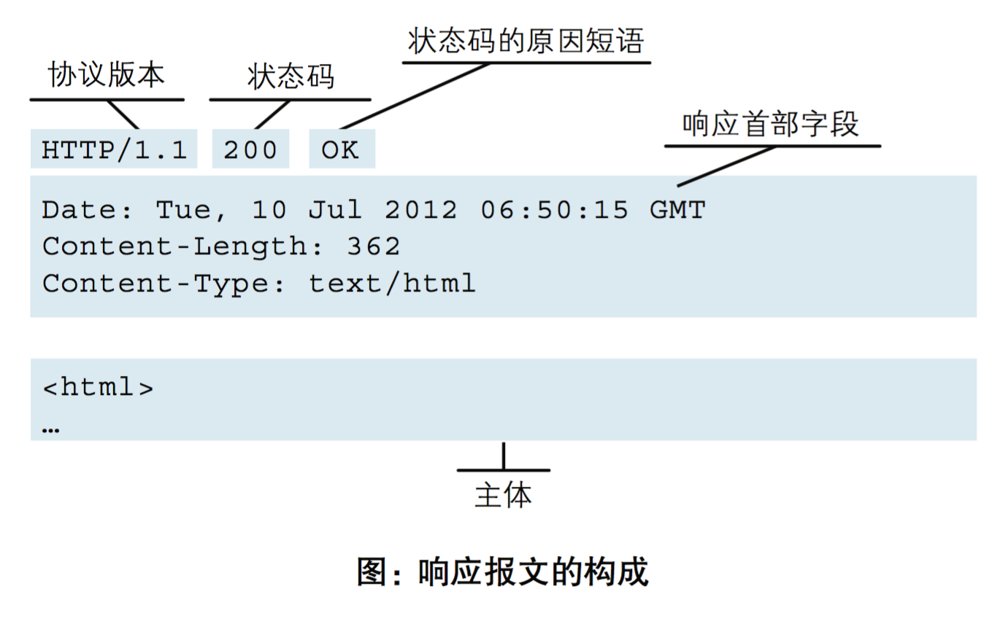

<!-- TOC -->

- [1. HTTP](#1-http)
  - [1.1. HTTP请求报文](#11-http请求报文)
    - [1.1.1. 方法](#111-方法)
      - [1.1.1.1. GET](#1111-get)
      - [1.1.1.2. HEAD](#1112-head)
      - [1.1.1.3. POST](#1113-post)
      - [1.1.1.4. PUT](#1114-put)
      - [1.1.1.5. DELETE](#1115-delete)
      - [1.1.1.6. TRACE](#1116-trace)
      - [1.1.1.7. OPTIONS](#1117-options)
      - [1.1.1.8. CONNECT](#1118-connect)
      - [1.1.1.9. GET和POST的区别](#1119-get和post的区别)
      - [1.1.1.10. 方法名的注意点](#11110-方法名的注意点)
    - [1.1.2. URL](#112-url)
  - [1.2. HTTP响应报文](#12-http响应报文)
    - [1.2.1. HTTP状态码](#121-http状态码)
    - [1.2.2. 常见首部字段](#122-常见首部字段)
      - [1.2.2.1. User-Agent](#1221-user-agent)
      - [1.2.2.2. Content-Length](#1222-content-length)
      - [1.2.2.3. Content-Type](#1223-content-type)
  - [cookie和session](#cookie和session)
    - [cookie](#cookie)
    - [session](#session)
    - [cookie和session的不同](#cookie和session的不同)
  - [HTTP版本](#http版本)
    - [HTTP 1.0](#http-10)
    - [HTTP 1.1](#http-11)
- [2. 域名系统](#2-域名系统)
- [3. 文件传送协议](#3-文件传送协议)
- [4. IP地址](#4-ip地址)
  - [4.1. 子网掩码](#41-子网掩码)
- [5. 网关](#5-网关)
- [6. 动态主机配置协议](#6-动态主机配置协议)
- [7. 远程登录协议](#7-远程登录协议)
- [8. 电子邮件协议](#8-电子邮件协议)
  - [8.1. SMTP](#81-smtp)
  - [8.2. POP3](#82-pop3)
  - [8.3. IMAP](#83-imap)
- [9. 常用端口](#9-常用端口)
- [10. Web 页面请求过程](#10-web-页面请求过程)
  - [10.1. DHCP配置主机信息](#101-dhcp配置主机信息)
  - [10.2. ARP解析MAC地址](#102-arp解析mac地址)
  - [10.3. DNS 解析域名](#103-dns-解析域名)
  - [10.4. HTTP请求页面](#104-http请求页面)

<!-- /TOC -->
# 1. HTTP
超文本传输协议（英文：HyperText Transfer Protocol，缩写：HTTP）是一种用于分布式、协作式和超媒体信息系统的应用层协议。HTTP是万维网的数据通信的基础。一个应用层协议，主要就用来做浏览器与服务器的通信。

HTTP是一个客户端终端（用户）和服务器端（网站）请求和应答的标准（TCP）。通过使用网页浏览器、网络爬虫或者其它的工具，客户端发起一个HTTP请求到服务器上指定端口（默认端口为80）。我们称这个客户端为用户代理程序（user agent）。应答的服务器上存储着一些资源，比如HTML文件和图像。我们称这个应答服务器为源服务器（origin server）。在用户代理和源服务器中间可能存在多个“中间层”，比如代理服务器、网关或者隧道（tunnel）。

尽管TCP/IP协议是互联网上最流行的应用，HTTP协议中，并没有规定必须使用它或它支持的层。事实上，HTTP可以在任何互联网协议上，或其他网络上实现。HTTP假定其下层协议提供可靠的传输。因此，任何能够提供这种保证的协议都可以被其使用。因此也就是其在TCP/IP协议族使用TCP作为其传输层。

通常，由HTTP客户端发起一个请求，创建一个到服务器指定端口（默认是80端口）的TCP连接。HTTP服务器则在那个端口监听客户端的请求。一旦收到请求，服务器会向客户端返回一个状态，比如"HTTP/1.1 200 OK"，以及返回的内容，如请求的文件、错误消息、或者其它信息。

HTTP协议定义Web客户端如何从Web服务器请求Web页面，以及服务器如何把Web页面传送给客户端。HTTP协议采用了请求/响应模型。客户端向服务器发送一个请求报文，请求报文包含请求的方法、URL、协议版本、请求头部和请求数据。服务器以一个状态行作为响应，响应的内容包括协议的版本、成功或者错误代码、服务器信息、响应头部和响应数据。

HTTP协议是请求响应模式，必须有请求有响应。http本身不保存状态，自身不对请求和响应之间的通信状态进行保存。也就是说在HTTP这个 级别,协议对于发送过的请求或响应都不做持久化处理。使用HTTP协议,每当有新的请求发送时,就会有对应的新响应产 生。协议本身并不保留之前一切的请求或响应报文的信息。这是为了更快地处理大量事务,确保协议的可伸缩性,而特意把HTTP协议设计成 如此简单的。可是,随着Web的不断发展,因无状态而导致业务处理变得棘手 的情况增多了。比如,用户登录到一家购物网站,即使他跳转到该站的 其他页面后,也需要能继续保持登录状态。针对这个实例,网站为了能 够掌握是谁送出的请求,需要保存用户的状态。HTTP/1.1虽然是无状态协议,但为了实现期望的保持状态功能, 于是引入了Cookie技术。有了Cookie再用HTTP协议通信,就可以管 理状态了。有关Cookie的详细内容稍后讲解。

无连接的含义是限制每次连接只处理一个请求。服务器处理完客户的请求，并收到客户的应答后，即断开连接。采用这种方式可以节省传输时间，并且可以提高并发性能，不能和每个用户建立长久的连接，请求一次相应一次，服务端和客户端就中断了。但是无连接有两种方式，早期的http协议是一个请求一个响应之后，直接就断开了，但是现在的http协议1.1版本不是直接就断开了，而是等几秒钟，这几秒钟是等什么呢，等着用户有后续的操作，如果用户在这几秒钟之内有新的请求，那么还是通过之前的连接通道来收发消息，如果过了这几秒钟用户没有发送新的请求，那么就会断开连接，这样可以提高效率，减少短时间内建立连接的次数，因为建立连接也是耗时的，默认的好像是3秒中现在，但是这个时间是可以通过咱们后端的代码来调整的，自己网站根据自己网站用户的行为来分析统计出一个最优的等待时间。

## 1.1. HTTP请求报文

### 1.1.1. 方法
HTTP的请求中定义了八种方法：
#### 1.1.1.1. GET
向指定的资源发出“显示”请求。使用GET方法应该只用在读取数据，而不应当被用于产生“副作用”的操作中，例如在Web Application中。其中一个原因是GET可能会被网络蜘蛛等随意访问。
#### 1.1.1.2. HEAD
与GET方法一样，都是向服务器发出指定资源的请求。只不过服务器将不传回资源的本文部分。它的好处在于，使用这个方法可以在不必传输全部内容的情况下，就可以获取其中“关于该资源的信息”（元信息或称元数据）。
#### 1.1.1.3. POST
向指定资源提交数据，请求服务器进行处理（例如提交表单或者上传文件）。数据被包含在请求本文中。这个请求可能会创建新的资源或修改现有资源，或二者皆有。
#### 1.1.1.4. PUT
向指定资源位置上传其最新内容。
#### 1.1.1.5. DELETE
请求服务器删除Request-URI所标识的资源。
#### 1.1.1.6. TRACE
回显服务器收到的请求，主要用于测试或诊断。
#### 1.1.1.7. OPTIONS
这个方法可使服务器传回该资源所支持的所有HTTP请求方法。用'*'来代替资源名称，向Web服务器发送OPTIONS请求，可以测试服务器功能是否正常运作。
#### 1.1.1.8. CONNECT
HTTP/1.1协议中预留给能够将连接改为管道方式的代理服务器。通常用于SSL加密服务器的链接（经由非加密的HTTP代理服务器）。

#### 1.1.1.9. GET和POST的区别
他们之间并没有本质区别，主要的区别都在具体实现上，也就是语义层面的不同。

GET的语义是请求获取指定的资源。GET方法是安全、幂等、可缓存的（除非有 Cache-ControlHeader的约束）,GET方法的报文主体没有任何语义。

POST的语义是根据请求负荷（报文主体）对指定的资源做出处理，具体的处理方式视资源类型而不同。POST不安全，不幂等，（大部分实现）不可缓存。

#### 1.1.1.10. 方法名的注意点
1. 方法名称是区分大小写的。当某个请求所针对的资源不支持对应的请求方法的时候，服务器应当返回状态码405（Method Not Allowed），当服务器不认识或者不支持对应的请求方法的时候，应当返回状态码501（Not Implemented）。
2. HTTP服务器至少应该实现GET和HEAD方法，其他方法都是可选的。当然，所有的方法支持的实现都应当匹配下述的方法各自的语义定义。此外，除了上述方法，特定的HTTP服务器还能够扩展自定义的方法。例如PATCH（由 RFC 5789 指定的方法）用于将局部修改应用到资源。

### 1.1.2. URL
HTTP的统一资源定位符将从因特网获取信息的五个基本元素包括在一个简单的地址中：
- 传送协议。
- 层级URL标记符号(为[//],固定不变)
- 访问资源需要的凭证信息（可省略）
- 服务器。（通常为域名，有时为IP地址）
- 端口号。（以数字方式表示，若为HTTP的默认值“:80”可省略）
- 路径。（以“/”字符区别路径中的每一个目录名称）
- 查询。（GET模式的窗体参数，以“?”字符为起点，每个参数以“&”隔开，再以“=”分开参数名称与数据，通常以UTF8的URL编码，避开字符冲突的问题）
- 片段。以“#”字符为起点

以http://www.luffycity.com:80/news/index.html?id=250&page=1 为例, 其中：
- http，是协议；
- www.luffycity.com，是服务器；
- 80，是服务器上的默认网络端口号，默认不显示；
- /news/index.html，是路径（URI：直接定位到对应的资源）；
- ?id=250&page=1，是查询。
  
大多数网页浏览器不要求用户输入网页中“http://”的部分，因为绝大多数网页内容是超文本传输协议文件。同样，“80”是超文本传输协议文件的常用端口号，因此一般也不必写明。一般来说用户只要键入统一资源定位符的一部分（www.luffycity.com:80/news/index.html?id=250&page=1）就可以了。

由于超文本传输协议允许服务器将浏览器重定向到另一个网页地址，因此许多服务器允许用户省略网页地址中的部分，比如 www。从技术上来说这样省略后的网页地址实际上是一个不同的网页地址，浏览器本身无法决定这个新地址是否通，服务器必须完成重定向的任务。

## 1.2. HTTP响应报文

### 1.2.1. HTTP状态码
所有HTTP响应的第一行都是状态行，依次是当前HTTP版本号，3位数字组成的状态代码，以及描述状态的短语，彼此由空格分隔。

状态代码的第一个数字代表当前响应的类型：

- 1xx消息——请求已被服务器接收，继续处理
- 2xx成功——请求已成功被服务器接收、理解、并接受
- 3xx重定向——需要后续操作才能完成这一请求
- 4xx请求错误——请求含有词法错误或者无法被执行
- 5xx服务器错误——服务器在处理某个正确请求时发生错误
- 
虽然 RFC 2616 中已经推荐了描述状态的短语，例如"200 OK"，"404 Not Found"，但是WEB开发者仍然能够自行决定采用何种短语，用以显示本地化的状态描述或者自定义信息。

### 1.2.2. 常见首部字段
#### 1.2.2.1. User-Agent
属于请求首部字段，HTTP客户端程序的信息。

User-Agent: Mozilla/5.0 (Windows NT 6.1; WOW64; rv:13.0) Gecko/20100101 Firefox/13.0.1

User-Agent: Fiddler

首部字段 User-Agent 会将创建请求的浏览器和用户代理名称等信息传达给服务器。

由网络爬虫发起请求时，有可能会在字段内添加爬虫作者的电子邮件地址。此外，如果请求经过代理，那么中间也很可能被添加上代理服务器的名称。

#### 1.2.2.2. Content-Length
Content-Length: 15000

首部字段 Content-Length 表明了实体主体部分的大小（单位是字节）。对实体主体进行内容编码传输时，不能再使用 Content-Length 首部字段。

#### 1.2.2.3. Content-Type

Content-Type: text/html; charset=utf-8

Content-Type: application/json; charset=utf-8

Content-Type: application/octet-stream

首部字段 Content-Type 说明了实体主体内对象的媒体类型。和首部字段 Accept 一样，字段值用 type/subtype 形式赋值。

参数 charset 使用 ISO-8859-1 或 euc-jp 等字符集进行赋值。

下面是导出Excel需要使用的头部设置：

Content-Type: application/vnd.ms-excel; charset=utf-8 

Content-disposition：attachment; filename=xxxx.xls

form 表单的 enctype 属性和这个请求头 Content-Type 有关系。

（1）enctype属性可能的值：application/x-www-form-urlencoded | multipart/form-data | text/plain。属性默认值是：application/x-www-form-urlencoded。

application/x-www-form-urlencoded：表示普通的form表单元素提交，在发送前编码所有字符，提交的参数格式遵循：name=value&name=value&name=value...。

multipart/form-data：表示不对字符编码。直接提交二进制文件流。在使用包含文件上传控件的form表单时，必须使用该值。

text/plain：表示空格转换为 "+" 加号，但不对特殊字符编码。

（2）当我们使用form表单上传文件时post请求的时候，需要在form表单中添加enctype="multipart/form-data"属性。

请求头中有一个Content-type字段，会声明数据编码格式。浏览器会自动添加 Content-Type:multipart/form-data。

如果form中没有指定enctype，浏览器会自动添加默认的 Content-Type:application/x-www-form-urlencoded;charset=utf-8。

## cookie和session
### cookie
而Web应用程序是使用HTTP协议传输数据的。HTTP协议是无状态的协议。一旦数据交换完毕，客户端与服务器端的连接就会关闭，再次交换数据需要建立新的连接。这就意味着服务器无法从连接上跟踪会话。即用户A购买了一件商品放入购物车内，当再次购买商品时服务器已经无法判断该购买行为是属于用户A的会话还是用户B的会话了。要跟踪该会话，必须引入一种机制。

Cookie就是这样的一种机制。它可以弥补HTTP协议无状态的不足。在Session出现之前，基本上所有的网站都采用Cookie来跟踪会话。

由于HTTP是一种无状态的协议，服务器单从网络连接上无从知道客户身份。怎么办呢？就给客户端们颁发一个通行证吧，每人一个，无论谁访问都必须携带自己通行证。这样服务器就能从通行证上确认客户身份了。这就是Cookie的工作原理。

Cookie实际上是一小段的文本信息。客户端请求服务器，如果服务器需要记录该用户状态，就使用response向客户端浏览器颁发一个Cookie。客户端浏览器会把Cookie保存起来。当浏览器再请求该网站时，浏览器把请求的网址连同该Cookie一同提交给服务器。服务器检查该Cookie，以此来辨认用户状态。服务器还可以根据需要修改Cookie的内容。

### session
除了使用Cookie，Web应用程序中还经常使用Session来记录客户端状态。Session是服务器端使用的一种记录客户端状态的机制，使用上比Cookie简单一些，相应的也增加了服务器的存储压力。

Session是另一种记录客户状态的机制，不同的是Cookie保存在客户端浏览器中，而Session保存在服务器上。客户端浏览器访问服务器的时候，服务器把客户端信息以某种形式记录在服务器上。这就是Session。客户端浏览器再次访问时只需要从该Session中查找该客户的状态就可以了。

 如果说Cookie机制是通过检查客户身上的“通行证”来确定客户身份的话，那么Session机制就是通过检查服务器上的“客户明细表”来确认客户身份。Session相当于程序在服务器上建立的一份客户档案，客户来访的时候只需要查询客户档案表就可以了。

session的实现方法有两种，一种是通过cookie，另一个是通过url重写。通过cookie就是在第一次连接时将sessionID以cookie的形式发到客户端，当客户端再次联系的时候就会带上此次的cookie。当浏览器禁用cookie时，就需要使用URL重写来实现session，这种补充机制要求在响应消息的实体内容中必须包含下一次请求的超链接，并将会话标识号作为超链接的URL地址的一个特殊参数。

### cookie和session的不同
- 作用范围不同，Cookie 保存在客户端（浏览器），Session 保存在服务器端。
- 存取方式的不同，Cookie 只能保存 ASCII，Session 可以存任意数据类型，一般情况下我们可以在 Session 中保持一些常用变量信息，比如说 UserId 等。
- 有效期不同，Cookie 可设置为长时间保持，比如我们经常使用的默认登录功能，Session 一般失效时间较短，客户端关闭或者 Session 超时都会失效。
- 隐私策略不同，Cookie 存储在客户端，比较容易遭到不法获取，早期有人将用户的登录名和密码存储在 Cookie 中导致信息被窃取；Session 存储在服务端，安全性相对 Cookie 要好一些。
- 存储大小不同， 单个 Cookie 保存的数据不能超过 4K，Session 可存储数据远高于 Cookie。

## HTTP版本
### HTTP 1.0
HTTP 协议老的标准是HTTP/1.0，为了提高系统的效率，HTTP 1.0规定浏览器与服务器只保持短暂的连接，浏览器的每次请求都需要与服务器建立一个TCP连接，服务器完成请求处理后立即断开TCP连接，服务器不跟踪每个客户也不记录过去的请求。但是，这也造成了一些性能上的缺陷，例如，一个包含有许多图像的网页文件中并没有包含真正的图像数据内容，而只是指明了这些图像的URL地址，当WEB浏览器访问这个网页文件时，浏览器首先要发出针对该网页文件的请求，当浏览器解析WEB服务器返回的该网页文档中的HTML内容时，发现其中的图像标签后，浏览器将根据标签中的src属性所指定的URL地址再次向服务器发出下载图像数据的请求。显然，访问一个包含有许多图像的网页文件的整个过程包含了多次请求和响应，每次请求和响应都需要建立一个单独的连接，每次连接只是传输一个文档和图像，上一次和下一次请求完全分离。即使图像文件都很小，但是客户端和服务器端每次建立和关闭连接却是一个相对比较费时的过程，并且会严重影响客户机和服务器的性能。当一个网页文件中包含JavaScript文件，CSS文件等内容时，也会出现类似上述的情况。

同时，带宽和延迟也是影响一个网络请求的重要因素。在网络基础建设已经使得带宽得到极大的提升的当下，大部分时候都是延迟在于响应速度。基于此会发现，http1.0被抱怨最多的就是连接无法复用，和队头阻塞（head of line blocking）这两个问题。理解这两个问题有一个十分重要的前提：客户端是依据域名来向服务器建立连接，一般PC端浏览器会针对单个域名的server同时建立6～8个连接，手机端的连接数则一般控制在4～6个。显然连接数并不是越多越好，资源开销和整体延迟都会随之增大。连接无法复用会导致每次请求都经历三次握手和慢启动。三次握手在高延迟的场景下影响较明显，慢启动则对文件类大请求影响较大。head of line blocking会导致带宽无法被充分利用，以及后续健康请求被阻塞。

head of line blocking(holb)会导致健康的请求会被不健康的请求影响，而且这种体验的损耗受网络环境影响，出现随机且难以监控。为了解决holb带来的延迟，协议设计者设计了一种新的pipelining机制。pipelining只能适用于http1.1,而且由于使用苛刻，很多浏览器厂商并不支持。

### HTTP 1.1

# 2. 域名系统

DNS是一个分布式数据库，提供了主机名和IP地址之间相互转换的服务。

所谓域名就是网站的网址，例如www.baidu.com这样的，IP地址就是数字化的网站地址，例如64.202.189.170。

其中的www实现了信息浏览查询服务。

这里的分布式数据库是指，每个站点只保留它自己的那部分数据。

域名具有层次结构，从上到下依次为：根域名、顶级域名、二级域名。通过查看下图可以得知，所谓根服务器会先根据网址的后缀指引你去哪个顶服务器，再根据网址名指引你去哪个二级服务器

域名的访问流程是：
1. 当用户在浏览器输入域名以后，浏览器将会开启查询，首先查询浏览器的缓存，查不到就查操作系统的缓存，再查不到就查路由的缓存，还查不到就去找互联网服务提供商（ISP），无线运营商或者第三方供应商里提供的DNS服务器去查。如果ISP的DNS服务器也查不到，ISP就会向根服务器发出请求，使用递归解析程序。
2. 递归解析程序首先联系根服务器，全球各地均有根服务器，每一个根服务器都知道不同后缀所对应的顶级域的DNS信息，递归解析程序向根服务器询问关于你想查的（例如.com）的DNS信息
3. 顶级域中存储了他们的二级域的地址信息，当查询到二级域时，二级服务器会回答所要的网址的IP地址
4. DNS服务器了解了IP地址以后将答案返回到递归解析程序
5. 浏览器从递归解析程序获得IP地址，从而能供访问这个IP地址

DNS可以使用UDP或者TCP进行传输，使用的端口号都为53（53号端口专用于域名解析）。大多数情况下DNS使用UDP进行传输，这就要求域名解析器和域名服务器都必须自己处理超时和重传从而保证可靠性。在两种情况下会使用 TCP 进行传输：

- 如果返回的响应超过的 512 字节（UDP 最大只支持 512 字节的数据）。
- 区域传送（区域传送是主域名服务器向辅助域名服务器传送变化的那部分数据）。

# 3. 文件传送协议

FTP 使用 TCP 进行连接，它需要两个连接来传送一个文件：

- 控制连接：服务器打开端口号 21 等待客户端的连接，客户端主动建立连接后，使用这个连接将客户端的命令传送给服务器，并传回服务器的应答。
- 数据连接：用来传送一个文件数据。

根据数据连接是否是服务器端主动建立，FTP 有主动和被动两种模式：

- 主动模式：服务器端主动建立数据连接，其中服务器端的端口号为 20，客户端的端口号随机，但是必须大于 1024，因为 0\~1023 是熟知端口号。

- 被动模式：客户端主动建立数据连接，其中客户端的端口号由客户端自己指定，服务器端的端口号随机。

主动模式要求客户端开放端口号给服务器端，需要去配置客户端的防火墙。被动模式只需要服务器端开放端口号即可，无需客户端配置防火墙。但是被动模式会导致服务器端的安全性减弱，因为开放了过多的端口号。

两个端口不会同时释放，

# 4. IP地址
IP地址被用来给Internet上的电脑一个编号。大家日常见到的情况是每台联网的PC上都需要有IP地址，才能正常通信。我们可以把“个人电脑”比作“一台电话”，那么“IP地址”就相当于“电话号码”，而Internet中的路由器，就相当于电信局的“程控式交换机”。

IP地址是一个32位的二进制数，通常被分割为4个“8位二进制数”（也就是4个字节）。IP地址通常用“点分十进制”表示成（a.b.c.d）的形式，其中，a,b,c,d都是0~255之间的十进制整数。例：点分十进IP地址（100.4.5.6），实际上是32位二进制数（01100100.00000100.00000101.00000110）。

## 4.1. 子网掩码

子网掩码不能单独存在，它必须结合IP地址一起使用。子网掩码只有一个作用，就是将某个IP地址划分成网络地址和主机地址两部分。

子网掩码是一个32位地址，用于屏蔽IP地址的一部分以区别网络标识和主机标识，并说明该IP地址是在局域网上，还是在远程网上。

子网掩码——屏蔽一个IP地址的网络部分的“全1”比特模式。对于A类地址来说，默认的子网掩码是255.0.0.0；对于B类地址来说默认的子网掩码是255.255.0.0；对于C类地址来说默认的子网掩码是255.255.255.0。

- 通过子网掩码，就可以判断两个IP在不在一个局域网内部。
- 子网掩码可以看出有多少位是网络号，有多少位是主机号

|  类型   | 特征  |网络范围|默认掩码|
|  ----  | ----  |----  |----  |
| A  | 第1个8位中的第1位始终为0 |0-127.x.x.x|255.0.0.0/8|
| B|第1个8位中的第1、2位始终为10|	128-191.x.x.x|	255.255.0.0/16|
|C|	第1个8位中的第1、2、3位始终为110|	192-y.x.x.x	|255.255.255.0/24|

假设局域网中子网掩码是255.255.0.0，则190.168.0.0表示本局域网的IP地址（本网段的网络地址），190.168.255.255表示本网段的广播地址，除了这俩地址剩下的都能用。

# 5. 网关
网关实质上是一个网络通向其他网络的IP地址。比如有网络A和网络B，网络A的IP地址范围为“192.168.1.1~192. 168.1.254”，子网掩码为255.255.255.0；网络B的IP地址范围为“192.168.2.1~192.168.2.254”，子网掩码为255.255.255.0。在没有路由器的情况下，两个网络之间是不能进行TCP/IP通信的，即使是两个网络连接在同一台交换机（或集线器）上，TCP/IP协议也会根据子网掩码（255.255.255.0）判定两个网络中的主机处在不同的网络里。而要实现这两个网络之间的通信，则必须通过网关。如果网络A中的主机发现数据包的目的主机不在本地网络中，就把数据包转发给它自己的网关，再由网关转发给网络B的网关，网络B的网关再转发给网络B的某个主机（如附图所示）。网络A向网络B转发数据包的过程。

所以说，只有设置好网关的IP地址，TCP/IP协议才能实现不同网络之间的相互通信。那么这个IP地址是哪台机器的IP地址呢？网关的IP地址是具有路由功能的设备的IP地址，具有路由功能的设备有路由器、启用了路由协议的服务器（实质上相当于一台路由器）、代理服务器（也相当于一台路由器）。

在和 Novell NetWare 网络交互操作的上下文中，网关在 Windows 网络中使用的服务器信息块 (SMB) 协议以及NetWare网络使用的 NetWare 核心协议 (NCP) 之间起着桥梁的作用。网关也被称为 IP路由器。

如果搞清了什么是网关，默认网关也就好理解了。就好像一个房间可以有多扇门一样，一台主机可以有多个网关。默认网关的意思是一台主机如果找不到可用的网关，就把数据包发给默认指定的网关，由这个网关来处理数据包。现在主机使用的网关，一般指的是默认网关。

# 6. 动态主机配置协议

DHCP(Dynamic Host Configuration Protocol)是一个局域网的网络协议。指的是由服务器控制一段IP地址范围，客户机登录服务器时就可以自动获得服务器分配的IP地址和子网掩码。提供了即插即用的连网方式，用户不再需要手动配置IP地址等信息。

DHCP配置的内容不仅是 IP 地址，还包括子网掩码、网关IP地址。

DHCP工作过程如下：

1. 一台新加入网络的主机首要任务便是找到与其能够交互的DHCP服务器。主机使用UDP分组向端口67发送DHCP发现报文（DHCP discover message）来完成该任务。由于主机新加入该网络，并不知道该网络的IP地址也不知道DHCP服务器的地址。于是该主机在发送包含DHCP发现报文的IP数据报时，使用目的地址为255.255.255.255的广播地址和使用代表“本主机”的0.0.0.0作为源地址。DHCP客户将该数据报传递给链路层，链路层然后将该帧广播到所有与该子网连接的子网。其中源端口号为68，目的端口为67。事务ID为654。
2. DHCP服务器收到一个DHCP发现报文时，将使用DHCP提供报文（DHCP offer message）向客户做出响应。，这里仍然会使用广播地址255.255.255.255作为目的地址（现在客户主机并没有地址）。一个子网中可能会存在好几台DHCP服务器，于是客户可能会在几个提供者之间进行优越选择。每台服务器的提供报文会包含：发现报文的事务ID、向客户推荐的IP地址、网络掩码、以及IP地址租用期（address lease time）,也是就IP地址的有效时间量。租用期通常为几小时或者几天。记为T，这个时间也表示在不更新租约的情况下地址可被租用的时间上限。也包含更新时间（T1）：客户从获得租约到尝试要求服务器更新租约的时间。以及重绑定时间（T2）：客户尝试要求DHCP服务器更新其地址的时间。默认情况下，T1 = T/2；T2 = 7T/8
3. DHCP服务提供报文到达客户后，客户便知道了DHCP服务器的信息。这时，客户从一个或者多个提供者中选择一个，并向选择的服务器发送DHCP请求报文（DHCP request message）,进行响应，回显配置参数。此时的数据报目的地址IP地址仍为广播地址，除了被客户选中的服务器外，其余服务器若收到该报文发现报文选项中的服务器IP地址与自己的不同便不做任何响应，并清除相应地IP分配记录。
4. 服务器使用DHCP ACK报文（DHCP ACK message）对DHCP请求报文进行响应，证实所要求的参数。如果服务器无法分配包含在DHCPREQUEST消息中的地址，该服务器将会响应一个DHCPNAK消息。

# 7. 远程登录协议

Telnet协议是TCP/IP协议族中的一员，用于登录到远程主机上，并且远程主机上的输出也会返回。

TELNET可以适应许多计算机和操作系统的差异，例如不同操作系统系统的换行符定义。

# 8. 电子邮件协议

一个电子邮件系统由三部分组成：用户代理、邮件服务器以及邮件协议。

邮件协议包含发送协议和读取协议，发送协议常用 SMTP，读取协议常用 POP3 和 IMAP。

## 8.1. SMTP

SMTP 只能发送 ASCII 码，而互联网邮件扩充 MIME 可以发送二进制文件。MIME 并没有改动或者取代 SMTP，而是增加邮件主体的结构，定义了非 ASCII 码的编码规则。

## 8.2. POP3

POP3 的特点是只要用户从服务器上读取了邮件，就把该邮件删除。但最新版本的 POP3 可以不删除邮件。

## 8.3. IMAP

IMAP 协议中客户端和服务器上的邮件保持同步，如果不手动删除邮件，那么服务器上的邮件也不会被删除。IMAP 这种做法可以让用户随时随地去访问服务器上的邮件。

# 9. 常用端口

|应用| 应用层协议 | 端口号 | 传输层协议 | 备注 |
| :---: | :--: | :--: | :--: | :--: |
| 域名解析 | DNS | 53 | UDP/TCP | 长度超过 512 字节时使用 TCP |
| 动态主机配置协议 | DHCP | 67/68 | UDP | |
| 简单网络管理协议 | SNMP | 161/162 | UDP | |
| 文件传送协议 | FTP | 20/21 | TCP | 控制连接 21，数据连接 20 |
| 远程终端协议 | TELNET | 23 | TCP | |
| 超文本传送协议 | HTTP | 80 | TCP | |
| 简单邮件传送协议 | SMTP | 25 | TCP | |
| 邮件读取协议 | POP3 | 110 | TCP | |
| 网际报文存取协议 | IMAP | 143 | TCP | |

# 10. Web 页面请求过程

## 10.1. DHCP配置主机信息

- 假设主机最开始没有IP地址以及其它信息，那么就需要先使用DHCP来获取。

- 主机生成一个DHCP请求报文，并将这个报文放入具有目的端口67和源端口68的UDP报文段中。

- 该报文段则被放入在一个具有广播IP目的地址(255.255.255.255) 和源IP地址（0.0.0.0）的 IP 数据报中。

- 该数据报则被放置在MAC帧中，该帧具有目的地址FF:<zero-width space>FF:<zero-width space>FF:<zero-width space>FF:<zero-width space>FF:FF，将广播到与交换机连接的所有设备。

- 连接在交换机的DHCP服务器收到广播帧之后，不断地向上分解得到IP数据报、UDP报文段、DHCP请求报文，之后生成DHCP ACK报文，该报文包含以下信息：IP 地址、DNS 服务器的 IP 地址、默认网关路由器的 IP 地址和子网掩码。该报文被放入 UDP 报文段中，UDP 报文段有被放入 IP 数据报中，最后放入 MAC 帧中。

- 该帧的目的地址是请求主机的MAC地址，因为交换机具有自学习能力，之前主机发送了广播帧之后就记录了MAC地址到其转发接口的交换表项，因此现在交换机就可以直接知道应该向哪个接口发送该帧。

- 主机收到该帧后，不断分解得到DHCP报文。之后就配置它的IP地址、子网掩码和DNS服务器的IP地址，并在其IP转发表中安装默认网关。

## 10.2. ARP解析MAC地址

- 主机通过浏览器生成一个TCP套接字，套接字向HTTP服务器发送HTTP请求。为了生成该套接字，主机需要知道网站的域名对应的 IP 地址。

- 主机生成一个DNS查询报文，该报文具有53号端口，因为DNS服务器的端口号是53。

- 该 DNS 查询报文被放入目的地址为 DNS 服务器 IP 地址的 IP 数据报中。

- 该 IP 数据报被放入一个以太网帧中，该帧将发送到网关路由器。

- DHCP 过程只知道网关路由器的 IP 地址，为了获取网关路由器的 MAC 地址，需要使用 ARP 协议。

- 主机生成一个包含目的地址为网关路由器 IP 地址的 ARP 查询报文，将该 ARP 查询报文放入一个具有广播目的地址（FF:<zero-width space>FF:<zero-width space>FF:<zero-width space>FF:<zero-width space>FF:FF）的以太网帧中，并向交换机发送该以太网帧，交换机将该帧转发给所有的连接设备，包括网关路由器。

- 网关路由器接收到该帧后，不断向上分解得到 ARP 报文，发现其中的 IP 地址与其接口的 IP 地址匹配，因此就发送一个 ARP 回答报文，包含了它的 MAC 地址，发回给主机。

## 10.3. DNS 解析域名

- 知道了网关路由器的MAC地址之后，就可以继续DNS的解析过程了。

- 网关路由器接收到包含DNS查询报文的以太网帧后，抽取出IP数据报，并根据转发表决定该IP数据报应该转发的路由器。

- 因为路由器具有内部网关协议（RIP、OSPF）和外部网关协议（BGP）这两种路由选择协议，因此路由表中已经配置了网关路由器到达DNS服务器的路由表项。

- 到达DNS服务器之后，DNS服务器抽取出 DNS 查询报文，并在 DNS 数据库中查找待解析的域名。

- 找到DNS记录之后，发送DNS回答报文，将该回答报文放入UDP报文段中，然后放入IP数据报中，通过路由器反向转发回网关路由器，并经过以太网交换机到达主机。

## 10.4. HTTP请求页面

- 有了HTTP服务器的IP地址之后，主机就能够生成TCP套接字，该套接字将用于向Web服务器发送HTTP GET报文。

- 在生成TCP套接字之前，必须先与HTTP服务器进行三次握手来建立连接。生成一个具有目的端口80的TCP SYN报文段，并向HTTP服务器发送该报文段。

- HTTP服务器收到该报文段之后，生成TCP SYN ACK报文段，发回给主机。

- 连接建立之后，浏览器生成HTTP GET报文，并交付给HTTP服务器。

- HTTP服务器从TCP套接字读取HTTP GET报文，生成一个HTTP响应报文，将Web页面内容放入报文主体中，发回给主机。

- 浏览器收到HTTP响应报文后，抽取出Web页面内容，之后进行渲染，显示Web页面。

合法的HTTP请求方法有： GET、POST和HEAD 。其中，GET方法用于获取由Request-URI所标识的资源的信息；POST方法用于想服务器发送请求，这点和GET方法没有区别。 但是POST方法要求服务器接收附在请求后面的数据。 HEAD方法与GET方法几乎是一样的， 它们的区别在于HEAD方法只是请求消息报头，而不是完整的内容。