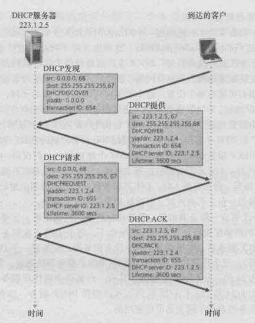

<!--
 * @Author: your name
 * @Date: 2020-06-25 10:07:11
 * @LastEditTime: 2020-07-02 21:51:45
 * @LastEditors: Please set LastEditors
 * @Description: In User Settings Edit
 * @FilePath: \StupidBirdFliesFirst\Network\ApplicationLayer.md
--> 

<!-- GFM-TOC -->
- [域名系统](#域名系统)
- [文件传送协议](#文件传送协议)
- [IP地址](#ip地址)
  - [子网掩码](#子网掩码)
- [动态主机配置协议](#动态主机配置协议)
- [远程登录协议](#远程登录协议)
- [电子邮件协议](#电子邮件协议)
  - [1. SMTP](#1-smtp)
  - [2. POP3](#2-pop3)
  - [3. IMAP](#3-imap)
- [常用端口](#常用端口)
- [Web 页面请求过程](#web-页面请求过程)
  - [1. DHCP 配置主机信息](#1-dhcp-配置主机信息)
  - [2. ARP解析MAC地址](#2-arp解析mac地址)
  - [3. DNS 解析域名](#3-dns-解析域名)
  - [4. HTTP请求页面](#4-http请求页面)
<!-- GFM-TOC -->

# 域名系统

DNS是一个分布式数据库，提供了主机名和IP地址之间相互转换的服务。

所谓域名就是网站的网址，例如www.baidu.com这样的，IP地址就是数字化的网站地址，例如64.202.189.170。

这里的分布式数据库是指，每个站点只保留它自己的那部分数据。

域名具有层次结构，从上到下依次为：根域名、顶级域名、二级域名。通过查看下图可以得知，所谓根服务器会先根据网址的后缀指引你去哪个顶服务器，再根据网址名指引你去哪个二级服务器

域名的访问流程是：
1. 当用户在浏览器输入域名以后，浏览器将会开启查询，查询首先会接触到递归解析程序，这时由互联网服务提供商（ISP），无线运营商或者第三方供应商运营。
2. 递归解析程序首先联系根服务器，全球各地均有根服务器，每一个根服务器都知道不同后缀所对应的顶级域的DNS信息，递归解析程序向根服务器询问关于你想查的（例如.com）的DNS信息
3. 顶级域中存储了他们的二级域的地址信息，当查询到二级域时，二级服务器会回答所要的网址的IP地址
4. DNS服务器了解了IP地址以后将答案返回到递归解析程序
5. 浏览器从递归解析程序获得IP地址，从而能供访问这个IP地址

DNS可以使用UDP或者TCP进行传输，使用的端口号都为53（53号端口专用于域名解析）。大多数情况下DNS使用UDP进行传输，这就要求域名解析器和域名服务器都必须自己处理超时和重传从而保证可靠性。在两种情况下会使用 TCP 进行传输：

- 如果返回的响应超过的 512 字节（UDP 最大只支持 512 字节的数据）。
- 区域传送（区域传送是主域名服务器向辅助域名服务器传送变化的那部分数据）。

# 文件传送协议

FTP 使用 TCP 进行连接，它需要两个连接来传送一个文件：

- 控制连接：服务器打开端口号 21 等待客户端的连接，客户端主动建立连接后，使用这个连接将客户端的命令传送给服务器，并传回服务器的应答。
- 数据连接：用来传送一个文件数据。

根据数据连接是否是服务器端主动建立，FTP 有主动和被动两种模式：

- 主动模式：服务器端主动建立数据连接，其中服务器端的端口号为 20，客户端的端口号随机，但是必须大于 1024，因为 0\~1023 是熟知端口号。

- 被动模式：客户端主动建立数据连接，其中客户端的端口号由客户端自己指定，服务器端的端口号随机。

主动模式要求客户端开放端口号给服务器端，需要去配置客户端的防火墙。被动模式只需要服务器端开放端口号即可，无需客户端配置防火墙。但是被动模式会导致服务器端的安全性减弱，因为开放了过多的端口号。

# IP地址
IP地址被用来给Internet上的电脑一个编号。大家日常见到的情况是每台联网的PC上都需要有IP地址，才能正常通信。我们可以把“个人电脑”比作“一台电话”，那么“IP地址”就相当于“电话号码”，而Internet中的路由器，就相当于电信局的“程控式交换机”。

IP地址是一个32位的二进制数，通常被分割为4个“8位二进制数”（也就是4个字节）。IP地址通常用“点分十进制”表示成（a.b.c.d）的形式，其中，a,b,c,d都是0~255之间的十进制整数。例：点分十进IP地址（100.4.5.6），实际上是32位二进制数（01100100.00000100.00000101.00000110）。

## 子网掩码

子网掩码不能单独存在，它必须结合IP地址一起使用。子网掩码只有一个作用，就是将某个IP地址划分成网络地址和主机地址两部分。
子网掩码是一个32位地址，用于屏蔽IP地址的一部分以区别网络标识和主机标识，并说明该IP地址是在局域网上，还是在远程网上。

子网掩码——屏蔽一个IP地址的网络部分的“全1”比特模式。对于A类地址来说，默认的子网掩码是255.0.0.0；对于B类地址来说默认的子网掩码是255.255.0.0；对于C类地址来说默认的子网掩码是255.255.255.0。

- 通过子网掩码，就可以判断两个IP在不在一个局域网内部。
- 子网掩码可以看出有多少位是网络号，有多少位是主机号

|  类型   | 特征  |网络范围|默认掩码|
|  ----  | ----  |----  |----  |
| A  | 第1个8位中的第1位始终为0 |0-127.x.x.x|255.0.0.0/8|
| B|第1个8位中的第1、2位始终为10|	128-191.x.x.x|	255.255.0.0/16|
|C|	第1个8位中的第1、2、3位始终为110|	192-y.x.x.x	|255.255.255.0/24|

# 动态主机配置协议

DHCP(Dynamic Host Configuration Protocol)是一个局域网的网络协议。指的是由服务器控制一段IP地址范围，客户机登录服务器时就可以自动获得服务器分配的IP地址和子网掩码。提供了即插即用的连网方式，用户不再需要手动配置IP地址等信息。

DHCP配置的内容不仅是 IP 地址，还包括子网掩码、网关IP地址。

DHCP工作过程如下：

1. 客户端发送Discover报文，该报文的目的地址为255.255.255.255:67，源地址为 0.0.0.0:68，被放入 UDP 中，该报文被广播到同一个子网的所有主机上。如果客户端和DHCP服务器不在同一个子网，就需要使用中继代理。
2. DHCP服务器收到Discover报文之后，发送Offer报文给客户端，该报文包含了客户端所需要的信息。因为客户端可能收到多个DHCP服务器提供的信息，因此客户端需要进行选择。
3. 如果客户端选择了某个DHCP服务器提供的信息，那么就发送Request报文给该DHCP服务器。
4. DHCP服务器发送Ack报文，表示客户端此时可以使用提供给它的信息。

# 远程登录协议

Telnet协议是TCP/IP协议族中的一员，用于登录到远程主机上，并且远程主机上的输出也会返回。

TELNET可以适应许多计算机和操作系统的差异，例如不同操作系统系统的换行符定义。

# 电子邮件协议

一个电子邮件系统由三部分组成：用户代理、邮件服务器以及邮件协议。

邮件协议包含发送协议和读取协议，发送协议常用 SMTP，读取协议常用 POP3 和 IMAP。

## 1. SMTP

SMTP 只能发送 ASCII 码，而互联网邮件扩充 MIME 可以发送二进制文件。MIME 并没有改动或者取代 SMTP，而是增加邮件主体的结构，定义了非 ASCII 码的编码规则。

## 2. POP3

POP3 的特点是只要用户从服务器上读取了邮件，就把该邮件删除。但最新版本的 POP3 可以不删除邮件。

## 3. IMAP

IMAP 协议中客户端和服务器上的邮件保持同步，如果不手动删除邮件，那么服务器上的邮件也不会被删除。IMAP 这种做法可以让用户随时随地去访问服务器上的邮件。

# 常用端口

|应用| 应用层协议 | 端口号 | 传输层协议 | 备注 |
| :---: | :--: | :--: | :--: | :--: |
| 域名解析 | DNS | 53 | UDP/TCP | 长度超过 512 字节时使用 TCP |
| 动态主机配置协议 | DHCP | 67/68 | UDP | |
| 简单网络管理协议 | SNMP | 161/162 | UDP | |
| 文件传送协议 | FTP | 20/21 | TCP | 控制连接 21，数据连接 20 |
| 远程终端协议 | TELNET | 23 | TCP | |
| 超文本传送协议 | HTTP | 80 | TCP | |
| 简单邮件传送协议 | SMTP | 25 | TCP | |
| 邮件读取协议 | POP3 | 110 | TCP | |
| 网际报文存取协议 | IMAP | 143 | TCP | |

# Web 页面请求过程

## 1. DHCP 配置主机信息

- 假设主机最开始没有IP地址以及其它信息，那么就需要先使用DHCP来获取。

- 主机生成一个DHCP请求报文，并将这个报文放入具有目的端口67和源端口68的UDP报文段中。

- 该报文段则被放入在一个具有广播IP目的地址(255.255.255.255) 和源IP地址（0.0.0.0）的 IP 数据报中。

- 该数据报则被放置在MAC帧中，该帧具有目的地址FF:<zero-width space>FF:<zero-width space>FF:<zero-width space>FF:<zero-width space>FF:FF，将广播到与交换机连接的所有设备。

- 连接在交换机的DHCP服务器收到广播帧之后，不断地向上分解得到IP数据报、UDP报文段、DHCP请求报文，之后生成DHCP ACK报文，该报文包含以下信息：IP 地址、DNS 服务器的 IP 地址、默认网关路由器的 IP 地址和子网掩码。该报文被放入 UDP 报文段中，UDP 报文段有被放入 IP 数据报中，最后放入 MAC 帧中。

- 该帧的目的地址是请求主机的MAC地址，因为交换机具有自学习能力，之前主机发送了广播帧之后就记录了MAC地址到其转发接口的交换表项，因此现在交换机就可以直接知道应该向哪个接口发送该帧。

- 主机收到该帧后，不断分解得到DHCP报文。之后就配置它的IP地址、子网掩码和DNS服务器的IP地址，并在其IP转发表中安装默认网关。

## 2. ARP解析MAC地址

- 主机通过浏览器生成一个TCP套接字，套接字向HTTP服务器发送HTTP请求。为了生成该套接字，主机需要知道网站的域名对应的 IP 地址。

- 主机生成一个DNS查询报文，该报文具有53号端口，因为DNS服务器的端口号是53。

- 该 DNS 查询报文被放入目的地址为 DNS 服务器 IP 地址的 IP 数据报中。

- 该 IP 数据报被放入一个以太网帧中，该帧将发送到网关路由器。

- DHCP 过程只知道网关路由器的 IP 地址，为了获取网关路由器的 MAC 地址，需要使用 ARP 协议。

- 主机生成一个包含目的地址为网关路由器 IP 地址的 ARP 查询报文，将该 ARP 查询报文放入一个具有广播目的地址（FF:<zero-width space>FF:<zero-width space>FF:<zero-width space>FF:<zero-width space>FF:FF）的以太网帧中，并向交换机发送该以太网帧，交换机将该帧转发给所有的连接设备，包括网关路由器。

- 网关路由器接收到该帧后，不断向上分解得到 ARP 报文，发现其中的 IP 地址与其接口的 IP 地址匹配，因此就发送一个 ARP 回答报文，包含了它的 MAC 地址，发回给主机。

## 3. DNS 解析域名

- 知道了网关路由器的MAC地址之后，就可以继续DNS的解析过程了。

- 网关路由器接收到包含DNS查询报文的以太网帧后，抽取出IP数据报，并根据转发表决定该IP数据报应该转发的路由器。

- 因为路由器具有内部网关协议（RIP、OSPF）和外部网关协议（BGP）这两种路由选择协议，因此路由表中已经配置了网关路由器到达DNS服务器的路由表项。

- 到达DNS服务器之后，DNS服务器抽取出 DNS 查询报文，并在 DNS 数据库中查找待解析的域名。

- 找到DNS记录之后，发送DNS回答报文，将该回答报文放入UDP报文段中，然后放入IP数据报中，通过路由器反向转发回网关路由器，并经过以太网交换机到达主机。

## 4. HTTP请求页面

- 有了HTTP服务器的IP地址之后，主机就能够生成TCP套接字，该套接字将用于向Web服务器发送HTTP GET报文。

- 在生成TCP套接字之前，必须先与HTTP服务器进行三次握手来建立连接。生成一个具有目的端口80的TCP SYN报文段，并向HTTP服务器发送该报文段。

- HTTP服务器收到该报文段之后，生成TCP SYN ACK报文段，发回给主机。

- 连接建立之后，浏览器生成HTTP GET报文，并交付给HTTP服务器。

- HTTP服务器从TCP套接字读取HTTP GET报文，生成一个HTTP响应报文，将Web页面内容放入报文主体中，发回给主机。

- 浏览器收到HTTP响应报文后，抽取出Web页面内容，之后进行渲染，显示Web页面。