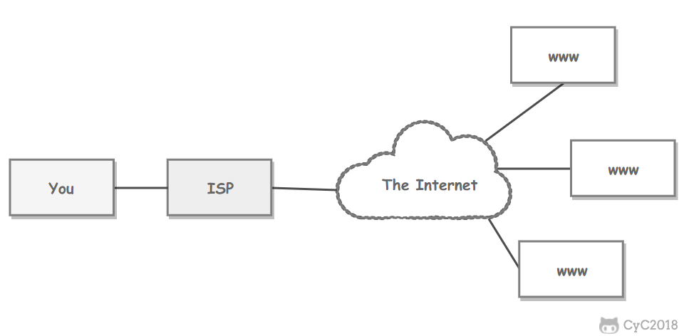

<!-- GFM-TOC -->
- [基本知识](#基本知识)
- [ISP](#isp)
- [主机之间的通信方式](#主机之间的通信方式)
- [电路交换与分组交换](#电路交换与分组交换)
  - [1. 电路交换](#1-电路交换)
  - [2. 分组交换](#2-分组交换)
- [时延](#时延)
  - [1. 排队时延](#1-排队时延)
  - [2. 处理时延](#2-处理时延)
  - [3. 传输时延](#3-传输时延)
  - [4. 传播时延](#4-传播时延)
- [计算机网络体系结构](#计算机网络体系结构)
  - [1. 五层协议](#1-五层协议)
  - [2. OSI](#2-osi)
  - [3. TCP/IP](#3-tcpip)
  - [4. 数据在各层之间的传递过程](#4-数据在各层之间的传递过程)
- [详细解释各层的作用](#详细解释各层的作用)
<!-- GFM-TOC -->

# 基本知识

网络把主机连接起来，而互连网（internet）是把多种不同的网络连接起来，因此互连网是网络的网络。而互联网（Internet）是全球范围的互连网。

# ISP

ISP(internet service provider)译为互联网服务提供商，类似中国电信，中国移动，中国联通就是国内有名的ISP。ISP可以从互联网管理机构申请到很多IP地址，然后一些机构和个人从某个ISP获取IP地址的使用权，并可通过该ISP连接到互联网。ISP可以从互联网管理机构获得许多IP地址，同时拥有通信线路以及路由器等联网设备，个人或机构向 ISP 缴纳一定的费用就可以接入互联网。

目前的互联网是一种多层次ISP结构，三层ISP结构分为主干ISP，地区ISP，本地ISP。本地ISP给用户提供最直接的服务，本地ISP可以连接到地区ISP，也可以连接到主干ISP。从原理上讲。只要每一个本地ISP都安装了路由器连接到某个地区ISP，而每一个地区ISP也有路由器连接到主干ISP，那么在这些相互连接的ISP的共同作用下，就可以完成互联网中的所有的分组转发任务。

互联网交换点(IXP)：为了更快地转发分组，IXP允许两个网络直接连接并交换分组，而不需要通过第三个网络来转发分组。例如上图中，主机A和主机B通过2个地区ISP连接起来了，就不必经过最上层的的主干ISP来转发分组。典型的IXP由一个或多个网络交换机组成。

# 主机之间的通信方式

- 客户-服务器（C/S）：客户是服务的请求方，服务器是服务的提供方。

- 对等（P2P）：不区分客户和服务器。

# 电路交换与分组交换

## 1. 电路交换

电路交换用于电话通信系统，两个用户要通信之前需要建立一条专用的物理链路，并且在整个通信过程中始终占用该链路。由于通信的过程中不可能一直在使用传输线路，因此电路交换对线路的利用率很低，往往不到 10%。

## 2. 分组交换

每个分组都有首部和尾部，包含了源地址和目的地址等控制信息，在同一个传输线路上同时传输多个分组互相不会影响，因此在同一条传输线路上允许同时传输多个分组，也就是说分组交换不需要占用传输线路。

在一个邮局通信系统中，邮局收到一份邮件之后，先存储下来，然后把相同目的地的邮件一起转发到下一个目的地，这个过程就是存储转发过程，分组交换也使用了存储转发过程。

# 时延

总时延 = 排队时延 + 处理时延 + 传输时延 + 传播时延

## 1. 排队时延

分组在路由器的输入队列和输出队列中排队等待的时间，取决于网络当前的通信量。

## 2. 处理时延

主机或路由器收到分组时进行处理所需要的时间，例如分析首部、从分组中提取数据、进行差错检验或查找适当的路由等。

## 3. 传输时延

主机或路由器传输数据帧所需要的时间。

  

<!-- 
  
  -->

其中 l 表示数据帧的长度，v 表示传输速率。

## 4. 传播时延

电磁波在信道中传播所需要花费的时间，电磁波传播的速度接近光速。

  

<!-- 
  
  -->

其中 l 表示信道长度，v 表示电磁波在信道上的传播速度。

# 计算机网络体系结构

## 1. 五层协议

-   **应用层**  ：为特定应用程序提供数据传输服务，例如 HTTP、DNS 等协议。数据单位为报文。

-   **传输层**  ：为进程提供通用数据传输服务。由于应用层协议很多，定义通用的传输层协议就可以支持不断增多的应用层协议。运输层包括两种协议：传输控制协议 TCP，提供面向连接、可靠的数据传输服务，数据单位为报文段；用户数据报协议 UDP，提供无连接、尽最大努力的数据传输服务，数据单位为用户数据报。TCP 主要提供完整性服务，UDP 主要提供及时性服务。

-   **网络层**  ：为主机提供数据传输服务。而传输层协议是为主机中的进程提供数据传输服务。网络层把传输层传递下来的报文段或者用户数据报封装成分组。

-   **数据链路层**  ：网络层针对的还是主机之间的数据传输服务，而主机之间可以有很多链路，链路层协议就是为同一链路的主机提供数据传输服务。数据链路层把网络层传下来的分组封装成帧。

-   **物理层**  ：考虑的是怎样在传输媒体上传输数据比特流，而不是指具体的传输媒体。物理层的作用是尽可能屏蔽传输媒体和通信手段的差异，使数据链路层感觉不到这些差异。

## 2. OSI

其中表示层和会话层用途如下：

-   **表示层**  ：数据压缩、加密以及数据描述，这使得应用程序不必关心在各台主机中数据内部格式不同的问题。

-   **会话层**  ：建立及管理会话。

五层协议没有表示层和会话层，而是将这些功能留给应用程序开发者处理。

## 3. TCP/IP

它只有四层，相当于五层协议中数据链路层和物理层合并为网络接口层。

TCP/IP 体系结构不严格遵循 OSI 分层概念，应用层可能会直接使用 IP 层或者网络接口层。

## 4. 数据在各层之间的传递过程

在向下的过程中，需要添加下层协议所需要的首部或者尾部，而在向上的过程中不断拆开首部和尾部。

路由器只有下面三层协议，因为路由器位于网络核心中，不需要为进程或者应用程序提供服务，因此也就不需要传输层和应用层。

# 详细解释各层的作用

关于计算机网络的体系结构这里做一些详细的解释，因为后续的所有协议都是基于以上的网络结构的分层。这里主要就讲五层的分层方法。

首先不同的分层主要是针对不同的层面来说的，这里的“层面”指的其实就是处理的对象，但是计算机网络的根本宗旨就是把不同的计算机连接起来并传输数据，所以总结起来，每一层的作用就是把不同的处理对象传输到不同的设备上。

物理层所处理的对象就是数字0和1，也就是实际电路中的高电平和低电平，并使用电路将他们连接在一起。物理层的传输就可以理解成是电路板上的一根导线而已（当然这跟导线也涉及像定时器之类的不同协议，但是肯定还是比特流数据传输）。当然我们知道网络肯定没有导线那么简单，肯定还有寻址之类的过程，不可能让信息哪里接着导线就传到哪去。这就是上面的层数所要说的事了，上面的层不仅更加抽象了处理的对象，同时也使得整个网络越来越庞大复杂。

数据链路层的处理对象是将数字0和1做了进一步编码，让他们能够表达我们所想表达的信息。同时因为加入了mac地址，所以此时能够在数据编码中表示网卡的信息和地址，这就使得设备到设备的通信成为了可能。

网络层也就是IP层，这里处理的信息又需要再加上IP地址。IP地址也是网络更加复杂之后的产物。上面的数据链路层，两个设备之间可以进行通信，但是也仅限于两个设备处于同一个局域网中，如果不在一个局域网中，那么就需要用一个统一的方式来对设备的地址进行命名，也就是IP。

传输层所处理的连接是进程。因为上面的网络层可以解决设备在不同网络中的连接，但是同一台设备不可能只有一个程序在联网，一般都有好多个，但是他们肯定是共用一个IP，所以就有了端口这个东西。每一个进程都会占用一个端口进行联网，而传输层的TCP或者UDP就是解决端口对端口通信的问题。

如果程序员想写一个网络程序，实现客户端和服务器的数据收发，不管他采用哪种语言，C/C++也好，Java也好、Python也好都会要用到一个东西----Socket。Socket中文叫套接字，是操作系统提供给程序员的一个接口，当你的程序要通过操作系统的管理的网卡收发数据时，就需要调用它。Socket呢有 几种 ，基于UDP的、基于TCP的，还有一个 直接 跑在 IP上的（这时候就不需要端口这个东西了，不过用得很少很少）。可以发现 ，直接使用Socket收发数据时，是不需要应用层协议参与的。或者说，自己用代码直接实现了一个属于自己使用的应用层协议。

其实网络 ，传输层已经解决了设备之间、端到端通信问题，为何还要一个应用层呢？上文也提到我们的网络程序，可以直接跑在传输层之上啊。看到应用这两个字，不难想到应用领域。没错，应用层解决的就是特定的领域 ，所涉及到的一些共有问题，至于具体细节交给代码完成。我们完全 可以把一个特定领域的共性问题提炼出来，弄成一个新的层。比如用于Web领域的HTTP，用于邮件领域的SMTP/IMAP/POP，用于音视频领域的SIP/SDP等等。以Web领域的HTTP为例，例如我们用浏览器访问一个网站时，我们首先在浏览器地址栏输入一个网址，然后回车。此时浏览器 就（应用程序）会调用HTTP协议去收发数据，HTTP协议呢，它会调用底层的有操作系统管理着的TCP，进而IP，最后再是网卡去收发数据。
