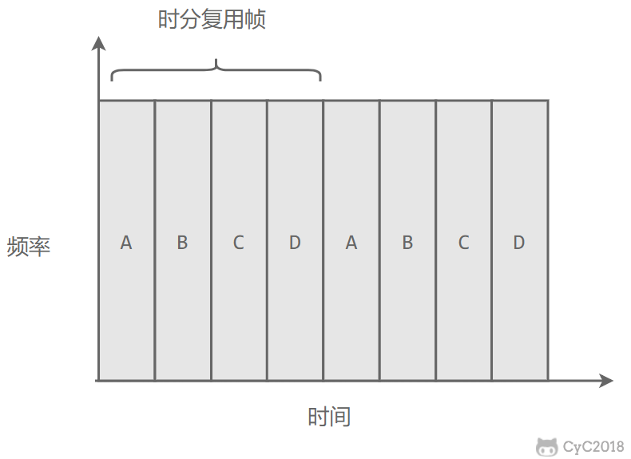
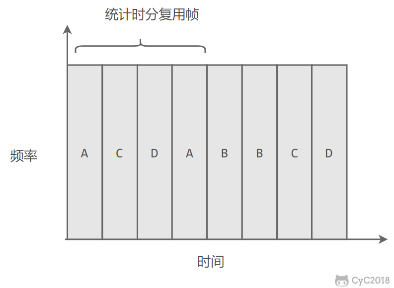
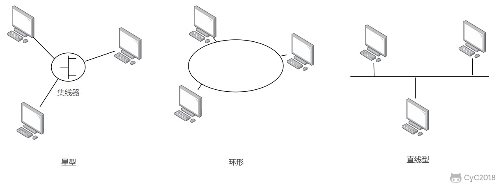
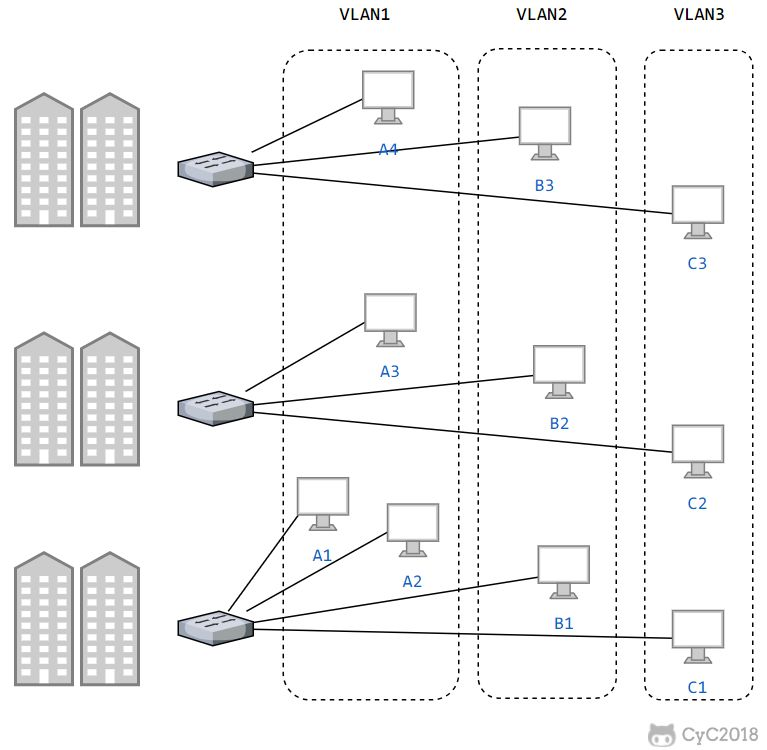

<!-- TOC -->

- [基本问题](#基本问题)
  - [1. 封装成帧](#1-封装成帧)
  - [2. 透明传输](#2-透明传输)
  - [3. 差错检测](#3-差错检测)
- [信道分类](#信道分类)
  - [1. 广播信道](#1-广播信道)
  - [2. 点对点信道](#2-点对点信道)
- [信道复用技术](#信道复用技术)
  - [1. 频分复用](#1-频分复用)
  - [2. 时分复用](#2-时分复用)
  - [3. 统计时分复用](#3-统计时分复用)
  - [4. 波分复用](#4-波分复用)
  - [5. 码分复用](#5-码分复用)
- [CSMA/CD协议](#csmacd协议)
- [PPP 协议](#ppp-协议)
- [MAC 地址](#mac-地址)
- [局域网](#局域网)
- [以太网](#以太网)
- [交换机](#交换机)
  - [交换机和路由器的区别](#交换机和路由器的区别)
- [虚拟局域网](#虚拟局域网)
- [宽带网络](#宽带网络)

<!-- /TOC -->

# 基本问题

## 1. 封装成帧

将网络层传下来的分组添加首部和尾部，用于标记帧的开始和结束。

## 2. 透明传输

透明表示一个实际存在的事物看起来好像不存在一样。透明传输是指不管所传数据是什么样的比特组合，都应当能够在链路上传送。 当所传数据中的比特组合恰巧与某一个控制信息完全一样时，就必须采取适当的措施，使接收方不会将这样的数据误认为是某种控制信息。 这样才能保证数据链路层的传输是透明的。

帧使用首部和尾部进行定界，如果帧的数据部分含有和首部尾部相同的内容，那么帧的开始和结束位置就会被错误的判定。需要在数据部分出现首部尾部相同的内容前面插入转义字符。如果数据部分出现转义字符，那么就在转义字符前面再加个转义字符。在接收端进行处理之后可以还原出原始数据。这个过程透明传输的内容是转义字符，用户察觉不到转义字符的存在。

## 3. 差错检测

在数据传输过程中，无论传输系统的设计再怎么完美，差错总会存在，这种差错可能会导致在链路上传输的一个或者多个帧被破坏(出现比特差错，0变为1，或者1变为0)，从而接受方接收到错误的数据。为尽量提高接受方收到数据的正确率，在接收方接收数据之前需要对数据进行差错检测，当且仅当检测的结果为正确时接收方才真正收下数据。检测的方式有多种，常见的有奇偶校验、因特网校验和循环冗余校验等。

目前数据链路层广泛使用了循环冗余检验（CRC）来检查比特差错。发送方计算机使用某公式计算出被传送数据所含信息的一个值，并将此值附在被传送数据后，接收方计算机则对同一数据进行相同的计算，应该得到相同的结果。如果这两个CRC结果不一致，则说明发送中出现了差错，接收方计算机可要求发送方计算机重新发送该数据。

# 信道分类

## 1. 广播信道

一对多通信，一个节点发送的数据能够被广播信道上所有的节点接收到。

所有的节点都在同一个广播信道上发送数据，因此需要有专门的控制方法进行协调，避免发生冲突（冲突也叫碰撞）。

主要有两种控制方法进行协调，一个是使用信道复用技术，一是使用 CSMA/CD 协议。

## 2. 点对点信道

一对一通信。

因为不会发生碰撞，因此也比较简单，使用 PPP 协议进行控制。

# 信道复用技术

## 1. 频分复用

频分复用的所有主机在相同的时间占用不同的频率带宽资源。

## 2. 时分复用

时分复用的所有主机在不同的时间占用相同的频率带宽资源。

使用频分复用和时分复用进行通信，在通信的过程中主机会一直占用一部分信道资源。但是由于计算机数据的突发性质，通信过程没必要一直占用信道资源而不让出给其它用户使用，因此这两种方式对信道的利用率都不高。

## 3. 统计时分复用

是对时分复用的一种改进，不固定每个用户在时分复用帧中的位置，只有当用户有数据要传输时才给他分配线路资源，当用户暂停发送数据时，不给他分配线路资源，线路的传输能力可以被其他用户使用。只要有数据就集中起来组成统计时分复用帧然后发送。

## 4. 波分复用

光的频分复用。由于光的频率很高，因此习惯上用波长而不是频率来表示所使用的光载波。

## 5. 码分复用

为每个用户分配 m bit 的码片，并且所有的码片正交，对于任意两个码片  和  有

  

<!-- 
  
  -->

为了讨论方便，取 m=8，设码片  为 00011011。在拥有该码片的用户发送比特 1 时就发送该码片，发送比特 0 时就发送该码片的反码 11100100。

在计算时将 00011011 记作 (-1 -1 -1 +1 +1 -1 +1 +1)，可以得到

   

  

<!-- 
  
 

  
  -->

其中  为  的反码。

利用上面的式子我们知道，当接收端使用码片  对接收到的数据进行内积运算时，结果为 0 的是其它用户发送的数据，结果为 1 的是用户发送的比特 1，结果为 -1 的是用户发送的比特 0。

码分复用需要发送的数据量为原先的 m 倍。

  
 

# CSMA/CD协议

CSMA/CD表示载波监听多点接入/碰撞检测，是IEEE 802.3使用的一种媒体访问控制方法。

CSMA/CD的基本原理是：每个节点都共享网络传输信道，在每个站要发送数据之前，都会检测信道是否空闲，如果空闲则发送，否则就等待；在发送出信息后，则对冲突进行检测，当发现冲突时，则取消发送。我们可以借助于生活中的一个例子来解释：假设有这一层楼，两旁住了几十户人，中间只有一条仅供一人同行的走道。我们看情况会怎么样：①当这些住户要经过走道出来时，首先探出头来看看走道上有没有人（这就是载波监听），如果没有，就通过走道出来；②如果走道上有人走，那么就一直盯着走道，直到走道上没人时再出来（1-坚持监听算法）；③如果有两人同时看到走道上没有人，而同时走向走道（冲突检测），则两个人发现时就马上回到自己屋里。在整个协议中最关键的是载波监听、冲突检测两部分。

-   **多点接入**  ：说明这是总线型网络，许多主机以多点的方式连接到总线上。
-   **载波监听**  ：每个主机都必须不停地监听信道。在发送前，如果监听到信道正在使用，就必须等待。
-   **碰撞检测**  ：在发送中，如果监听到信道已有其它主机正在发送数据，就表示发生了碰撞。虽然每个主机在发送数据之前都已经监听到信道为空闲，但是由于电磁波的传播时延的存在，还是有可能会发生碰撞。

记端到端的传播时延为 τ，最先发送的站点最多经过 2τ 就可以知道是否发生了碰撞，称 2τ 为   **争用期**  。只有经过争用期之后还没有检测到碰撞，才能肯定这次发送不会发生碰撞。

当发生碰撞时，站点要停止发送，等待一段时间再发送。这个时间采用   **截断二进制指数退避算法**   来确定。从离散的整数集合 {0, 1, .., (2k-1)} 中随机取出一个数，记作 r，然后取 r 倍的争用期作为重传等待时间。

# PPP 协议

互联网用户通常需要连接到某个ISP之后才能接入到互联网，PPP 协议是用户计算机和ISP进行通信时所使用的数据链路层协议。

PPP 的帧格式：

- F 字段为帧的定界符
- A 和 C 字段暂时没有意义
- FCS 字段是使用 CRC 的检验序列
- 信息部分的长度不超过 1500

# MAC 地址

MAC地址（英语：Media Access Control Address），直译为媒体存取控制位址，也称为局域网地址（LAN Address），MAC位址，以太网地址（Ethernet Address）或物理地址（Physical Address），它是一个用来确认网络设备位置的位址。在OSI模型中，第三层网络层负责IP地址，第二层数据链路层则负责MAC位址。MAC地址用于在网络中唯一标示一个网卡，一台设备若有一或多个网卡，则每个网卡都需要并会有一个唯一的MAC地址

MAC地址是链路层地址，长度为6字节（48 位），用于唯一标识网络适配器（网卡）。

48位的MAC地址包括两部分：24位组织唯一标志符(OUI)和剩下的24位由厂家分配的代码，二进制24位，四合一，6个16进制位

# 局域网

局域网（Local Area Network，LAN）是一种典型的广播信道，主要特点是网络为一个单位所拥有，且地理范围和站点数目均有限。

主要有以太网、令牌环网、FDDI 和 ATM 等局域网技术，目前以太网占领着有线局域网市场。

可以按照网络拓扑结构对局域网进行分类：

拓扑结构是指用传输介质互连各种设备的物理布局。网络中的计算机等设备要实现互联，就需要以一定的结构方式进行连接，这种连接方式就叫做“拓扑结构”，通俗地讲就是这些网络设备是如何连接在一起的。常见的网络拓扑结构主要有：总线型结构、环形结构、星形结构、树形结构和网状结构等。

- 总线拓扑结构所有设备连接到一条连接介质上。总线结构所需要的电缆数量少，线缆长度短，易于布线和维护。多个结点共用一条传输信道，信道利用率高。但不找诊断故障。
- 星型拓扑结构是一个中心，多个分节点。它结构简单，连接方便，管理和维护都相对容易，而且扩展性强。网络延迟时间较小，传输误差低。中心无故障，一般网络没问题。中心故障，网络就出问题，同时共享能力差，通信线路利用率不高。
- 环形拓扑结构是节点形成一个闭合环。工作站少，节约设备。当然，这样就导致一个节点出问题，网络就会出问题，而且不好诊断故障。
- 树形拓扑结构从总线拓扑演变而来。形状像一棵倒置的树,顶端是树根，树根以下带分支，每个分支还可再带子分支，树根接收各站点发送的数据，然后再广播发送到全网。好扩展，容易诊断错误，但对根部要求高。
- 网形拓扑结构是应用最广泛的，它的优点是不受瓶颈问题和失效问题的影响，一旦线路出问题，可以做其他线路，但太复杂，成本高。

# 以太网

以太网是一种星型拓扑结构局域网。

早期使用集线器进行连接，集线器是一种物理层设备， 作用于比特而不是帧，当一个比特到达接口时，集线器重新生成这个比特，并将其能量强度放大，从而扩大网络的传输距离，之后再将这个比特发送到其它所有接口。如果集线器同时收到两个不同接口的帧，那么就发生了碰撞。

目前以太网使用交换机替代了集线器，交换机是一种链路层设备，它不会发生碰撞，能根据 MAC 地址进行存储转发。

以太网帧格式：

-   **类型**  ：标记上层使用的协议；
-   **数据**  ：长度在 46-1500 之间，如果太小则需要填充；
-   **FCS**  ：帧检验序列，使用的是 CRC 检验方法；

# 交换机

交换机可以实现特定网络内部的数据交换。

交换机具有自学习能力，学习的是交换表的内容，交换表中存储着 MAC 地址到接口的映射。

正是由于这种自学习能力，因此交换机是一种即插即用设备，不需要网络管理员手动配置交换表内容。

下图中，交换机有4个接口，主机A向主机B发送数据帧时，交换机把主机A到接口1的映射写入交换表中。为了发送数据帧到B，先查交换表，此时没有主机B的表项，那么主机A就发送广播帧，主机C和主机D会丢弃该帧，主机B回应该帧向主机A发送数据包时，交换机查找交换表得到主机A映射的接口为1，就发送数据帧到接口1，同时交换机添加主机B到接口2的映射。

## 交换机和路由器的区别

路由器实现了不同网络之间的数据转发，交换机实现了特定网络内的数据交换：

- 工作层次不同：交换机主要工作在数据链路层（第二层）路由器工作在网络层（第三层）。
- 转发依据不同：交换机转发所依据的对象时：MAC地址（物理地址）。路由转发所依据的对象是：IP地址（网络地址）。
- 主要功能不同：交换机主要用于组建局域网，而路由主要功能是将由交换机组好的局域网相互连接起来，或者接入Internet。交换机能做的，路由都能做。交换机不能分割广播域，路由可以。路由还可以提供防火墙的功能。路由配置比交换机复杂。
- 价格不同交换机是看门大爷，路由是邮差。

# 虚拟局域网

虚拟局域网可以建立与物理位置无关的逻辑组，只有在同一个虚拟局域网中的成员才会收到链路层广播信息。

例如下图中 (A1, A2, A3, A4) 属于一个虚拟局域网，A1发送的广播会被 A2、A3、A4 收到，而其它站点收不到。

使用 VLAN 干线连接来建立虚拟局域网，每台交换机上的一个特殊接口被设置为干线接口，以互连 VLAN 交换机。IEEE 定义了一种扩展的以太网帧格式 802.1Q，它在标准以太网帧上加进了 4 字节首部 VLAN 标签，用于表示该帧属于哪一个虚拟局域网。

# 宽带网络
建设宽带网络的两个关键技术是骨干网和接入网技术：
- 骨干网：它由所有用户共享，负责传输骨干数据流。
- 接入网：提供通常说的最后一公里的连接——即用户和骨干网络之间的连接。
