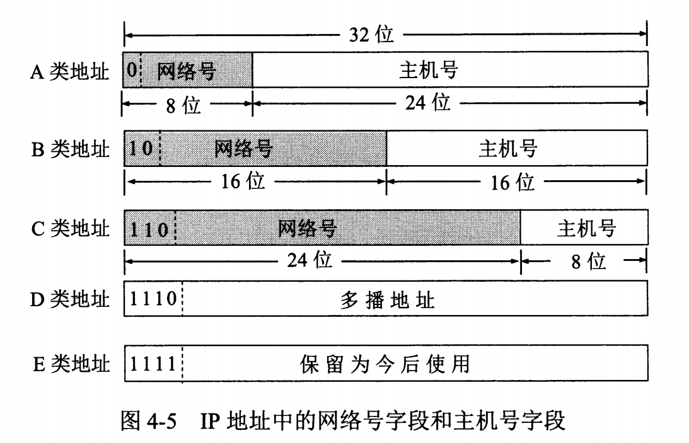

<!-- TOC -->

- [概述](#概述)
- [IP协议](#ip协议)
  - [IP数据报格式](#ip数据报格式)
  - [IP地址编址方式](#ip地址编址方式)
  - [1. 分类](#1-分类)
  - [2. 子网划分](#2-子网划分)
  - [IP碎片](#ip碎片)
  - [3. 无分类](#3-无分类)
- [地址解析协议 ARP](#地址解析协议-arp)
  - [有了MAC地址为什么还需要IP地址？](#有了mac地址为什么还需要ip地址)
  - [有了IP地址为什么还需要MAC地址？](#有了ip地址为什么还需要mac地址)
- [网际控制报文协议ICMP](#网际控制报文协议icmp)
  - [1. Ping](#1-ping)
  - [2. Traceroute](#2-traceroute)
- [虚拟专用网VPN](#虚拟专用网vpn)
- [网络地址转换NAT](#网络地址转换nat)
  - [NAT基本工作原理](#nat基本工作原理)
  - [NAPT工作原理](#napt工作原理)
- [路由器的结构](#路由器的结构)
- [路由器分组转发流程](#路由器分组转发流程)
- [路由选择协议](#路由选择协议)
  - [1. 内部网关协议RIP](#1-内部网关协议rip)
  - [2. 内部网关协议OSPF](#2-内部网关协议ospf)
  - [3. 外部网关协议BGP](#3-外部网关协议bgp)

<!-- /TOC -->

# 概述

因为网络层是整个互联网的核心，因此应当让网络层尽可能简单。网络层向上只提供简单灵活的、无连接的、尽最大努力交互的数据报服务。

使用IP协议，可以把异构的物理网络连接起来，使得在网络层看起来好像是一个统一的网络。因为不同机器不可能直接相连，网络层的任务就是选择中间节点，以确定两台机器之间的通信路径。

与 IP 协议配套使用的还有三个协议：

- 地址解析协议 ARP（Address Resolution Protocol）
- 网际控制报文协议 ICMP（Internet Control Message Protocol）
- 网际组管理协议 IGMP（Internet Group Management Protocol）
# IP协议
IP协议是网络层最核心的协议，依据数据包的目的IP地址来决定如何投递它，不能直接投递的就为它找到下一跳路由器。
## IP数据报格式

-   **版本**   : 有 4（IPv4，32位）和 6（IPv6，128位）两个值；

-   **首部长度**   : 占 4 位，因此最大值为 15。值为 1 表示的是 1 个 32 位字的长度，也就是 4 字节。因为固定部分长度为 20 字节，因此该值最小为 5。如果可选字段的长度不是 4 字节的整数倍，就用尾部的填充部分来填充。

-   **区分服务**   : 用来获得更好的服务，一般情况下不使用。

-   **总长度**   : 包括首部长度和数据部分长度。

-   **生存时间**   ：TTL，它的存在是为了防止无法交付的数据报在互联网中不断兜圈子。以路由器跳数为单位，当 TTL 为 0 时就丢弃数据报。

-   **协议**  ：指出携带的数据应该上交给哪个协议进行处理，例如 ICMP、TCP、UDP 等。

-   **首部检验和**  ：因为数据报每经过一个路由器，都要重新计算检验和，因此检验和不包含数据部分可以减少计算的工作量。

-   **标识**   : 在数据报长度过长从而发生分片的情况下，相同数据报的不同分片具有相同的标识符。

-   **片偏移**   : 和标识符一起，用于发生分片的情况。片偏移的单位为 8 字节。

## IP地址编址方式

IP 地址的编址方式经历了三个历史阶段：

- 分类
- 子网划分
- 无分类

## 1. 分类

由两部分组成，网络号和主机号，其中不同分类具有不同的网络号长度，并且是固定的。

IP 地址 ::= {< 网络号 >, < 主机号 >}

## 2. 子网划分

通过在主机号字段中拿一部分作为子网号，把两级 IP 地址划分为三级 IP 地址。

IP 地址 ::= {< 网络号 >, < 子网号 >, < 主机号 >}

要使用子网，必须配置子网掩码。一个 B 类地址的默认子网掩码为 255.255.0.0，如果 B 类地址的子网占两个比特，那么子网掩码为 11111111 11111111 11000000 00000000，也就是 255.255.192.0。

注意，外部网络看不到子网的存在。

## IP碎片

链路层具有最大传输单元MTU这个特性，它限制了数据帧的最大长度，不同的网络类型都有一个上限值。以太网的MTU是1500，你可以用 netstat -i 命令查看这个值。如果IP层有数据包要传，而且数据包的长度超过了MTU，那么IP层就要对数据包进行分片（fragmentation）操作，使每一片的长度都小于或等于MTU。我们假设要传输一个UDP数据包，以太网的MTU为1500字节，一般IP首部为20字节，UDP首部为8字节，数据的净荷（payload）部分预留是1500-20-8=1472字节。如果数据部分大于1472字节，就会出现分片现象。

另外，当数据报被分片后，每个片的总长度值要改为该片的长度值。每一IP分片都各自路由，到达目的主机后在IP层重组，请放心，首部中的数据能够正确完成分片的重组。

数据不到终点不会重组。

## 3. 无分类

无分类编址 CIDR 消除了传统 A 类、B 类和 C 类地址以及划分子网的概念，使用网络前缀和主机号来对 IP 地址进行编码，网络前缀的长度可以根据需要变化。

IP 地址 ::= {< 网络前缀号 >, < 主机号 >}

CIDR 的记法上采用在 IP 地址后面加上网络前缀长度的方法，例如 128.14.35.7/20 表示前 20 位为网络前缀。

CIDR 的地址掩码可以继续称为子网掩码，子网掩码首 1 长度为网络前缀的长度。

一个 CIDR 地址块中有很多地址，一个 CIDR 表示的网络就可以表示原来的很多个网络，并且在路由表中只需要一个路由就可以代替原来的多个路由，减少了路由表项的数量。把这种通过使用网络前缀来减少路由表项的方式称为路由聚合，也称为   **构成超网**  。

在路由表中的项目由“网络前缀”和“下一跳地址”组成，在查找时可能会得到不止一个匹配结果，应当采用最长前缀匹配来确定应该匹配哪一个。

# 地址解析协议 ARP

网络层实现主机之间的通信，而链路层实现具体每段链路之间的通信。因此在通信过程中，IP 数据报的源地址和目的地址始终不变，而 MAC 地址随着链路的改变而改变。

<!-- 
  
  -->

ARP 实现由 IP 地址得到 MAC 地址。

每个主机都有一个 ARP 高速缓存，里面有本局域网上的各主机和路由器的 IP 地址到 MAC 地址的映射表。

如果主机A知道主机B的 IP 地址，但是ARP高速缓存中没有该IP地址到MAC地址的映射，此时主机A通过广播的方式发送ARP请求分组，主机B收到该请求后会发送ARP响应分组给主机A告知其MAC地址，随后主机A向其高速缓存中写入主机B的IP地址到MAC地址的映射。

## 有了MAC地址为什么还需要IP地址？

由于全世界存在着各式各样的网络，它们使用不同的硬件地址。要是这些异构网络能够互相通信就必须进行非常复杂的硬件地址转换工作，因此由用户或用户主机来完成这项工作几乎是不可能的事。但统一的IP地址把这个复杂问题解决了。连接到因特网的主机只需拥有统一的IP地址，它们之间的通信就像连接在同一个网络（虚拟互连网络或者简称IP网）上那么简单方便，因为调用ARP的复杂过程都是由计算机软件自动进行的，对用户来说是看不见这种调用过程的。

## 有了IP地址为什么还需要MAC地址？

a.信息传递时候，需要知道的其实是两个地址：终点地址、下一跳的地址。IP地址本质上是终点地址，它在跳过路由器的时候不会改变，而MAC地址则是下一跳的地址，每跳过一次路由器都会改变。这就是为什么还要用MAC地址的原因之一，它起到了记录下一跳的信息的作用。 
b.网络体系结构的分层模型：用MAC地址和IP地址两个地址，用于分别表示物理地址和逻辑地址是有好处的。这样分层可以使网络层与数据链路层的协议更灵活地替换。 
c.历史原因：早期的以太网只有集线器，没有交换机，所以发出去的包能被以太网内的所有机器监听到，因此要附带上MAC地址，每个机器只需要接受与自己MAC地址相匹配的包。

# 网际控制报文协议ICMP

ICMP协议主要用来检测网络通信故障和实现链路追踪，最典型的应用就是PING和tracerooute。ICMP是为了更有效地转发IP数据报和提高交付成功的机会。它封装在IP数据报中，但是不属于高层协议。

ICMP 报文分为差错报告报文和询问报文。

## 1. Ping

Ping 是 ICMP 的一个重要应用，主要用来测试两台主机之间的连通性。

Ping 的原理是通过向目的主机发送 ICMP Echo 请求报文，目的主机收到之后会发送 Echo 回答报文。Ping 会根据时间和成功响应的次数估算出数据包往返时间以及丢包率。

## 2. Traceroute

Traceroute 是 ICMP 的另一个应用，用来跟踪一个分组从源点到终点的路径。

Traceroute 发送的 IP 数据报封装的是无法交付的 UDP 用户数据报，并由目的主机发送终点不可达差错报告报文。

- 源主机向目的主机发送一连串的 IP 数据报。第一个数据报 P1 的生存时间 TTL 设置为 1，当 P1 到达路径上的第一个路由器 R1 时，R1 收下它并把 TTL 减 1，此时 TTL 等于 0，R1 就把 P1 丢弃，并向源主机发送一个 ICMP 时间超过差错报告报文；
- 源主机接着发送第二个数据报 P2，并把 TTL 设置为 2。P2 先到达 R1，R1 收下后把 TTL 减 1 再转发给 R2，R2 收下后也把 TTL 减 1，由于此时 TTL 等于 0，R2 就丢弃 P2，并向源主机发送一个 ICMP 时间超过差错报文。
- 不断执行这样的步骤，直到最后一个数据报刚刚到达目的主机，主机不转发数据报，也不把 TTL 值减 1。但是因为数据报封装的是无法交付的 UDP，因此目的主机要向源主机发送 ICMP 终点不可达差错报告报文。
- 之后源主机知道了到达目的主机所经过的路由器 IP 地址以及到达每个路由器的往返时间。

# 虚拟专用网VPN

首先世界上有两类地址：
- 本地地址：仅在机构内部使用的 IP 地址，可以由本机构自行分配，而不需要向因特网的管理机构申请。
- 全球地址：全球唯一的IP地址，必须向因特网的管理机构申请。

其中的本地地址只能在机构内部通信，所以是无法使用外部网络访问的，所以便有了虚拟专用网技术，主要的功能就是使用全球地址（接入互联网的地址）也能访问本地地址

之所以会有仅能在机构内使用的本地地址，是由于IP地址的紧缺，一个机构能申请到的IP地址数往往远小于本机构所拥有的主机数。并且一个机构并不需要把所有的主机接入到外部的互联网中，机构内的计算机可以使用仅在本机构有效的IP地址（专用地址）。

有三个专用地址块：

- 10.0.0.0 \~ 10.255.255.255
- 172.16.0.0 \~ 172.31.255.255
- 192.168.0.0 \~ 192.168.255.255

VPN使用公用的互联网作为本机构各专用网之间的通信载体。专用指机构内的主机只与本机构内的其它主机通信；虚拟指好像是，而实际上并不是，它有经过公用的互联网。

VPN的本质就是在互联网上传输私有数据，大概流程如下：
1. 远程用户在公网上访问企业内部服务器RAS时，先使用RAS服务器分配的私网地址作为数据包的源地址，企业内网的WebServer地址作为目标地址组成局域网数据包。然后远程用户再使用自己的公网地址作为源地址，RAS服务器的公网地址作为目标地址对局域网数据包进行封装，组成广域网数据包。由于广域网数据包的目标地址和源地址都为公网地址，所以数据包可以通过互联网顺利中转到企业内的RAS服务器上。
2. 收到广域网数据包后，RAS服务器再去掉其中的公网目标地址和源地址，把数据包还原为局域网数据包，最后中转给WebServer。
3. 同样的，从WebServer发出的数据包，经过远程访问服务器RAS中转至公网前，先对数据包进行封装，加上一层公网的目标地址和源地址
4. 即远程用户和企业内配置好的远程访问服务器RAS都拥有一个私网地址和一个公网地址，在公网上通信时使用广域网数据包，在私网内通信时使用局域网数据包。

下图中，场所A和B的通信经过互联网，如果场所A的主机X要和另一个场所B的主机Y通信，IP数据报的源地址是10.1.0.1，目的地址是10.2.0.3。数据报先发送到与互联网相连的路由器R1，R1对内部数据进行加密，然后重新加上数据报的首部，源地址是路由器R1的全球地址125.1.2.3，目的地址是路由器 R2 的全球地址 194.4.5.6。路由器R2收到数据报后将数据部分进行解密，恢复原来的数据报，此时目的地址为10.2.0.3，就交付给Y。

# 网络地址转换NAT

专用网内部的主机使用本地IP地址又想和互联网上的主机通信时，可以使用NAT来将本地地址的IP转换为全球地址的IP。

在以前，NAT将本地IP和全球IP一一对应，这种方式下拥有n个全球IP地址的专用网内最多只可以同时有n台主机接入互联网。为了更有效地利用全球IP地址，现在常用的NAT转换表把传输层的端口号也用上了，使得多个专用网内部的主机共用一个全球IP地址。使用端口号的NAT也叫做网络地址与端口转换NAPT。

## NAT基本工作原理
NAT的基本工作原理是，当私有网主机和公共网主机通信的IP包经过NAT网关时，将IP包中的源IP或目的IP在私有IP和NAT的公共IP之间进行转换。NAT网关有2个网络端口，其中公共网络端口的IP地址是统一分配的公共IP，为202.204.65.2；私有网络端口的IP地址是保留地址，为192.168.1.1。私有网中的主机 192.168.1.2向公共网中的主机166.111.80.200发送了1个IP包（Des=166.111.80.200,Src=192.168.1.2）。当IP包经过NAT网关时，NAT会将IP包的源IP转换为NAT的公共 IP并转发到公共网，此时IP包（Des=166.111.80.200，Src=202.204.65.2）中已经不含任何私有网IP的信息。由于IP 包的源IP已经被转换成NAT的公共IP，响应的IP包（Des=202.204.65.2,Src=166.111.80.200）将被发送到NAT。 这时，NAT会将IP包的目的IP转换成私有网中主机的IP，然后将IP包（Des=192.168.1.2，Src=166.111.80.200）转 发到私有网。对于通信双方而言，这种地址的转换过程是完全透明的。

## NAPT工作原理
由于NAT实现是私有IP和NAT的公共IP之间的转换，那么，私有网中同时与公共网进行通信的主机数量就受到NAT的公共IP地址数量的限制。为了克服 这种限制，NAT被进一步扩展到在进行IP地址转换的同时进行Port的转换，这就是网络地址端口转换NAPT（Network Address Port Translation）技术。

NAPT与NAT的区别在于，NAPT不仅转换IP包中的IP地址，还对IP包中TCP和UDP的Port进行转换。这使得多台私有网主机利用1个NAT公共IP就可以同时和公共网进行通信。（NAPT多了对TCP和UDP的端口号的转换）

私有网主机192.168.1.2要访问公共网中的 Http服务器166.111.80.200。首先，要建立TCP连接，假设分配的TCP Port是1010，发送了1个IP包（Des=166.111.80.200:80,Src=192.168.1.2:1010）,当IP包经过NAT 网关时，NAT会将IP包的源IP转换为NAT的公共IP，同时将源Port转换为NAT动态分配的1个Port。然后，转发到公共网，此时IP包 （Des=166.111.80.200：80，Src=202.204.65.2:2010）已经不含任何私有网IP和Port的信息。由于IP包的源 IP和Port已经被转换成NAT的公共IP和Port，响应的IP包 （Des=202.204.65.2:,Src=2010166.111.80.200:80）将被发送到NAT。这时NAT会将IP包的目的IP转换成 私有网主机的IP，同时将目的Port转换为私有网主机的Port，然后将IP包 （Des=192.168.1.2:1010，Src=166.111.80.200:80）转发到私网。对于通信双方而言，这种IP地址和Port的转 换是完全透明的。

# 路由器的结构

路由器从功能上可以划分为：路由选择和分组转发。

分组转发结构由三个部分组成：交换结构、一组输入端口和一组输出端口。

# 路由器分组转发流程

- 从数据报的首部提取目的主机的 IP 地址 D，得到目的网络地址 N。
- 若 N 就是与此路由器直接相连的某个网络地址，则进行直接交付；
- 若路由表中有目的地址为 D 的特定主机路由，则把数据报传送给表中所指明的下一跳路由器；
- 若路由表中有到达网络 N 的路由，则把数据报传送给路由表中所指明的下一跳路由器；
- 若路由表中有一个默认路由，则把数据报传送给路由表中所指明的默认路由器；
- 报告转发分组出错。

# 路由选择协议

路由选择协议（或叫动态路由协议）都是自适应的，能随着网络通信量和拓扑结构的变化而自适应地进行调整。

动态路由协议通过路由信息的交换生成并维护转发引擎所需的路由表。当网络拓扑结构改变时动态路由协议可以自动更新路由表，并负责决定数据传输最佳路径。

在动态路由中，管理员不再需要与静态路由一样，手工对路由器上的路由表进行维护，而是在每台路由器上运行一个路由协议。这个路由协议会根据路由器上的接口的配置（如IP地址的配置）及所连接的链路的状态，生成路由表中的路由表项。

互联网可以划分为许多较小的自治系统 AS，一个 AS 可以使用一种和别的 AS 不同的路由选择协议。

动态路由协议的优点：
1. 可以自动适应网络状态的变化。
2. 自动维护路由信息而不需要网络管理员的参与。
  
动态路由协议的缺点：
1. 由于需要相互交换路由信息，因而占用网络带宽与系统资源。
2. 安全性不如静态路由。
   
在有冗余连接的复杂网络环境中，适合采用动态路由协议。在动态路由协议中，目的网络是否可达取决于网络状态。

可以把路由选择协议划分为两大类：

- 自治系统内部的路由选择：RIP 和 OSPF
- 自治系统间的路由选择：BGP

## 1. 内部网关协议RIP

RIP 是一种基于距离向量的路由选择协议。距离是指跳数，直接相连的路由器跳数为 1。跳数最多为 15，超过 15 表示不可达。

RIP 按固定的时间间隔仅和相邻路由器交换自己的路由表，经过若干次交换之后，所有路由器最终会知道到达本自治系统中任何一个网络的最短距离和下一跳路由器地址。

距离向量算法：

- 对地址为 X 的相邻路由器发来的 RIP 报文，先修改报文中的所有项目，把下一跳字段中的地址改为 X，并把所有的距离字段加 1；
- 对修改后的 RIP 报文中的每一个项目，进行以下步骤：
 - 若原来的路由表中没有目的网络 N，则把该项目添加到路由表中；
 - 否则：若下一跳路由器地址是 X，则把收到的项目替换原来路由表中的项目；否则：若收到的项目中的距离 d 小于路由表中的距离，则进行更新（例如原始路由表项为 Net2, 5, P，新表项为 Net2, 4, X，则更新）；否则什么也不做。
- 若 3 分钟还没有收到相邻路由器的更新路由表，则把该相邻路由器标为不可达，即把距离置为 16。

RIP 协议实现简单，开销小。但是 RIP 能使用的最大距离为 15，限制了网络的规模。并且当网络出现故障时，要经过比较长的时间才能将此消息传送到所有路由器。

## 2. 内部网关协议OSPF

开放最短路径优先 OSPF，是为了克服 RIP 的缺点而开发出来的。

开放表示 OSPF 不受某一家厂商控制，而是公开发表的；最短路径优先表示使用了 Dijkstra 提出的最短路径算法 SPF。

OSPF 具有以下特点：

- 向本自治系统中的所有路由器发送信息，这种方法是洪泛法。
- 发送的信息就是与相邻路由器的链路状态，链路状态包括与哪些路由器相连以及链路的度量，度量用费用、距离、时延、带宽等来表示。
- 只有当链路状态发生变化时，路由器才会发送信息。

所有路由器都具有全网的拓扑结构图，并且是一致的。相比于 RIP，OSPF 的更新过程收敛的很快。

## 3. 外部网关协议BGP

BGP（Border Gateway Protocol，边界网关协议）

AS 之间的路由选择很困难，主要是由于：

- 互联网规模很大；
- 各个 AS 内部使用不同的路由选择协议，无法准确定义路径的度量；
- AS 之间的路由选择必须考虑有关的策略，比如有些 AS 不愿意让其它 AS 经过。

BGP 只能寻找一条比较好的路由，而不是最佳路由。

每个 AS 都必须配置 BGP 发言人，通过在两个相邻 BGP 发言人之间建立 TCP 连接来交换路由信息。

  
 