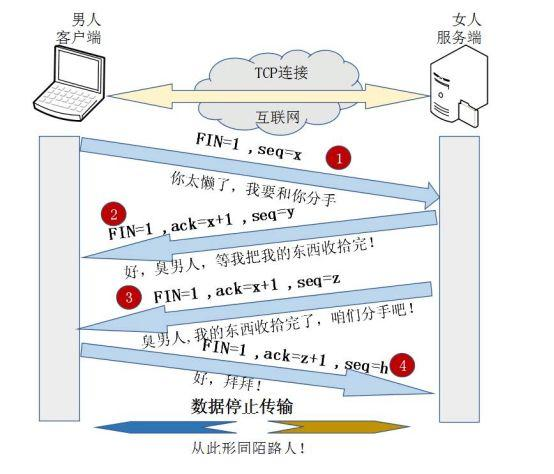

<!--
 * @Author: your name
 * @Date: 2020-05-26 21:05:43
 * @LastEditTime: 2020-06-21 17:44:39
 * @LastEditors: Please set LastEditors
 * @Description: In User Settings Edit
 * @FilePath: \undefinedc:\Users\conan\Desktop\LongTime\StupidBirdFliesFirst\Network\TCPConnect.md
--> 

<!-- TOC -->

- [TCP协议连接的建立和解除](#tcp协议连接的建立和解除)
  - [概念性讲解](#概念性讲解)
  - [TCP报文格式](#tcp报文格式)
  - [TCP 三次握手详解](#tcp-三次握手详解)
  - [TCP四次挥手](#tcp四次挥手)
  - [为什么“握手”是三次，“挥手”却要四次？](#为什么握手是三次挥手却要四次)

<!-- /TOC -->

# TCP协议连接的建立和解除
## 概念性讲解
&emsp;&emsp;TCP协议中其实并没有物理意义上上的连接，只是一种数据包的互相发送。其中三次握手指的是客户端和服务器建立连接的过程。“握手”指的是在建立连接的过程中产生的三次数据发送。首先的两次握手是最基本的。第一次握手，客户端发了个连接请求消息到服务端，服务端收到信息后知道自己与客户端是可以连接成功的，但此时客户端并不知道服务端是否已经接收到了它的请求，所以服务端接收到消息后的应答，客户端得到服务端的反馈后，才确定自己与服务端是可以连接上的，这就是第二次握手。第三次握手是为了防止已经失效的连接请求报文段突然又传到服务端，因而产生错误。

&emsp;&emsp;譬如发起请求遇到类似这样的情况：客户端发出去的第一个连接请求由于某些原因在网络节点中滞留了导致延迟，直到连接释放的某个时间点才到达服务端，这是一个早已失效的报文，但是此时服务端仍然认为这是客户端的建立连接请求第一次握手，于是服务端回应了客户端，第二次握手。如果只有两次握手，那么到这里，连接就建立了，但是此时客户端并没有任何数据要发送，而服务端还在傻傻的等候佳音，造成很大的资源浪费。所以需要第三次握手，只有客户端再次回应一下，就可以避免这种情况。

## TCP报文格式

1. 序号（sequence number）：Seq序号，占32位，用来标识从TCP源端向目的端发送的字节流，发起方发送数据时对此进行标记。
2. 确认号（acknowledgement number）：Ack序号，占32位，只有ACK标志位为1时，确认序号字段才有效，Ack=Seq+1。
3. 标志位（Flags）：共6个，即URG、ACK、PSH、RST、SYN、FIN等。具体含义如下：
    - URG：紧急指针（urgent pointer）有效。
    - ACK：确认序号有效。
    - PSH：接收方应该尽快将这个报文交给应用层。
    - RST：重置连接。
    - SYN：发起一个新连接。
    - FIN：释放一个连接。
    - 
    不要将确认序号Ack与标志位中的ACK搞混了。确认方Ack=发起方Seq+1，两端配对。

## TCP 三次握手详解
1. 首先客户端向服务器端发送一段TCP报文，其中：
   - 标记位为SYN，表示“请求建立新连接”;
   - 序号为Seq=X（X一般为1）；
   - 随后客户端进入SYN-SENT阶段。
2. 服务器端接收到来自客户端的TCP报文之后，结束LISTEN阶段。并返回一段TCP报文，其中：
   - 标志位为SYN和ACK，表示“确认客户端的报文Seq序号有效，服务器能正常接收客户端发送的数据，并同意创建新连接”（即告诉客户端，服务器收到了你的数据）；
   - 序号为Seq=y；
   - 确认号为Ack=x+1，表示收到客户端的序号Seq并将其值加1作为自己确认号Ack的值；随后服务器端进入SYN-RCVD阶段。
3. 客户端接收到来自服务器端的确认收到数据的TCP报文之后，明确了从客户端到服务器的数据传输是正常的，结束SYN-SENT阶段。并返回最后一段TCP报文。其中：
   - 标志位为ACK，表示“确认收到服务器端同意连接的信号”（即告诉服务器，我知道你收到我发的数据了）；
   - 序号为Seq=x+1，表示收到服务器端的确认号Ack，并将其值作为自己的序号值；
   - 确认号为Ack=y+1，表示收到服务器端序号Seq，并将其值加1作为自己的确认号Ack的值；
   - 随后客户端进入ESTABLISHED阶段。

    服务器收到来自客户端的“确认收到服务器数据”的TCP报文之后，明确了从服务器到客户端的数据传输是正常的。结束SYN-SENT阶段，进入ESTABLISHED阶段。

    在客户端与服务器端传输的TCP报文中，双方的确认号Ack和序号Seq的值，都是在彼此Ack和Seq值的基础上进行计算的，这样做保证了TCP报文传输的连贯性。一旦出现某一方发出的TCP报文丢失，便无法继续"握手"，以此确保了"三次握手"的顺利完成。

    此后客户端和服务器端进行正常的数据传输。这就是“三次握手”的过程。

## TCP四次挥手
&emsp;&emsp;四次挥手即断开连接的过程，连接的释放必须是一方主动释放，另一方被动释放。
1. 首先客户端想要释放连接，向服务器端发送一段TCP报文，其中：
   - 标记位为FIN，表示“请求释放连接“；
   - 序号为Seq=U；
   - 随后客户端进入FIN-WAIT-1阶段，即半关闭阶段。并且停止在客户端到服务器端方向上发送数据，但是客户端仍然能接收从服务器端传输过来的数据。

    注意：这里不发送的是正常连接时传输的数据(非确认报文)，而不是一切数据，所以客户端仍然能发送ACK确认报文。
2. 服务器端接收到从客户端发出的TCP报文之后，确认了客户端想要释放连接，随后服务器端结束ESTABLISHED阶段，进入CLOSE-WAIT阶段（半关闭状态）并返回一段TCP报文，其中：
   - 标记位为ACK，表示“接收到客户端发送的释放连接的请求”；
   - 序号为Seq=V；
   - 确认号为Ack=U+1，表示是在收到客户端报文的基础上，将其序号Seq值加1作为本段报文确认号Ack的值；
   - 随后服务器端开始准备释放服务器端到客户端方向上的连接。

    客户端收到从服务器端发出的TCP报文之后，确认了服务器收到了客户端发出的释放连接请求，随后客户端结束FIN-WAIT-1阶段，进入FIN-WAIT-2阶段

    *前"两次挥手"既让服务器端知道了客户端想要释放连接，也让客户端知道了服务器端了解了自己想要释放连接的请求。于是，可以确认关闭客户端到服务器端方向上的连接了*
3. 服务器端自从发出ACK确认报文之后，经过CLOSED-WAIT阶段，做好了释放服务器端到客户端方向上的连接准备，再次向客户端发出一段TCP报文，其中：
   - 标记位为FIN，ACK，表示“已经准备好释放连接了”。注意：这里的ACK并不是确认收到服务器端报文的确认报文。
   - 序号为Seq=W；
   - 确认号为Ack=U+1；表示是在收到客户端报文的基础上，将其序号Seq值加1作为本段报文确认号Ack的值。

    随后服务器端结束CLOSE-WAIT阶段，进入LAST-ACK阶段。并且停止在服务器端到客户端的方向上发送数据，但是服务器端仍然能够接收从客户端传输过来的数据。
4. 客户端收到从服务器端发出的TCP报文，确认了服务器端已做好释放连接的准备，结束FIN-WAIT-2阶段，进入TIME-WAIT阶段，并向服务器端发送一段报文，其中：
   - 标记位为ACK，表示“接收到服务器准备好释放连接的信号”。
   - 序号为Seq=U+1；表示是在收到了服务器端报文的基础上，将其确认号Ack值作为本段报文序号的值。
   - 确认号为Ack=W+1；表示是在收到了服务器端报文的基础上，将其序号Seq值作为本段报文确认号的值。

    随后客户端开始在TIME-WAIT阶段等待2MSL。因为为了确认服务器端是否收到客户端发出的ACK确认报文

    当客户端发出最后的ACK确认报文时，并不能确定服务器端能够收到该段报文。所以客户端在发送完ACK确认报文之后，会设置一个时长为2MSL的计时器。MSL指的是Maximum Segment Lifetime：一段TCP报文在传输过程中的最大生命周期。2MSL即是服务器端发出为FIN报文和客户端发出的ACK确认报文所能保持有效的最大时长。

    服务器端在1MSL内没有收到客户端发出的ACK确认报文，就会再次向客户端发出FIN报文；

    如果客户端在2MSL内，再次收到了来自服务器端的FIN报文，说明服务器端由于各种原因没有接收到客户端发出的ACK确认报文。客户端再次向服务器端发出ACK确认报文，计时器重置，重新开始2MSL的计时；否则客户端在2MSL内没有再次收到来自服务器端的FIN报文，说明服务器端正常接收了ACK确认报文，客户端可以进入CLOSED阶段，完成“四次挥手”。

    服务器端收到从客户端发出的TCP报文之后结束LAST-ACK阶段，进入CLOSED阶段。由此正式确认关闭服务器端到客户端方向上的连接。

    客户端等待完2MSL之后，结束TIME-WAIT阶段，进入CLOSED阶段，由此完成“四次挥手”。

后“两次挥手”既让客户端知道了服务器端准备好释放连接了，也让服务器端知道了客户端了解了自己准备好释放连接了。于是，可以确认关闭服务器端到客户端方向上的连接了，由此完成“四次挥手”。

与“三次挥手”一样，在客户端与服务器端传输的TCP报文中，双方的确认号Ack和序号Seq的值，都是在彼此Ack和Seq值的基础上进行计算的，这样做保证了TCP报文传输的连贯性，一旦出现某一方发出的TCP报文丢失，便无法继续"挥手"，以此确保了"四次挥手"的顺利完成。

## 为什么“握手”是三次，“挥手”却要四次？
TCP建立连接时之所以只需要"三次握手"，是因为在第二次"握手"过程中，服务器端发送给客户端的TCP报文是以SYN与ACK作为标志位的。SYN是请求连接标志，表示服务器端同意建立连接；ACK是确认报文，表示告诉客户端，服务器端收到了它的请求报文。

即SYN建立连接报文与ACK确认接收报文是在同一次"握手"当中传输的，所以"三次握手"不多也不少，正好让双方明确彼此信息互通。

TCP释放连接时之所以需要“四次挥手”,是因为FIN释放连接报文与ACK确认接收报文是分别由第二次和第三次"握手"传输的。为何建立连接时一起传输，释放连接时却要分开传输？

建立连接时，被动方服务器端结束CLOSED阶段进入“握手”阶段并不需要任何准备，可以直接返回SYN和ACK报文，开始建立连接。

释放连接时，被动方服务器，突然收到主动方客户端释放连接的请求时并不能立即释放连接，因为还有必要的数据需要处理，所以服务器先返回ACK确认收到报文，经过CLOSE-WAIT阶段准备好释放连接之后，才能返回FIN释放连接报文。