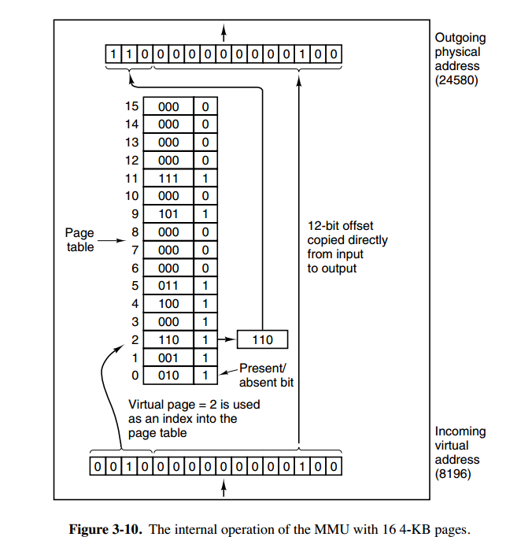

<!--
 * @Author: your name
 * @Date: 2020-06-23 18:56:23
 * @LastEditTime: 2020-06-24 21:25:30
 * @LastEditors: Please set LastEditors
 * @Description: In User Settings Edit
 * @FilePath: \undefinedc:\Users\conan\Desktop\LongTime\StupidBirdFliesFirst\OperationSystem\MemoryManagement.md
--> 
# 内存管理
内存管理是指软件运行时对计算机内存资源的分配和使用的技术。其最主要的目的是如何高效，快速的分配，并且在适当的时候释放和回收内存资源。

## 内存的组成
内存由缓存（cache），主存（RAM）和磁盘组成（ROM）组成。其中缓存容量最低但速度最快、成本最高，主存中速度、中容量、中成本，磁盘大容量，速度慢，最持久。

## 内存管理
内存管理就是要对"用户"提供一个统一的抽象，屏蔽缓存、主存和磁盘之间的差异，甚至感知不到它们的存在。用户无需担心程序是存储在缓存、主存或者磁盘上，反正运行、输出的结果都是一样的，这种抽象是通过虚拟内存来实现的。

操作系统中要同时执行多个进程程序，要保证它们之间互不干扰，也就是说一个进程不能访问另一个进程的内存空间。程序中读写特定内存数据时，不能直接映射到物理内存，也就是说程序发出的内存地址和物理内存要是独立的。综上所述，内存管理的目标就是：
- 地址保护：一个程序不应该访问另一个程序地址空间。
- 地址独立：程序发出的地址应与物理主存地址无关。

## 虚拟内存
虚拟内存是计算机系统内存管理的一种技术。它使得应用程序避免直接与各种物理内存打交道，并且认为程序自己拥有连续的可用的内存（一个连续完整的地址空间），而实际上，程序中能看到的内存地址就是虚拟内存地址，程序读写内存时会被映射到实际的物理内存中，这个映射也叫翻译，是由内存管理单元（MMU）完成的。

虚拟内存可以让物理内存扩充成更大的逻辑内存，从而让程序获得更多的可用内存。注意，这里的内存扩充仅仅是逻辑上的扩充，这种扩充来源于对于内存的管理，例如，假设浏览器中有20个选项卡，每个选项卡占用1GB的内存。在没有虚拟内存支持的操作系统中，您需要20GB的RAM才能正常工作。诀窍是，您不能同时浏览所有20个选项卡，因此具有虚拟内存的操作系统将使您能够像仅使用几GB RAM一样使用浏览器，将不活动的选项卡交换到磁盘。

## 分页内存
分页系统的核心是将虚拟内存空间和物理内存空间皆划分为大小相同的页，如4KB、8KB或16KB等，并以页作为内存空间的最小分配单位，一个程序的一个页可以存放在任意一个物理页里。这些页被映射到物理内存，但不需要映射到连续的物理内存，也不需要所有页都必须在物理内存中。当程序引用到不在物理内存中的页时，由硬件执行必要的映射，将缺失的部分装入物理内存并重新执行失败的指令。

从上面的描述中可以看出，虚拟内存允许程序不用将地址空间中的每一页都映射到物理内存，也就是说一个程序不需要全部调入内存就可以运行，这使得有限的内存运行大程序成为可能。例如有一台计算机可以产生 16 位地址，那么一个程序的地址空间范围是 0~64K。该计算机只有 32KB 的物理内存，虚拟内存技术允许该计算机运行一个 64K 大小的程序。

## 分页系统地址映射
内存管理单元（MMU）管理着地址空间和物理内存的转换，其中的页表（Page table）存储着页（程序地址空间）和页框（物理内存空间）的映射表。

一个虚拟地址分成两个部分，一部分存储页面号，一部分存储偏移量。

下图的页表存放着 16 个页，这 16 个页需要用 4 个比特位来进行索引定位。例如对于虚拟地址（0010 000000000100），前 4 位是存储页面号 2，读取表项内容为（110 1），页表项最后一位表示是否存在于内存中，1 表示存在。后 12 位存储偏移量。这个页对应的页框的地址为 （110 000000000100）。

## 页面置换算法
在程序运行过程中，如果要访问的页面不在内存中，就发生缺页中断从而将该页调入内存中。此时如果内存已无空闲空间，系统必须从内存中调出一个页面到磁盘对换区中来腾出空间。

页面置换算法和缓存淘汰策略类似，可以将内存看成磁盘的缓存。在缓存系统中，缓存的大小有限，当有新的缓存到达时，需要淘汰一部分已经存在的缓存，这样才有空间存放新的缓存数据。

页面置换算法的主要目标是使页面置换频率最低（也可以说缺页率最低）。

### OPT, Optimal replacement algorithm
这是一种理想情况下的页面置换算法，但实际上是不可能实现的。该算法的基本思想是：发生缺页时，有些页面在内存中，其中有一页将很快被访问（也包含紧接着的下一条指令的那页），而其他页面则可能要到10、100或者1000条指令后才会被访问，每个页面都可以用在该页面首次被访问前所要执行的指令数进行标记。最佳页面置换算法只是简单地规定：标记最大的页应该被置换。这个算法唯一的一个问题就是它无法实现。当缺页发生时，操作系统无法知道各个页面下一次是在什么时候被访问。虽然这个算法不可能实现，但是最佳页面置换算法可以用于对可实现算法的性能进行衡量比较。

### 先进先出置换算法（FIFO）
简单的页面置换算法是先入先出（FIFO）法。这种算法的实质是，总是选择在主存中停留时间最长（即最老）的一页置换，即先进入内存的页，先退出内存。理由是：最早调入内存的页，其不再被使用的可能性比刚调入内存的可能性大。建立一个FIFO队列，收容所有在内存中的页。被置换页面总是在队列头上进行。当一个页面被放入内存时，就把它插在队尾上。

这种算法只是在按线性顺序访问地址空间时才是理想的，否则效率不高。因为那些常被访问的页，往往在主存中也停留得最久，结果它们因变“老”而不得不被置换出去。

FIFO的另一个缺点是，它有一种异常现象，即在增加存储块的情况下，反而使缺页中断率增加了。当然，导致这种异常现象的页面走向实际上是很少见的。

### LRU, Least Recently Used
虽然无法知道将来要使用的页面情况，但是可以知道过去使用页面的情况。LRU 将最近最久未使用的页面换出。

为了实现 LRU，需要在内存中维护一个所有页面的链表。当一个页面被访问时，将这个页面移到链表表头。这样就能保证链表表尾的页面是最近最久未访问的。

因为每次访问都需要更新链表，因此这种方式实现的 LRU 代价很高。